# 🗺️ 執行功能訓練遊戲 — 完整流程圖集

> **對應文件**：[完整需求文件 v4.5](完整需求文件v4.5.md)（2026/02/18）  
> **流程圖語法**：Mermaid  
> **總數**：30 個流程圖 + 3 個開發路線圖，分 6 大類  
> **v4.3 變更**：探險地圖取代遊戲場+標準模式、自由選擇取代自由模式、WM≥83%通過、全員完成廣播+觀看總結果按鈕鎖定解鎖、房主變更通知區分新房主/其他玩家  
> **v4.4 變更**：§1.3 流程圖索引完整交叉連結（30 流程圖↔需求章節雙向導航）、新增開發路線圖章節（Phase 依賴圖 + 甘特圖 + 決策時間線）  
> **v4.5 變更**：Phase 5 多人重構完成、檔案結構完整重寫（66 JS + 23 HTML）、遊戲設定範圍更新、即時排行榜代碼制（2分鐘生命週期）、班級排行榜匯入匯出完整化

---

## 📑 目錄

### 📍 開發路線圖（Development Roadmap）

0-1. [Phase 依賴圖](#roadmap-1-phase-依賴圖)
0-2. [開發時程甘特圖](#roadmap-2-開發時程甘特圖)
0-3. [設計決策時間線](#roadmap-3-設計決策時間線)

### A. 使用者流程（User Flows）

1. [系統總覽流程圖](#flow-1-系統總覽流程圖)
2. [多人模式完整流程](#flow-2-多人模式完整流程)
3. [單人探險地圖模式流程](#flow-3-單人探險地圖模式流程)
4. [單人自由選擇模式流程](#flow-4-單人自由選擇模式流程)
5. [探險地圖單一探險點流程](#flow-5-探險地圖單一探險點流程)
6. [多人房間建立與加入流程](#flow-6-多人房間建立與加入流程)
7. [暫停與退出流程](#flow-7-暫停與退出流程)
8. [房主斷線轉移流程](#flow-8-房主斷線轉移流程)

### B. 遊戲邏輯（Game Logic Flows）

9. [單一試驗時間軸流程](#flow-9-單一試驗trial時間軸流程)
10. [Go/No-Go 規則判定引擎](#flow-10-gono-go-規則判定引擎)
11. [計分系統流程（單一規則）](#flow-11-計分系統流程單一規則)
12. [WM 計分系統流程](#flow-12-wm-計分系統流程)
13. [WM 測驗遊戲流程](#flow-13-wm-測驗遊戲流程)
14. [題目生成流程](#flow-14-題目生成流程)
15. [刺激物語音性別判定流程](#flow-15-刺激物語音性別判定流程)

### C. 資料流程（Data Flows）

16. [資料儲存層次與同步流程](#flow-16-資料儲存層次與同步流程)
17. [多人模式 Firebase 即時同步流程](#flow-17-多人模式-firebase-即時同步流程)
18. [成績輸出流程（截圖＋CSV）](#flow-18-成績輸出流程截圖csv)
19. [排行榜雙軌制資料流](#flow-19-排行榜雙軌制資料流)
20. [Fallback 降級機制流程](#flow-20-fallback-降級機制流程)

### D. 狀態機（State Machines）

21. [關卡解鎖狀態機](#flow-21-關卡解鎖狀態機)
22. [星星與等級狀態機](#flow-22-星星與等級狀態機)
23. [徽章判定狀態機](#flow-23-徽章判定狀態機)
24. [多人房間狀態機](#flow-24-多人房間狀態機)
25. [單一組合玩家狀態機](#flow-25-單一組合combo玩家狀態機)

### E. 決策流程（Decision Flows）

26. [通過／失敗判定與後續處理流程](#flow-26-通過失敗判定與後續處理流程)
27. [不屈勇士徽章觸發流程](#flow-27-不屈勇士徽章觸發流程)
28. [反應時間（RT）計算流程](#flow-28-反應時間rt計算流程)
29. [聲音系統播放決策流程](#flow-29-聲音系統播放決策流程)
30. [配色主題與刺激物 Config 載入流程](#flow-30-配色主題與刺激物-config-載入流程)

---

# 📍 開發路線圖（Development Roadmap）

> **用途**：開發導航——知道「現在該做什麼」「下一步是什麼」「什麼時候討論什麼」  
> **對應文件**：[完整需求文件 v4.4 §7](完整需求文件v4.4.md#七開發時程與路線圖-)（完整版含各 Phase 產出物清單、決策分級與 checklist）

---

## Roadmap-1: Phase 依賴圖

> **說明**：8 個開發階段的先後依賴關係。實線 = 強依賴，虛線 = 可平行。Phase 4（單人）→ 5（多人）接續式開發。

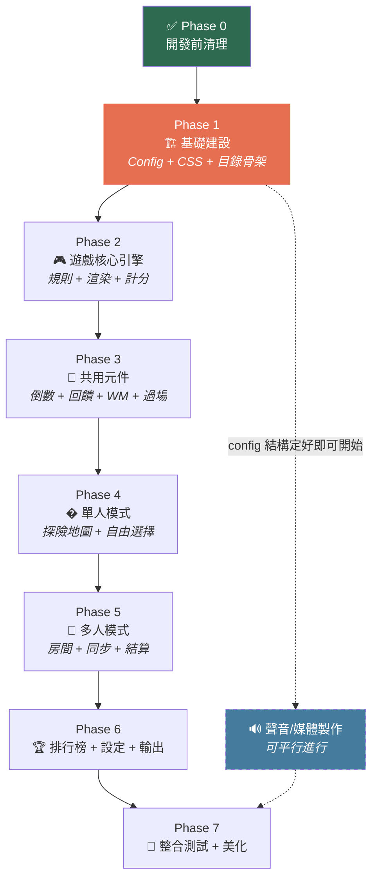

**閱讀方式**：

- **實線箭頭** = 強依賴（必須完成前一個）
- **虛線箭頭** = 弱依賴（可平行進行）
- Phase 4 → 5 **接續式開發**：先用單人模式驗證核心引擎，再加上多人同步層
- 🔊 聲音/媒體製作隨時可進行，不卡主線

| Phase              | 內容                         |         預估天數          |   風險    |
| ------------------ | ---------------------------- | :-----------------------: | :-------: |
| 0 開發前清理       | Firebase rules / config 修正 |            0.5            | ✅ 已完成 |
| 1 基礎建設         | Config + CSS 主題 + 目錄骨架 |            3-4            |   🟢 低   |
| 2 遊戲核心引擎     | 規則判定 + 渲染 + 計分       |            4-5            |   🟡 中   |
| 3 共用元件         | 倒數 + 回饋 + WM + 過場      |            4-5            |   🟡 中   |
| 4 單人模式         | 探險地圖 + 自由選擇          |            5-7            |   🟡 中   |
| 5 多人模式         | 房間 + 即時同步 + 結算       |            5-7            |   🔴 高   |
| 6 排行榜+設定+輸出 | 三種排行榜 + CSV + 設定      |            4-5            |   🟢 低   |
| 7 整合測試+美化    | 跨瀏覽器 + 響應式 + 效能     |            3-5            |   🟡 中   |
| **合計**           |                              | **29-39 天（約 5-7 週）** |           |

---

## Roadmap-2: 開發時程甘特圖

> **說明**：各 Phase 時程預估與平行作業視覺化。Phase 4（單人）→ 5（多人）接續開發。

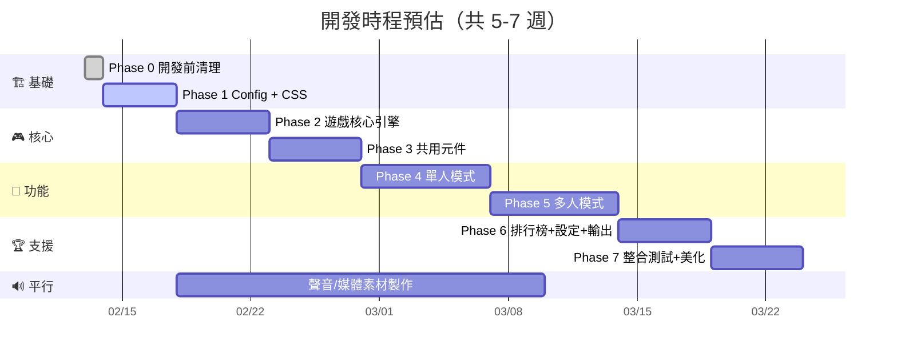

---

## Roadmap-3: 設計決策時間線

> **說明**：「什麼時候該討論什麼設計」— 越早定的項目，後續改動成本越高。

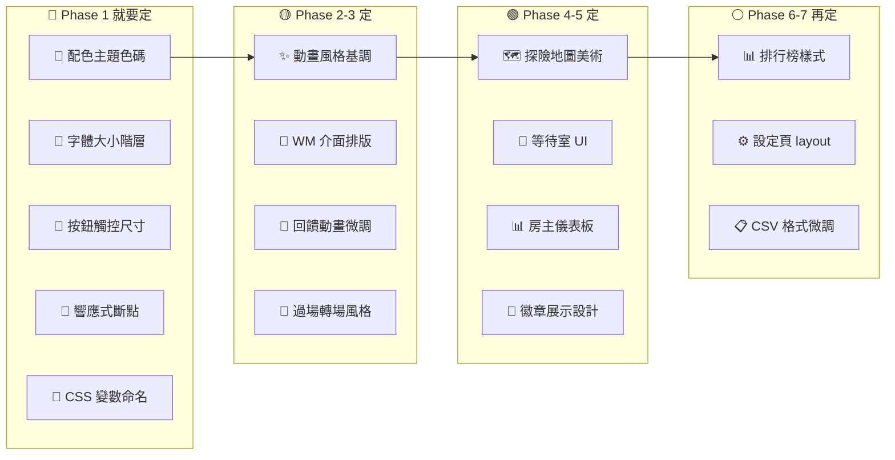

**判斷原則**：

| 等級 | 什麼時候決定               | 為什麼                       |   改動成本    |
| :--: | -------------------------- | ---------------------------- | :-----------: |
|  🔴  | **開始寫第一行 CSS/JS 前** | 這些是地基，所有頁面都會引用 |  💀 全站返工  |
|  🟡  | **開發共用元件時**         | 多人/單人共用，定一次用到底  | 😰 多頁面修改 |
|  🟢  | **開發各模式時**           | 僅影響該頁面，不擴散         |  😐 單頁修改  |
|  ⚪  | **最後收尾時**             | 純呈現層，隨時可改           |  😊 微調即可  |

---

# A. 使用者流程（User Flows）

---

## Flow-1: 系統總覽流程圖

> **說明**：從首頁入口到所有功能終點的全局導覽。  
> **對應章節**：§1.3 系統流程圖、§6 檔案結構

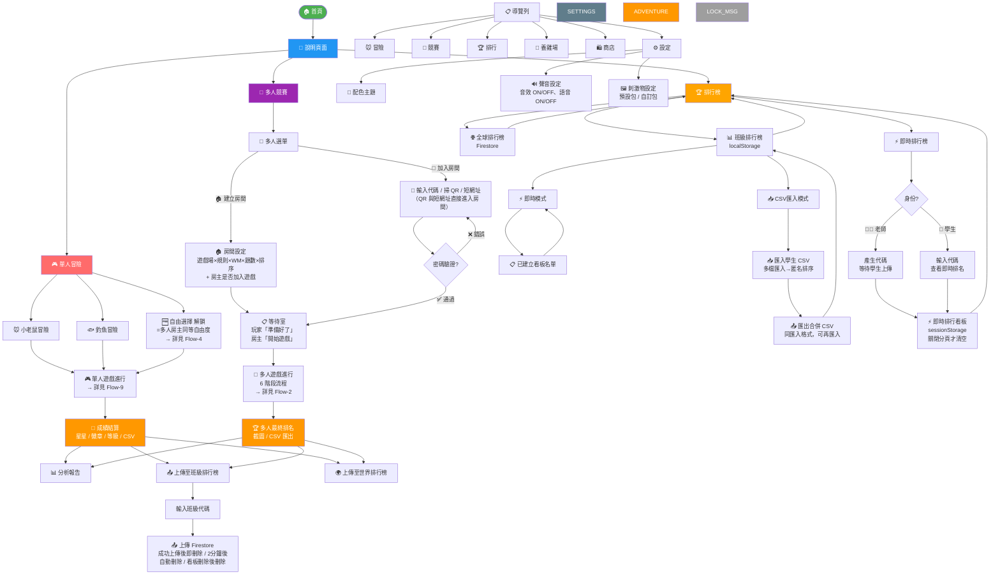

### 📌 關鍵設計點

- **首頁兩大入口**：📱 單人 / 👥 多人，簡潔分流
- **⚙️ 設定 = 全局浮動**：右上角齒輪 icon，任何頁面都能進入（不佔首頁入口）
- **單人主流程 = 探險地圖**：新手唯一入口，12 個探險點逐步解鎖 🆕v4.3
- **自由選擇 = 解鎖後開放**：探險地圖全通過後解鎖，= 多人房主同等自由度 🆕v4.3
- **遊戲場模式已取消**：由探險地圖取代 🆕v4.3
- **通過門檻**：全局 ≥83%（≈5/6 題），依文獻設定
- **排行榜三種**：📊 班級（本地）+ 🌐 全球（Firestore 逐項勾選）+ ⚡ 即時（代碼制，2分鐘生命週期）🆕v4.3
- **CSV 統一格式**：個人 CSV = 班級排行榜 CSV（第一區 14 欄摘要 + 第二區逐題明細），班級匯入只讀第一區 🆕v4.3
- **座號欄位**：學生在設定頁填寫，CSV 第一欄，班級排行榜以座號匿名顯示 🆕v4.3
- **班級排行榜**：匯入多位學生 CSV → 匿名（座號）排序，可選擇排行欄位（最多顯示 5 個）🆕v4.3
- **即時排行榜**：上傳「本次成績」（非累計），重複上傳覆蓋前一筆，看板存 sessionStorage 🆕v4.3
- **多人密碼可選**：房間可設密碼，也可開放加入
- **房主可選擇是否加入遊戲**：不加入則顯示即時狀態儀表板 🆕v4.3
- **QR Code 與短網址直接進入房間**：無須手動輸入代碼，掃描 / 點連結即進入 🔄v4.3

---

## Flow-2: 多人模式完整流程

> **說明**：從房主建立房間到最終排名的 6 階段完整生命週期。  
> **對應章節**：§2.5–§2.8 遊戲流程完整版

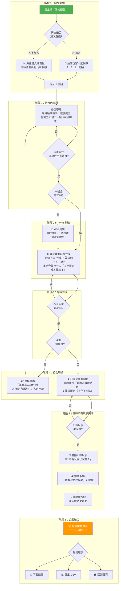

### 📌 關鍵設計點

- **階段 1 唯一同步**：只有最開始需所有人一起倒數
- **房主可選擇不加入遊戲**：不加入則顯示即時狀態儀表板（所有玩家的答題進度、組合完成狀態、分數等） 🆕v4.3
- **階段 4 各自節奏**：組合切換時各自按開始、各自倒數
- **0 秒題目切換**：多人模式答題後立即顯示下一題（無停留）
- **3 秒完成通知**：顯示具體組合名稱（如「🐭規則一+WM」）；全部完成時額外通知「🎉 全部完成！」
- **階段 5 按鈕鎖定機制**：玩家完成所有組合後看到「觀看遊戲總結果」按鈕（🔒 鎖定），等所有玩家都完成後廣播「🎉 所有玩家已完成！」→ 按鈕解鎖（🔓），玩家自行點擊進入總結果畫面 🆕v4.3
- **截圖與 CSV 在總結果畫面**：進入階段 6 最終排名畫面後才能下載截圖與匯出 CSV
- **成績不寫入個人紀錄**：多人成績存 RTDB，房主離開遊戲 / 關閉分頁即清空刪除

---

## Flow-3: 單人探險地圖模式流程

> **說明**：單人主流程，2 張探險地圖各 6 個探險點，逐步解鎖，全通過解鎖自由選擇。  
> **對應章節**：§3.2 探險地圖模式 🆕v4.3

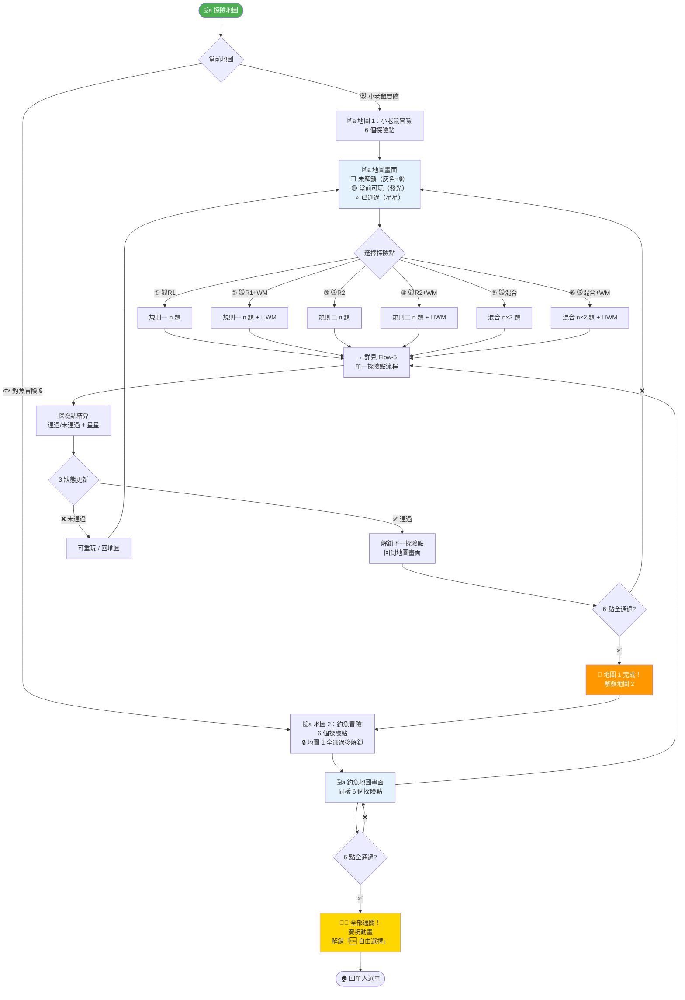

### 📌 關鍵設計點

- **單人唯一起始流程**：探險地圖取代遊戲場模式 + 標準模式 🆕v4.3
- **2 張地圖，各 6 探險點**：①R1 → ②R1+WM → ③R2 → ④R2+WM → ⑤混合 → ⑥混合+WM
- **強制逐步解鎖**：通過①才能玩②，依此類推
- **可分次遊玩**：今天玩到③，明天繼續④（進度 localStorage 儲存）
- **探險點 3 狀態**：⬜ 未解鎖 / 🟡 當前可玩 / ⭐ 已通過
- **已通過可重玩**：星星無限累計，不影響解鎖進度
- **Config 可調順序**：ADVENTURE_MAPS 陣列可彈性調整探險點排列
- **地圖 1 全通過 → 解鎖地圖 2**；**12 點全通過 → 解鎖自由選擇**

---

## Flow-4: 單人自由選擇模式流程

> **說明**：探險地圖全通過後解鎖，= 多人房主同等自由度，共用 game-session-builder 模組。  
> **對應章節**：§3.2 自由選擇模式 🆕v4.3

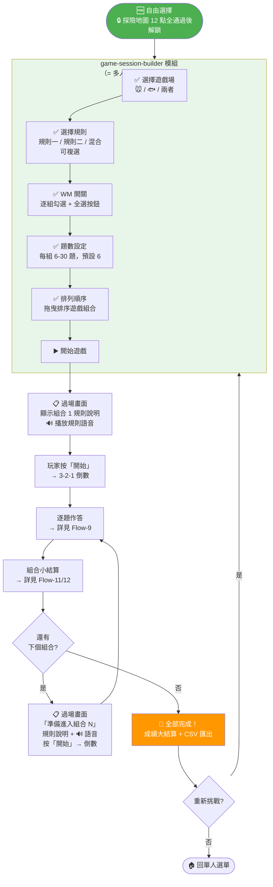

### 📌 關鍵設計點

- **探險地圖 12 點全通過後解鎖** 🆕v4.3
- **= 多人房主同等自由度**：共用 game-session-builder 模組
- **組合切換與多人一致**：過場畫面 → 規則說明語音 → 按開始 → 倒數 → 開始 🆕v4.3
- **共用 shared/combo-transition.html**：多人/自由選擇同頁面 🆕v4.3
- **可複選遊戲場×規則**：任意排列組合
- **拖曳排序**：自訂遊戲順序
- **WM 逐組勾選**：每組獨立決定 + 全選/全取消
- **教師覆寫**：`?unlock=all` 可跳過所有鎖定

---

## Flow-5: 探險地圖單一探險點流程

> **說明**：探險地圖上點擊一個探險點後的完整遊玩流程（純規則 or 規則+WM）。  
> **對應章節**：§3.2 探險地圖模式 🆕v4.3

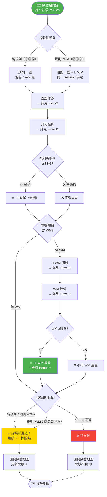

### 📌 關鍵設計點

- **兩種探險點**：純規則（①③⑤）vs 規則+WM（②④⑥）
- **規則+WM 綁定**：同一 session 連續完成，WM 回憶「剛才」的刺激物
- **通過條件**：純規則 = 規則≥83%；規則+WM = 兩者皆≥83% 🆕v4.3
- **星星無限累計**：規則通過 +1⭐，WM 通過 +1⭐，WM 全對 Bonus ⭐（每次重玩都可累計）
- **WM Bonus 星星**：逆向全對 n≥2 → +(n-1)⭐；順向全對 2-6 → +1⭐，7-9 → +2⭐，n≥10 → +(n-7)⭐
- **未通過不解鎖**：可重玩此探險點，不影響其他進度

---

## Flow-6: 多人房間建立與加入流程

> **說明**：房主設定房間 + 玩家加入 + 等待室流程。  
> **對應章節**：§2.2 房間系統、§2.9 邀請功能

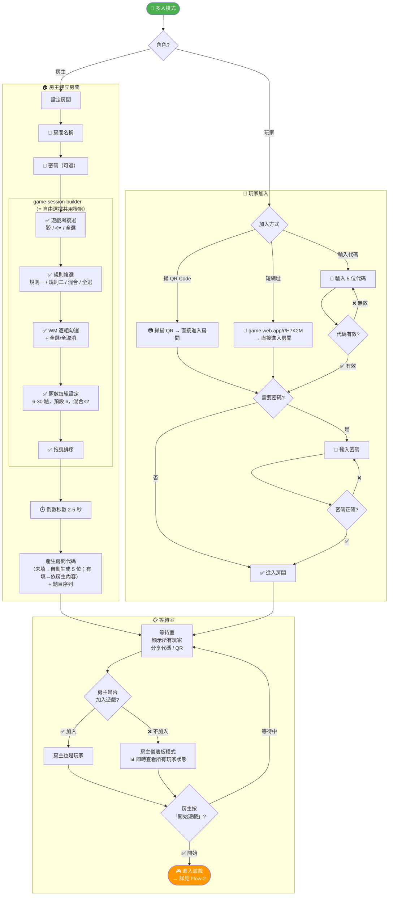

### 📌 關鍵設計點

- **game-session-builder 共用模組**：遊戲場複選 → 規則複選 → WM 逐組勾選 → 題數每組設定 → 拖曳排序（= 自由選擇完全一致）
- **多人額外設定**：房間名稱、密碼、倒數秒數（在 builder 外）
- **房主可選擇是否加入遊戲**：加入則同時是玩家；不加入則顯示即時狀態儀表板（所有玩家的答題進度、組合完成、分數等） 🆕v4.3
- **3 種加入方式**：代碼（手動輸入）、QR Code（掃描即進）、短網址（點連結即進） 🔄v4.3
- **QR 與短網址直接進入房間**：無須手動輸入代碼，僅密碼房需額外輸入密碼 🔄v4.3
- **密碼可選**：房主可自由決定是否設密碼
- **不允許中途加入**：遊戲開始後不可加入
- **題數 6-30**：全模式統一範圍，預設 6 題，每組獨立設定

---

## Flow-7: 暫停與退出流程

> **說明**：單人暫停/退出 vs 多人退出/斷線處理。  
> **對應章節**：§3.1b 暫停/中斷功能

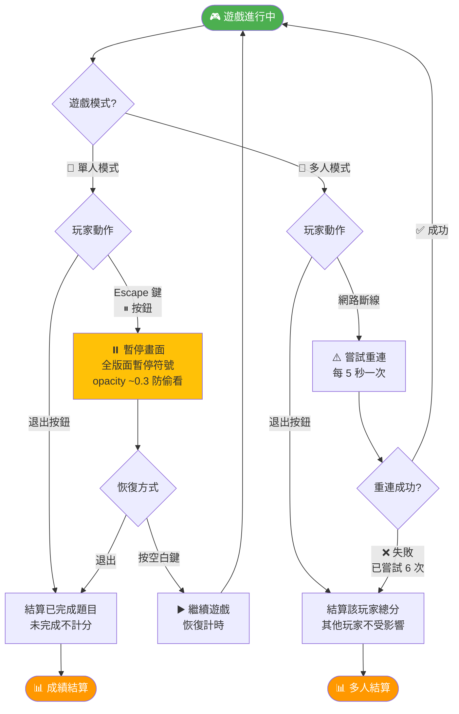

### 📌 關鍵設計點

- **暫停觸發**：Escape 鍵或右上角 ⏸ 按鈕
- **空白鍵恢復**：按空白鍵以繼續遊戲 🔄v4.3
- **暫停不計時**：反應時間凍結
- **多人無暫停**：僅可退出
- **多人斷線重連**：每 5 秒嘗試一次 × 最多 6 次 = 30 秒，仍失敗即結算總分 🔄v4.3

---

## Flow-8: 房主斷線轉移流程

> **說明**：房主離線時按 joinOrder 自動轉移房主權限。  
> **對應章節**：§2.8 房主斷線處理

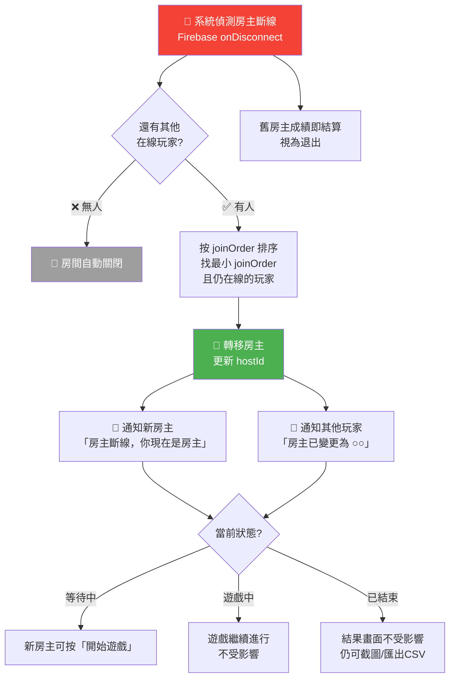

### 📌 關鍵設計點

- **joinOrder 排序**：房主=0，第一個加入=1，依此類推
- **自動無感轉移**：不中斷遊戲進行
- **通知區分**：新房主看到「房主斷線，你現在是房主」；其他玩家看到「房主已變更為 ○○」 🆕v4.3
- **3 種狀態都處理**：等待中（新房主可開始遊戲）、遊戲中（繼續進行）、已結束（結果畫面不受影響） 🆕v4.3
- **斷線者即結算**：離線玩家的已答題目照常計分

---

# B. 遊戲邏輯（Game Logic Flows）

---

## Flow-9: 單一試驗（Trial）時間軸流程

> **說明**：一題從刺激物出現到下一題的完整時間線。  
> **對應章節**：§3.1b 遊戲進行時間機制

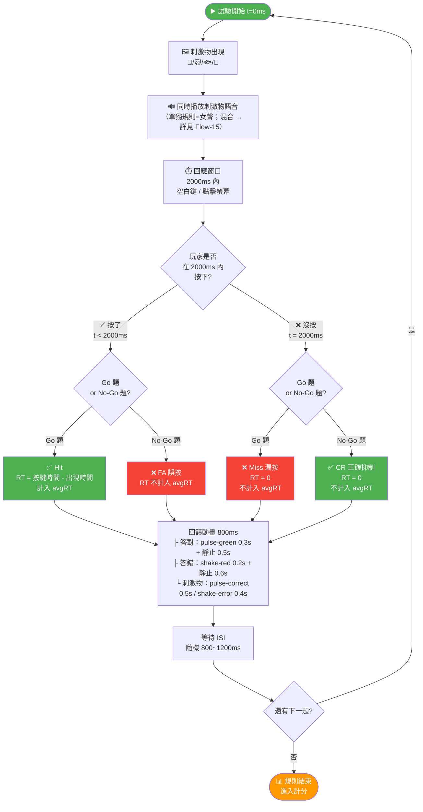

### 📌 關鍵設計點

- **2000ms 回應窗口**：超時即判定為「沒按」
- **4 種結果**：Hit（Go 正確）、CR（No-Go 正確）、Miss（Go 漏按）、FA（No-Go 誤按）
- **avgRT 只計 Hit**：僅 Go 正確答對的 RT 計入平均
- **雙層動畫**：容器動畫（0.3s/0.2s）+ 刺激物動畫（0.5s/0.4s）同時播放
- **800ms 總停留**：CSS 動畫 + 靜止，整體 800ms 後消退

---

## Flow-10: Go/No-Go 規則判定引擎

> **說明**：根據遊戲場 × 規則 × 情境判定正確動作。  
> **對應章節**：§2.3 規則詳細說明

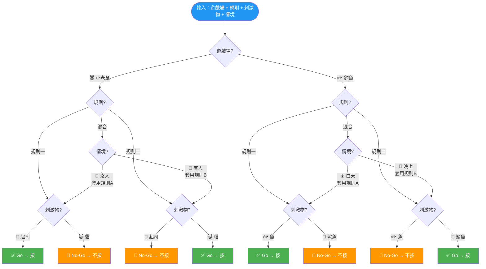

### 📌 關鍵設計點

- **混合規則 = 情境切換**：先看情境（有人/白天 vs 沒人/晚上），再套用對應規則
- **規則一 ↔ 規則二完全相反**：Go 與 No-Go 刺激物互換
- **80:20 比例**：混合規則中 80% 套用規則A、20% 套用規則B
- **視覺提示**：混合時畫面會有明顯的情境視覺提示（人物/邊框色/背景色）

---

## Flow-11: 計分系統流程（單一規則）

> **說明**：一個規則完成後的完整計分流程，含 4 種額外獎勵。  
> **對應章節**：§3.3 計分系統

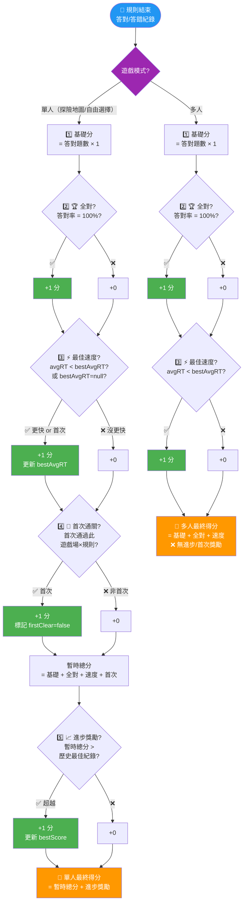

### 📌 關鍵設計點

- **🟣 模式分支**：入口即區分單人（4 種獎勵）vs 多人（2 種獎勵）🆕v4.3
- **計算順序很重要**：進步獎勵最後判定，避免循環
- **首次遊玩 bestAvgRT=null → 自動 +1**：邊界條件已處理
- **多人模式簡化**：僅保留全對 + 最佳速度，無進步/首次（成績不記錄歷史）
- **每項各 +1**：不使用乘法加權，簡單明確

---

## Flow-12: WM 計分系統流程

> **說明**：WM 測驗的完整計分流程，含順向/逆向不同公式。  
> **對應章節**：§3.4 工作記憶計分系統

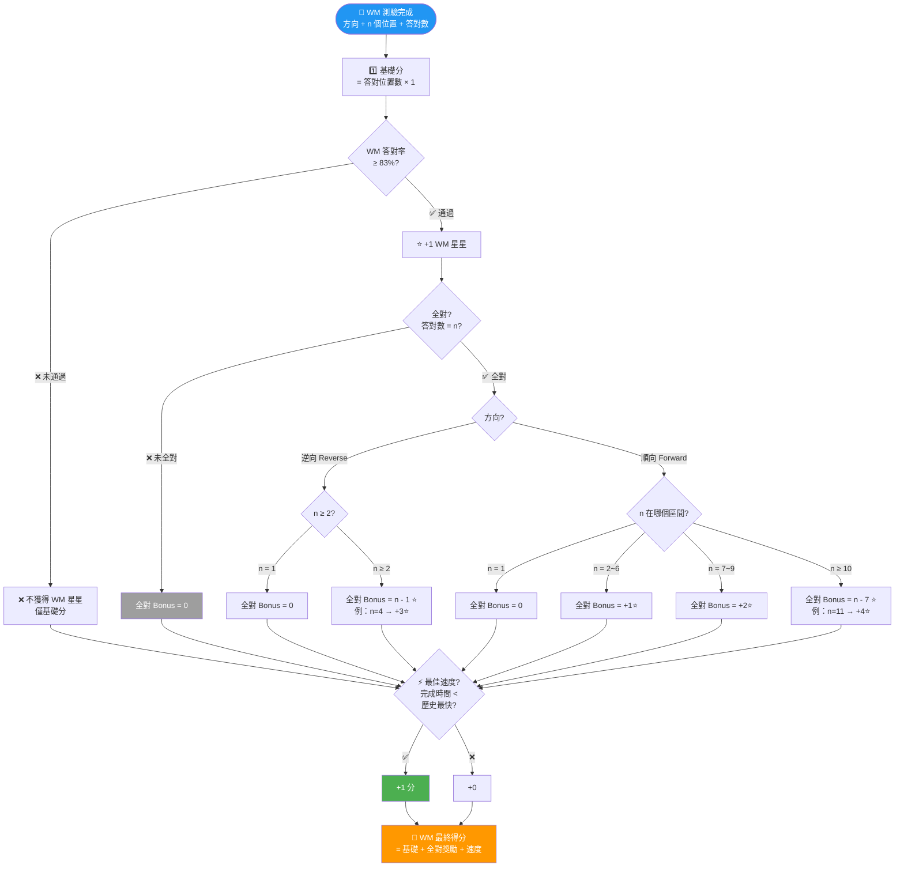

### 📌 關鍵設計點

- **WM 通過門檻 ≥83%**：答對率 ≥83% → +1⭐ WM 星星 🆕v4.3
- **全對才有 Bonus⭐**：通過後若全對 → 額外 Bonus 星星（依公式）
- **逆向獎勵更高**：逆向 n=4 全對 → +3⭐；順向 n=4 全對 → +1⭐
- **無時間限制**：但系統記錄完成時間，用於速度獎勵比較

---

## Flow-13: WM 測驗遊戲流程

> **說明**：WM 測驗從系統展示到玩家作答的完整互動流程。  
> **對應章節**：§3.4 遊戲機制、WM 顯示介面

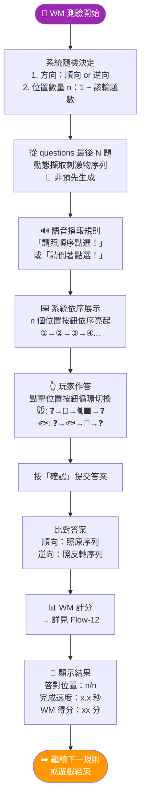

### 📌 關鍵設計點

- **動態擷取序列**：WM 序列由該規則 questions 最後 N 題擷取（方案 C）
- **Toggle 按鈕**：點擊循環 ❓→刺激物A→刺激物B→❓
- **無時間限制**：不限作答時間，但記錄完成速度
- **支援觸控**：所有位置按鈕支援觸控點擊

---

## Flow-14: 題目生成流程

> **說明**：系統生成題目序列的完整邏輯。  
> **對應章節**：§2.4 題目生成流程

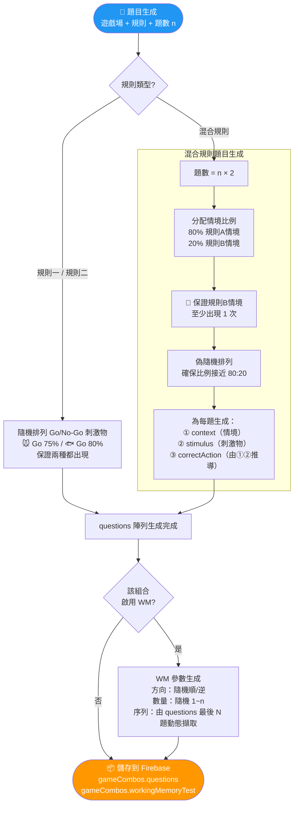

### 📌 關鍵設計點

- **混合規則雙層結構**：每題同時包含 context（情境）+ stimulus（刺激物）
- **80:20 偽隨機**：保證比例接近且規則二至少出現 1 次
- **Go 比例**：🐭 小老鼠 Go:No-Go = 75:25、🐟 釣魚 Go:No-Go = 80:20 🆕
- **混合規則刺激物比例**：每個情境內沿用遊戲場 Go:No-Go 比例（🐭 75:25 / 🐟 80:20）🆕v4.3
- **WM 序列動態擷取**：不預先生成序列，由答題紀錄的最後 N 題提取

---

## Flow-15: 刺激物語音性別判定流程

> **說明**：刺激物出現時決定播放男聲或女聲。  
> **對應章節**：§4.2.1 刺激物語音系統

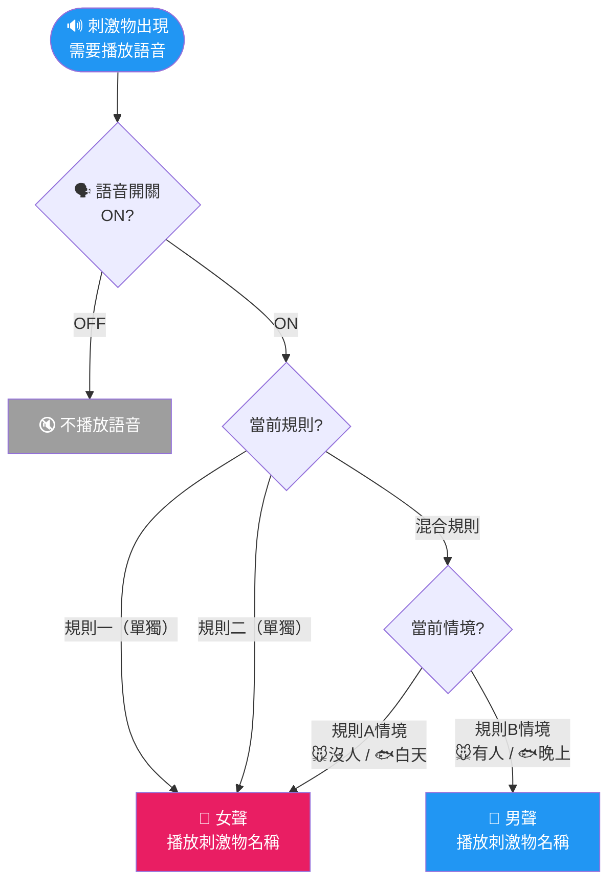

### 📌 關鍵設計點

- **聲音性別 = 規則提示**：混合規則中，男/女聲幫助孩子辨識當前套用的規則（A or B）
- **規則一/二單獨時統一女聲**：因為不需要聲音區分
- **語音開關獨立**：關閉語音不影響遊戲可玩性

---

# C. 資料流程（Data Flows）

---

## Flow-16: 資料儲存層次與同步流程

> **說明**：4 層儲存架構的讀寫流向。  
> **對應章節**：§5.3 資料儲存層次

```mermaid
flowchart LR
    subgraph 前端["🖥️ 前端（瀏覽器）"]
        UI[遊戲介面]
    end

    subgraph L1["Layer 1：localStorage（離線優先）"]
        PROFILE[playerProfile<br/>暱稱/星星/等級/徽章/設定]
        PROGRESS[adventureProgress<br/>解鎖/分數/bestRT/星星]
        CLASS_DATA[classData<br/>班級排行榜]
    end

    subgraph L2["Layer 2：Realtime Database（即時）"]
        ROOMS[rooms/{code}<br/>房間資料/玩家/成績]
        NOTE_L2[⏰ 房主離開 / 關閉分頁即清空刪除]
    end

    subgraph L3["Layer 3：Firestore（選擇性）"]
        GLOBAL_LB[全球排行榜<br/>使用者主動上傳]
    end

    subgraph L4["Layer 4：Firebase Storage"]
        CUSTOM[自訂音效/刺激物 SVG 檔<br/>研究者上傳（僅限 SVG）]
    end

    UI -->|單人成績/設定/進度| PROFILE
    UI -->|單人成績/設定/進度| PROGRESS
    UI -->|班級榜| CLASS_DATA
    UI <-->|多人即時同步| ROOMS
    UI -->|開啟上傳開關| GLOBAL_LB
    UI <--|載入自訂包| CUSTOM

    style L1 fill:#E3F2FD
    style L2 fill:#FFF3E0
    style L3 fill:#E8F5E9
    style L4 fill:#F3E5F5
```

### 📌 關鍵設計點

- **localStorage 優先**：單人模式完全離線可玩
- **RTDB 只給多人**：多人成績不寫入個人紀錄，房主離開 / 關閉分頁即清空刪除
- **Firestore 可選**：排行榜上傳需使用者主動開啟
- **4 層互不依賴**：任一層故障不影響其他層

---

## Flow-17: 多人模式 Firebase 即時同步流程

> **說明**：多人遊戲中前端與 Realtime Database 的資料同步時機。  
> **對應章節**：§2.11 Firebase 資料結構

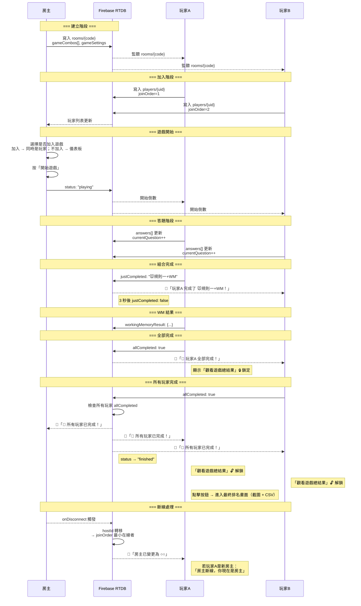

### 📌 關鍵設計點

- **onDisconnect 預設**：房主連上時即設定斷線後的轉移邏輯
- **房主可選擇不加入遊戲**：不加入則進入儀表板模式，即時查看所有玩家狀態 🆕v4.3
- **justCompleted 通知**：完成組合時設為具體組合名 → 3 秒後 false；allCompleted 用於全部完成通知
- **全員完成 broadcast**：當所有玩家 allCompleted: true → 廣播「🎉 所有玩家已完成！」+ status → "finished" + 解鎖「觀看遊戲總結果」按鈕 🆕v4.3
- **房主變更通知區分**：新房主收到「房主斷線，你現在是房主」；其他玩家收到「房主已變更為 ○○」 🆕v4.3
- **各自節奏**：answers[] 各自寫入，不需等待同步

---

## Flow-18: 成績輸出流程（截圖＋CSV）

> **說明**：遊戲結束後的成績匯出流程。  
> **對應章節**：§2.10 成績處理、§5.4b 單人 CSV

```mermaid
flowchart TB
    GAME_END([🎉 遊戲結束]) --> MODE{遊戲模式?}

    MODE -->|👥 多人| MP_OUT
    MODE -->|📱 單人| SP_OUT

    subgraph MP_OUT["👥 多人輸出"]
        MP_SCREEN[📸 截圖<br/>html2canvas → PNG<br/>內容：排名+分數+星星]
        MP_CSV[📊 CSV<br/>UTF-8 BOM<br/>欄位：排名/暱稱/總分/<br/>各組合分/WM分/獎勵/avgRT]
    end

    subgraph SP_OUT["📱 單人輸出"]
        SP_CSV[📊 CSV（14 欄摘要 + 11 欄逐題）<br/>UTF-8 BOM<br/>欄位：試驗序號/規則/刺激物/<br/>正確反應/實際反應/正確性/<br/>RT(ms)/結果/遊戲場/情境/時間戳]
        SP_RESULT[結果類型：<br/>Hit / CR / Miss / FA]
    end

    MP_SCREEN --> DOWNLOAD[💾 下載檔案]
    MP_CSV --> DOWNLOAD
    SP_CSV --> DOWNLOAD

    DOWNLOAD --> HOME([🏠 回首頁 / 重新挑戰])

    style GAME_END fill:#4CAF50,color:#fff
    style DOWNLOAD fill:#FF9800,color:#fff
```

### 📌 關鍵設計點

- **UTF-8 BOM**：確保 Excel 能正確開啟中文
- **單人 11 欄**：每個試驗一行，詳細記錄 RT 和結果類型
- **多人匯總**：按玩家匯總，各組合分數分開欄位

---

## Flow-19: 排行榜雙軌制資料流

> **說明**：本地班級榜 vs 全球榜的資料流動。  
> **對應章節**：§3.6 排行榜系統

```mermaid
flowchart TB
    SCORE([📊 遊戲結算]) --> LOCAL[📥 寫入 localStorage<br/>classData 班級排行榜]

    LOCAL --> UPLOAD_CHECK{全球排行榜<br/>上傳開關 ON?}

    UPLOAD_CHECK -->|OFF| LOCAL_ONLY[僅本地<br/>教師可匯出 JSON/CSV]
    UPLOAD_CHECK -->|ON| FIRESTORE[📤 上傳 Firestore<br/>僅暱稱 + 分數<br/>不含個人資料]

    FIRESTORE --> GLOBAL_VIEW[🌐 全球排行榜<br/>所有人可見]

    LOCAL --> LOCAL_VIEW[📊 班級排行榜<br/>僅本機可見]

    subgraph 教師功能["👨‍🏫 教師功能"]
        LOCAL_VIEW --> EXPORT[📤 匯出 JSON/CSV]
        IMPORT[📥 匯入 JSON] --> LOCAL_VIEW
    end

    style SCORE fill:#4CAF50,color:#fff
    style GLOBAL_VIEW fill:#2196F3,color:#fff
    style LOCAL_VIEW fill:#FF9800,color:#fff
```

### 📌 關鍵設計點

- **預設不上傳**：全球榜需使用者主動開啟
- **隱私保護**：上傳僅暱稱+分數，不含真實身份
- **教師匯出入**：班級資料支援 JSON/CSV 匯出與匯入還原

---

## Flow-20: Fallback 降級機制流程

> **說明**：音效/圖檔/網路缺失時的降級處理。  
> **對應章節**：§5.4c Fallback

```mermaid
flowchart TB
    LOAD([📦 載入資源]) --> TYPE{資源類型?}

    TYPE -->|🔊 音效| SFX_CHECK{自訂音效<br/>檔案存在?}
    TYPE -->|🖼️ 刺激物圖| IMG_CHECK{SVG 檔案<br/>存在?}
    TYPE -->|🌐 網路| NET_CHECK{網路連線?}

    %% 音效 Fallback
    SFX_CHECK -->|✅| SFX_OK[播放自訂音效]
    SFX_CHECK -->|❌| SFX_DEFAULT{預設音效<br/>存在?}
    SFX_DEFAULT -->|✅| SFX_FALLBACK[播放預設音效]
    SFX_DEFAULT -->|❌ 404| SFX_SILENT[🔇 靜默跳過<br/>console.warn 記錄<br/>不彈錯誤訊息]

    %% 圖檔 Fallback
    IMG_CHECK -->|✅| IMG_OK[顯示 SVG]
    IMG_CHECK -->|❌| IMG_EMOJI[顯示 Emoji 替代<br/>🧀😺🐟🦈]

    %% 網路 Fallback
    NET_CHECK -->|✅ 在線| NET_OK[正常運作]
    NET_CHECK -->|❌ 離線| NET_MODE{遊戲模式?}
    NET_MODE -->|📱 單人| OFFLINE_OK[✅ 完全離線可玩<br/>localStorage 運作]
    NET_MODE -->|👥 多人等待中| NET_WARN[⚠️ 顯示連線提示]
    NET_MODE -->|👥 多人遊戲中| NET_RETRY{嘗試重連}
    NET_RETRY -->|< 30s| NET_RECONNECT[🔄 自動重連]
    NET_RETRY -->|≥ 30s| NET_EXIT[視為退出<br/>結算成績]

    style LOAD fill:#2196F3,color:#fff
    style SFX_SILENT fill:#9E9E9E,color:#fff
    style IMG_EMOJI fill:#FFC107,color:#333
    style OFFLINE_OK fill:#4CAF50,color:#fff
    style NET_EXIT fill:#F44336,color:#fff
```

### 📌 關鍵設計點

- **三級降級**：自訂包 → 預設包 → 靜默/Emoji
- **不打擾使用者**：降級時只 console.warn，不彈錯誤框
- **單人離線無憂**：完全靠 localStorage，無需網路

---

# D. 狀態機（State Machines）

---

## Flow-21: 關卡解鎖狀態機

> **說明**：探險地圖 12 個探險點的逐步解鎖狀態機。  
> **對應章節**：§3.9 關卡解鎖系統 🆕v4.3

```mermaid
stateDiagram-v2
    [*] --> 地圖1_探險點1

    state 地圖1_小老鼠冒險 {
        地圖1_探險點1: ① 🐭R1 🟡（初始可玩）
        地圖1_探險點2: ② 🐭R1+WM 🔒
        地圖1_探險點3: ③ 🐭R2 🔒
        地圖1_探險點4: ④ 🐭R2+WM 🔒
        地圖1_探險點5: ⑤ 🐭混合 🔒
        地圖1_探險點6: ⑥ 🐭混合+WM 🔒

        地圖1_探險點1 --> 地圖1_探險點2: ①通過\n規則≥83%
        地圖1_探險點2 --> 地圖1_探險點3: ②通過\n規則≥83% AND WM≥83%
        地圖1_探險點3 --> 地圖1_探險點4: ③通過\n規則≥83%
        地圖1_探險點4 --> 地圖1_探險點5: ④通過\n規則≥83% AND WM≥83%
        地圖1_探險點5 --> 地圖1_探險點6: ⑤通過\n規則≥83%
    }

    地圖1_探險點6 --> 地圖2_探險點1: ⑥通過\n規則≥83% AND WM≥83%\n🎉 地圖 1 完成！

    state 地圖2_釣魚冒險 {
        地圖2_探險點1: ⑦ 🐟R1 🟡
        地圖2_探險點2: ⑧ 🐟R1+WM 🔒
        地圖2_探險點3: ⑨ 🐟R2 🔒
        地圖2_探險點4: ⑩ 🐟R2+WM 🔒
        地圖2_探險點5: ⑪ 🐟混合 🔒
        地圖2_探險點6: ⑫ 🐟混合+WM 🔒

        地圖2_探險點1 --> 地圖2_探險點2: ⑦通過\n規則≥83%
        地圖2_探險點2 --> 地圖2_探險點3: ⑧通過\n規則≥83% AND WM≥83%
        地圖2_探險點3 --> 地圖2_探險點4: ⑨通過\n規則≥83%
        地圖2_探險點4 --> 地圖2_探險點5: ⑩通過\n規則≥83% AND WM≥83%
        地圖2_探險點5 --> 地圖2_探險點6: ⑪通過\n規則≥83%
    }

    地圖2_探險點6 --> 自由選擇: ⑫通過\n規則≥83% AND WM≥83%\n🎉🎉 全部通關！

    自由選擇: 🆓 自由選擇 解鎖！\n= 多人房主同等自由度

    note right of 地圖1_小老鼠冒險
        探險點 3 狀態：
        ⬜ 未解鎖（灰色+🔒）
        🟡 當前可玩（發光）
        ⭐ 已通過（顯示星星）
        已通過可重玩，星星無限累計
    end note

    note right of 地圖2_釣魚冒險
        通過條件：
        純規則點（奇數）：規則 ≥83%
        規則+WM 點（偶數）：兩者皆 ≥83%
        教師覆寫：?unlock=all
    end note
```

### 📌 關鍵設計點

- **唯一解鎖路徑**：探險地圖 → 逐步解鎖（取消雙路線） 🆕v4.3
- **12 個探險點**：2 地圖 × 6 點 = ①~⑫，強制依序
- **通過條件**：純規則≥83%；規則+WM 兩者皆≥83% 🆕v4.3
- **跨 session 保存**：進度存 localStorage，今天玩到③，明天繼續④
- **已通過可重玩**：星星無限累計，不影響解鎖進度
- **教師覆寫**：`?unlock=all` 跳過所有鎖定
- **Config 可調**：ADVENTURE_MAPS 陣列可彈性調整探險點排列
- **不再有 UNLOCK_START_MODE**：已取消雙路線切換 🆕v4.3

---

## Flow-22: 星星與等級狀態機

> **說明**：星星累積 → 等級升級的狀態轉換。  
> **對應章節**：§3.8 等級系統

```mermaid
stateDiagram-v2
    [*] --> 蛋寶寶

    蛋寶寶: 🥚 蛋寶寶\n0-10 ⭐
    破殼雞: 🐣 破殼雞\n11-20 ⭐
    小雞仔: 🐥 小雞仔\n21-40 ⭐
    雞大王: 🐓 雞大王\n41-60 ⭐
    金鷹王者: 🦅 金鷹王者\n61+ ⭐

    蛋寶寶 --> 破殼雞: 累積 11 ⭐\n🔊 語音播報升級
    破殼雞 --> 小雞仔: 累積 21 ⭐\n🔊 語音播報升級
    小雞仔 --> 雞大王: 累積 41 ⭐\n🔊 語音播報升級
    雞大王 --> 金鷹王者: 累積 61 ⭐\n🔊 語音播報升級

    note right of 蛋寶寶
        星星來源（探險地圖 🆕v4.3）：
        ✅ 規則通過 ≥83% → +1⭐（每次重玩都累計）
        ✅ WM 通過 ≥83% → +1⭐（每次重玩都累計）
        ✅ WM 全對 Bonus → 額外⭐（依公式）
        單次探險點最多：1⭐規則 + 1⭐WM + Bonus⭐
        累積無上限
    end note
```

### 📌 關鍵設計點

- **星星可重複**：同探險點重複通過每次都累計⭐
- **WM 通過門檻 ≥83%**：WM ≥83% → +1⭐；全對另有 Bonus⭐ 🆕v4.3
- **WM Bonus 公式**：逆向 n≥2 → +(n-1)⭐；順向 2-6 → +1⭐，7-9 → +2⭐，n≥10 → +(n-7)⭐
- **等級只升不降**：星星只增不減
- **升級語音**：升級時語音播報新等級名稱

---

## Flow-23: 徽章判定狀態機

> **說明**：18 個徽章的觸發條件決策樹。  
> **對應章節**：§3.7 徽章系統

```mermaid
flowchart TB
    TRIGGER([🎯 遊戲結算<br/>觸發徽章判定]) --> B_GROUP{徽章類別}

    B_GROUP --> BASIC
    B_GROUP --> ADVANCED
    B_GROUP --> SPECIAL

    subgraph BASIC["🏅 基礎徽章（5 個）"]
        B1{🐭 小老鼠<br/>3 規則都 ≥83%?}
        B1 -->|✅| B1_Y[🐭🏆 小老鼠冒險家]
        B2{🐟 釣魚<br/>3 規則都 ≥83%?}
        B2 -->|✅| B2_Y[🐟🏆 釣魚大冒險家]
        B3{任一遊戲場<br/>規則二 ≥83%?}
        B3 -->|✅| B3_Y[🔄⭐ 規則轉換大師]
        B4{任一遊戲場<br/>混合 ≥83%?}
        B4 -->|✅| B4_Y[🎯✨ 混合高手]
        B5{WM 完成<br/>≥ 5 次?}
        B5 -->|✅| B5_Y[🧠💫 記憶達人]
    end

    subgraph ADVANCED["🥇 進階徽章（5 個）"]
        A1{avgRT < 2 秒?}
        A1 -->|✅| A1_Y[⚡👑 速度之王]
        A2{任一規則<br/>100% 答對?}
        A2 -->|✅| A2_Y[💯🏅 完美主義者]
        A3{總分 ><br/>歷史最佳?}
        A3 -->|✅| A3_Y[📈🚀 進步之星]
        A4{WM 任一次<br/>全對?}
        A4 -->|✅| A4_Y[🧠⭐ 記憶之星]
        A5{所有遊戲場<br/>所有規則 ≥83%?}
        A5 -->|✅| A5_Y[🏅🎊 全制霸]
    end

    subgraph SPECIAL["🏅 特殊徽章（8 個）"]
        H2{已獲得<br/>≥ 7 不同徽章?}
        H2 -->|✅| H2_Y[🌟🌈 七彩收藏家]
        H3{未達標 → 重試<br/>→ 達標 ≥83%<br/>同 session?}
        H3 -->|✅| H3_Y[🦸‍♂️⚔️ 不屈勇士]
        H4{時間 < 8:00?}
        H4 -->|✅| H4_Y[🌅☀️ 早起鳥兒]
        H4b{時間 ≥ 22:00<br/>OR < 8:00?}
        H4b -->|✅| H4b_Y[🌙💪 懸梁刺骨]
        H5{累積遊玩<br/>≥ 10 次?}
        H5 -->|✅| H5_Y[🎮🕹️ 遊戲達人]
        S1{集滿基礎<br/>5 個?}
        S1 -->|✅| S1_Y[🏅🔰 徽章強者]
        S2{集滿進階<br/>5 個?}
        S2 -->|✅| S2_Y[🏅🎖️ 徽章專家]
        S3{集滿基礎+進階<br/>+不屈勇士+早起鳥兒<br/>+懸梁刺骨+遊戲達人?}
        S3 -->|✅| S3_Y[🏅👑 徽章職人大師]
    end

    style TRIGGER fill:#2196F3,color:#fff
```

### 📌 關鍵設計點

- **3 類 18 個**：基礎 5 + 進階 5 + 特殊 8
- **獲得時語音播報**：「獲得小老鼠冒險家！」
- **不屈勇士**：未通過（<83%）→ 同 session 重試 → 通過（≥83%）即觸發
- **特殊徽章含提示**：部分特殊徽章有提示文字引導但不明示條件
- **懸梁刺骨**：晚上 22:00 ～ 早上 8:00 之間遊玩即觸發
- **集滿類徽章**：徽章強者（集滿基礎）、徽章專家（集滿進階）、徽章職人大師（集滿全部指定徽章）

---

## Flow-24: 多人房間狀態機

> **說明**：房間的生命週期狀態轉換。  
> **對應章節**：§2.11 Firebase 資料結構 status 欄位

```mermaid
stateDiagram-v2
    [*] --> waiting: 房主建立房間

    waiting: 📋 waiting\n等待中（玩家可加入）
    playing: 🎮 playing\n遊戲進行中
    finished: 🏆 finished\n遊戲結束

    waiting --> playing: 房主按「開始遊戲」
    playing --> finished: 所有玩家完成所有組合

    finished --> [*]: 房主離開 / 關閉分頁\n即清空刪除房間資料

    note right of waiting
        等待中可以：
        ✅ 玩家加入/離開
        ✅ 分享邀請碼
        ✅ 房主選擇是否加入遊戲
    end note

    note right of playing
        遊戲中：
        ✅ 各自答題
        ✅ 斷線→退出或轉移
        ❌ 不可暫停
    end note

    note right of finished
        遊戲結束：
        ✅ 廣播「所有玩家已完成」
        ✅ 「觀看遊戲總結果」按鈕解鎖
        ✅ 截圖 / CSV 匯出
        ✅ 房主變更不影響結果畫面
    end note
```

### 📌 關鍵設計點

- **3 個狀態**：waiting → playing → finished
- **playing → finished 觸發**：所有玩家的 allCompleted 都為 true → 廣播「🎉 所有玩家已完成！」→ 解鎖「觀看遊戲總結果」按鈕 🆕v4.3
- **房主可選擇是否加入遊戲**：不加入則顯示即時狀態儀表板 🆕v4.3
- **房主變更通知**：新房主「房主斷線，你現在是房主」；其他玩家「房主已變更為 ○○」 🆕v4.3
- **房主離開即清**：房主離開遊戲 / 關閉分頁即刪除 RTDB 資料（onDisconnect + beforeunload）
- **不可逆**：進入 playing 後不可回到 waiting

---

## Flow-25: 單一組合（Combo）玩家狀態機

> **說明**：多人模式中每位玩家在一個組合內的狀態進展。  
> **對應章節**：§2.11 comboStatus

```mermaid
stateDiagram-v2
    [*] --> 未開始

    未開始: 📋 未開始\nstarted: false
    答題中: ✏️ 答題中\ncurrentQuestion++
    答題完成: ✅ 答題完成
    WM測驗中: 🧠 WM 測驗中
    WM完成: 🧠 WM 完成
    組合完成: 🎉 組合完成\njustCompleted: "組合名"
    等待中: ⏳ 等待其他玩家

    未開始 --> 答題中: 玩家按「開始」\n→ 各自倒數
    答題中 --> 答題中: 答完一題\ncurrentQuestion++
    答題中 --> 答題完成: 所有題目答完

    答題完成 --> WM測驗中: 本組合有 WM
    答題完成 --> 組合完成: 本組合無 WM

    WM測驗中 --> WM完成: 提交 WM 答案
    WM完成 --> 組合完成: WM 計分完成

    組合完成 --> 等待中: 3 秒後\njustCompleted → false
    等待中 --> [*]: 所有玩家完成\n→ 進入下一組合
```

### 📌 關鍵設計點

- **justCompleted 通知**：完成時設為具體組合名（如 "🐭規則一+WM"）觸發通知，3 秒後設 false
- **allCompleted 通知**：全部組合完成時設 true，額外觸發「🎉 全部完成！」
- **WM 可選**：視組合設定決定是否進入 WM
- **各自節奏**：每人獨立推進，完成後等待他人

---

# E. 決策流程（Decision Flows）

---

## Flow-26: 通過／失敗判定與後續處理流程

> **說明**：探險地圖探險點完成後的通過判定 + 連鎖效果。  
> **對應章節**：§3.8–§3.9 星星/解鎖系統 🆕v4.3

```mermaid
flowchart TB
    FINISH([📝 規則完成<br/>答對率計算完畢]) --> PASS{答對率<br/>≥ 83%<br/>（≈5/6 題）?}

    PASS -->|✅ 通過| SUCCESS
    PASS -->|❌ 未通過| FAIL

    subgraph SUCCESS["✅ 通過效果"]
        S1[⭐ +1 星星（規則）]
        S2[📊 計入探險地圖<br/>通過進度]
        S3[🔊 語音播報通過]
        S5{首次通過?}
        S5 -->|是| S5_Y[🌟 首次通關 +1 分<br/>標記 firstClear=false]
        S5 -->|否| S5_N[無額外]
        S6[🏅 觸發徽章判定<br/>→ 詳見 Flow-23]
        S7[📊 更新 localStorage<br/>bestScore / starsEarned]
    end

    subgraph FAIL["❌ 未通過效果"]
        F1[❌ 不得星星]
        F2[❌ 不計入通過進度]
        F3[可重新遊玩]
        F4{同 session<br/>重試後通過?}
        F4 -->|是| F4_Y[🦸‍♂️ 不屈勇士徽章<br/>→ 詳見 Flow-27]
    end

    SUCCESS --> WM_CHECK
    FAIL --> WM_CHECK

    WM_CHECK{本探險點<br/>含 WM?}
    WM_CHECK -->|有 WM| WM[🧠 WM 測驗<br/>→ 詳見 Flow-13]
    WM_CHECK -->|無 WM| UNLOCK_CHECK

    WM --> WM_PASS{WM ≥83%?}
    WM_PASS -->|✅| WM_STAR[⭐ +1 WM 星星<br/>+ 全對 Bonus ⭐]
    WM_PASS -->|❌| WM_NO[僅基礎分<br/>❌ 無 WM 星星]

    WM_STAR --> UNLOCK_CHECK
    WM_NO --> UNLOCK_CHECK

    UNLOCK_CHECK{探險點通過判定}
    UNLOCK_CHECK -->|純規則：規則≥83%| UNLOCK[🔓 解鎖下一探險點]
    UNLOCK_CHECK -->|規則+WM：兩者皆≥83%| UNLOCK
    UNLOCK_CHECK -->|任一未達標| NO_UNLOCK[❌ 未解鎖<br/>可重玩此探險點]

    UNLOCK --> MAP_CHECK{最後一點?}
    MAP_CHECK -->|地圖1第6點| MAP2_UNLOCK[🎉 解鎖地圖 2]
    MAP_CHECK -->|地圖2第6點| FREE_UNLOCK[🎉🎉 解鎖自由選擇！<br/>慶祝動畫]
    MAP_CHECK -->|其他| NEXT[➡️ 回到探險地圖]

    NO_UNLOCK --> NEXT
    MAP2_UNLOCK --> NEXT
    FREE_UNLOCK --> NEXT

    style FINISH fill:#2196F3,color:#fff
    style SUCCESS fill:#E8F5E9
    style FAIL fill:#FFEBEE
    style FREE_UNLOCK fill:#FFD700,color:#333
```

### 📌 關鍵設計點

- **通過 = 得星**：規則≥83% 獲得 1⭐
- **WM 通過門檻 ≥83%**：WM ≥83% → +1⭐ + 全對 Bonus⭐ 🆕v4.3
- **探險點通過判定**：純規則只看規則；規則+WM 兩者皆需≥83% 🆕v4.3
- **解鎖連鎖**：通過→解鎖下一探險點→地圖完成→解鎖下一地圖→全通關→解鎖自由選擇
- **不屈勇士**：未通過 → 同 session 重試 → 通過 → 觸發特殊徽章
- **WM 星星獨立**：規則未通過仍可嘗試 WM（但探險點不算通過）

---

## Flow-27: 不屈勇士徽章觸發流程

> **說明**：特殊徽章「不屈勇士」的精確觸發條件。  
> **對應章節**：§3.7 特殊徽章

```mermaid
flowchart TB
    FINISH([📝 規則結束]) --> ACC{答對率?}

    ACC -->|≥ 83%| NO_TRIGGER[不觸發<br/>（本身就達標了）]
    ACC -->|< 83%| UNDER[📌 標記為「未達標」<br/>記錄 session ID]

    UNDER --> ACTION{玩家動作?}
    ACTION -->|🏠 離開網站| CANCEL[❌ 重置標記<br/>離開不算重試]
    ACTION -->|🔄 按「重新挑戰」| RETRY[🔄 開始重試<br/>同一 session]

    RETRY --> RETRY_FINISH[📝 重試完成]
    RETRY_FINISH --> RETRY_ACC{重試答對率?}

    RETRY_ACC -->|≥ 83%| BADGE[🦸‍♂️⚔️ 獲得「不屈勇士」！<br/>🔊 語音播報徽章名稱]
    RETRY_ACC -->|< 83%| NO_BADGE[❌ 未達標<br/>可再次重試]

    NO_BADGE --> ACTION

    style FINISH fill:#2196F3,color:#fff
    style BADGE fill:#FFD700,color:#333
    style CANCEL fill:#9E9E9E,color:#fff
```

### 📌 關鍵設計點

- **83% 門檻**（≈5/6）：與系統級通過門檻一致，即「失敗後重試並通過」
- **同 session 限定**：離開網站後重置，不算「立刻重試」
- **可多次嘗試**：未達標可持續重試直到達標
- **用「達標/未達標」**：避免與系統「通過/失敗」混淆

---

## Flow-28: 反應時間（RT）計算流程

> **說明**：各種情境下 RT 的計算規則與 avgRT 判定。  
> **對應章節**：§3.1b 反應時間計算方式

```mermaid
flowchart TB
    TRIAL([⏱️ 試驗完成]) --> TYPE{試題類型 +<br/>玩家反應}

    TYPE -->|Go 題 + 按了 ✅| HIT_RT[RT = 按鍵時間 - 出現時間<br/>✅ 計入 avgRT]
    TYPE -->|Go 題 + 沒按 ❌| MISS_RT[RT = 0<br/>Omission Error<br/>❌ 不計入 avgRT]
    TYPE -->|No-Go 題 + 沒按 ✅| CR_RT[RT = 0<br/>Correct Rejection<br/>❌ 不計入 avgRT]
    TYPE -->|No-Go 題 + 按了 ❌| FA_RT[RT = 按鍵時間<br/>False Alarm<br/>❌ 不計入 avgRT]

    HIT_RT --> COLLECT[收集所有 Hit 的 RT]
    MISS_RT --> SKIP[排除]
    CR_RT --> SKIP
    FA_RT --> SKIP

    COLLECT --> AVG[計算 avgRT<br/>= 所有 Hit RT 的平均值]

    AVG --> COMPARE{與歷史比較}
    COMPARE --> BEST_CHECK{bestAvgRT<br/>= null?}
    BEST_CHECK -->|null（首次）| AUTO_AWARD[✅ 自動獲得速度 +1<br/>設 bestAvgRT = 當前 avgRT]
    BEST_CHECK -->|有紀錄| FASTER{avgRT <<br/>bestAvgRT?}
    FASTER -->|✅ 更快| SPEED_AWARD[✅ 速度獎勵 +1<br/>更新 bestAvgRT]
    FASTER -->|❌ 沒更快| NO_AWARD[❌ 無速度獎勵]

    style TRIAL fill:#2196F3,color:#fff
    style HIT_RT fill:#4CAF50,color:#fff
    style MISS_RT fill:#F44336,color:#fff
    style CR_RT fill:#4CAF50,color:#fff
    style FA_RT fill:#F44336,color:#fff
    style AUTO_AWARD fill:#FFD700,color:#333
    style SPEED_AWARD fill:#FFD700,color:#333
```

### 📌 關鍵設計點

- **只計 Hit**：avgRT 只包含 Go 正確按鍵的反應時間
- **首次自動 +1**：bestAvgRT=null 時直接獲得速度獎勵
- **No-Go 不計 RT**：抑制反應無法測量反應時間

---

## Flow-29: 聲音系統播放決策流程

> **說明**：遊戲事件觸發聲音時的開關判定與 fallback。  
> **對應章節**：§4.2–§4.3 聲音分類與控制

```mermaid
flowchart TB
    EVENT([🎯 遊戲事件觸發]) --> CLASSIFY{事件分類}

    CLASSIFY -->|音效類| SFX_CHECK{🔊 音效開關<br/>ON?}
    CLASSIFY -->|語音類| VOICE_CHECK{🗣️ 語音開關<br/>ON?}

    SFX_CHECK -->|OFF| SILENT_SFX[🔇 不播放]
    SFX_CHECK -->|ON| SFX_PLAY

    VOICE_CHECK -->|OFF| SILENT_VOICE[🔇 不播放]
    VOICE_CHECK -->|ON| VOICE_PLAY

    subgraph SFX_PLAY["🔊 音效播放"]
        SFX_LIST[音效事件：<br/>✅ 答對叮 / 答錯噗<br/>✅ 倒數嗶<br/>✅ WM 位置亮起<br/>✅ 按鈕點擊<br/>✅ 玩家加入通知<br/>✅ 徽章解鎖<br/>✅ 等級升級]
    end

    subgraph VOICE_PLAY["🗣️ 語音播放"]
        VOICE_LIST[語音事件：<br/>✅ 規則說明語音<br/>✅ 刺激物語音（男/女聲）<br/>✅ 徽章名稱播報<br/>✅ 等級名稱播報<br/>✅ 解鎖通知播報<br/>✅ WM 規則播報]
    end

    SFX_LIST --> FALLBACK
    VOICE_LIST --> FALLBACK

    subgraph FALLBACK["🔄 Fallback 機制"]
        FB1{自訂音效<br/>存在?}
        FB1 -->|✅| FB_OK[播放自訂]
        FB1 -->|❌| FB2{預設音效<br/>存在?}
        FB2 -->|✅| FB_DEFAULT[播放預設]
        FB2 -->|❌| FB_SKIP[靜默跳過<br/>console.warn]
    end

    style EVENT fill:#2196F3,color:#fff
    style SILENT_SFX fill:#9E9E9E,color:#fff
    style SILENT_VOICE fill:#9E9E9E,color:#fff
```

### 📌 關鍵設計點

- **兩個主開關**：🔊 音效 和 🗣️ 語音，各自獨立
- **無 BGM**：已取消背景音樂
- **三級 Fallback**：自訂 → 預設 → 靜默跳過
- **不彈錯誤**：缺失時只 console.warn

---

## Flow-30: 配色主題與刺激物 Config 載入流程

> **說明**：頁面載入時的主題、刺激物包、音效包選擇與 fallback。  
> **對應章節**：§4.4.5 主題切換、§4.5.4 切換流程

```mermaid
flowchart TB
    LOAD([🌐 頁面載入]) --> READ_LS[讀取 localStorage 偏好<br/>colorTheme / stimuliPack / soundPack]

    READ_LS --> THEME[1️⃣ 套用配色主題<br/>data-theme 屬性]

    THEME --> THEME_TYPE{主題類型?}
    THEME_TYPE -->|field-primary| FP[遊戲場主導配色<br/>🐭=綠色系 / 🐟=藍色系]
    THEME_TYPE -->|rule-independent| RI[規則獨立配色<br/>規則一=統一色A<br/>規則二=統一色B]

    FP --> STIMULI
    RI --> STIMULI

    STIMULI[2️⃣ 載入刺激物包<br/>currentPack]
    STIMULI --> STIM_CHECK{自訂包?}
    STIM_CHECK -->|default| STIM_DEFAULT[使用預設 SVG]
    STIM_CHECK -->|custom| STIM_CUSTOM{SVG 存在?}
    STIM_CUSTOM -->|✅| STIM_OK[使用自訂 SVG]
    STIM_CUSTOM -->|❌| STIM_EMOJI[回退 Emoji 🧀😺🐟🦈]

    STIM_DEFAULT --> SOUND
    STIM_OK --> SOUND
    STIM_EMOJI --> SOUND

    SOUND[3️⃣ 載入音效包<br/>currentSoundPack + soundOverrides]
    SOUND --> SOUND_CHECK{自訂音效?}
    SOUND_CHECK -->|default| SOUND_DEFAULT[使用預設音效]
    SOUND_CHECK -->|custom| SOUND_CUSTOM{檔案存在?}
    SOUND_CUSTOM -->|✅| SOUND_OK[使用自訂音效]
    SOUND_CUSTOM -->|❌| SOUND_FALLBACK[回退預設音效]

    SOUND_DEFAULT --> READY
    SOUND_OK --> READY
    SOUND_FALLBACK --> READY

    READY([✅ 初始化完成<br/>可開始遊戲])

    style LOAD fill:#2196F3,color:#fff
    style READY fill:#4CAF50,color:#fff
```

### 📌 關鍵設計點

- **3 步初始化**：主題 → 刺激物 → 音效，依序載入
- **localStorage 持久化**：偏好設定跨 session 保留
- **雙主題方案**：遊戲場主導 vs 規則獨立，使用者可切換
- **Fallback 鏈**：自訂 → 預設 → Emoji/靜默

---

## 📊 流程圖總覽統計

| 類別          |  數量  | 流程圖編號 |
| ------------- | :----: | ---------- |
| A. 使用者流程 |   8    | Flow 1-8   |
| B. 遊戲邏輯   |   7    | Flow 9-15  |
| C. 資料流程   |   5    | Flow 16-20 |
| D. 狀態機     |   5    | Flow 21-25 |
| E. 決策流程   |   5    | Flow 26-30 |
| **合計**      | **30** |            |

---

> 📌 本文件使用 Mermaid 語法，可在 GitHub、VS Code（Markdown Preview Mermaid Support 擴充套件）、或任何支援 Mermaid 的工具中直接預覽。
