<a id="top"></a>

# 📋 執行功能訓練遊戲 - 完整需求文件 v4.6

**專案名稱**：3-6歲聽障學齡前幼兒執行功能訓練遊戲  
**開發目標**：多人 Kahoot 風格 → 單人模式（優先順序）  
**部署環境**：Firebase Hosting  
**文件版本**：v4.6（2026/02/18）  
**文件作者**：小摩研究助理  
**前版差異**：Phase 5 MP 重構完成紀錄、檔案結構完整重寫（66 JS + 23 HTML）、遊戲設定範圍更新

---

> 🔀 **快速切換**：[🛠️ 開發規範與工具](開發規範與工具.md#top) · [🔝 回到目錄](#目錄)

<a id="目錄"></a>

## 📑 目錄

1. [核心設計原則](#一核心設計原則)
2. [多人模式（Kahoot 風格）](#二多人模式kahoot-風格)
3. [單人模式](#三單人模式)
4. [多感官設計（聲音、配色與刺激物系統）](#四多感官設計聲音配色與刺激物系統)
5. [技術架構](#五技術架構)
6. [檔案結構規劃](#六檔案結構規劃)
7. [開發時程](#七開發時程)
8. [關鍵設計決策總覽](#八關鍵設計決策總覽)
9. [待辦事項檢查表](#九待辦事項檢查表)
10. [文件版本紀錄](#十文件版本紀錄)
11. [附錄](#十一附錄)

---

<a id="一核心設計原則"></a>

## 一、核心設計原則

[🔝 回到目錄](#目錄) · [🛠️ 開發規範](開發規範與工具.md#top)

### 1.1 多感官設計（參考聲音設計文件）

```
✅ 視覺為主（必要），聽覺為輔（增強）
✅ 無聲音 100% 可玩，有聲音體驗更佳
✅ 「多一個感官輸入，多一個理解機會」
✅ 刺激物出現時念出名稱（多感官增強）🆕v4.1
✅ 混合規則中聲音性別 = 規則切換提示（女聲=規則A、男聲=規則B）🆕v4.1
✅ 所有聲音可自由替換（預設+自訂）🆕v4.1
✅ 關鍵時刻語音播報：WM 規則、徽章名稱、等級名稱、解鎖通知 🆕v4.1
```

[🔝 回到目錄](#目錄) · [🛠️ 開發規範](開發規範與工具.md#top)

### 1.2 目標使用者

- **年齡層**：3-6歲學齡前幼兒
- **障礙類別**：聽障學齡前幼兒
- **設計原則**：視覺優先、極簡文字、大圖示

[🔝 回到目錄](#目錄) · [🛠️ 開發規範](開發規範與工具.md#top)

### 1.3 系統流程圖索引

> 📋 共 **30 個** Mermaid 流程圖 + **3 個**路線圖，已嵌入各對應章節。以下為完整索引。

#### A. 使用者流程（User Flows）

| #   | 流程圖名稱                                               | 對應需求章節    |
| --- | -------------------------------------------------------- | --------------- |
| 1   | [系統總覽流程圖](#flow-1-系統總覽流程圖)                 | §1.3、§6        |
| 2   | [多人模式完整流程](#flow-2-多人模式完整流程)             | §2.5–§2.8       |
| 3   | [單人探險地圖模式流程](#flow-3-單人探險地圖模式流程)     | §3.2 探險地圖   |
| 4   | [單人自由選擇模式流程](#flow-4-單人自由選擇模式流程)     | §3.2 自由選擇   |
| 5   | [探險地圖單一探險點流程](#flow-5-探險地圖單一探險點流程) | §3.2 探險地圖   |
| 6   | [多人房間建立與加入流程](#flow-6-多人房間建立與加入流程) | §2.2、§2.9      |
| 7   | [暫停與退出流程](#flow-7-暫停與退出流程)                 | §3.1b 暫停/中斷 |
| 8   | [房主斷線轉移流程](#flow-8-房主斷線轉移流程)             | §2.8            |

#### B. 遊戲邏輯（Game Logic Flows）

| #   | 流程圖名稱                                                         | 對應需求章節       |
| --- | ------------------------------------------------------------------ | ------------------ |
| 9   | [單一試驗（Trial）時間軸流程](#flow-9-單一試驗（trial）時間軸流程) | §3.1b 遊戲進行時間 |
| 10  | [Go/No-Go 規則判定引擎](#flow-10-gono-go-規則判定引擎)             | §2.3 規則詳細說明  |
| 11  | [計分系統流程（單一規則）](#flow-11-計分系統流程（單一規則）)      | §3.3 計分系統      |
| 12  | [WM 計分系統流程](#flow-12-wm-計分系統流程)                        | §3.4 WM 計分       |
| 13  | [WM 測驗遊戲流程](#flow-13-wm-測驗遊戲流程)                        | §3.4 遊戲機制      |
| 14  | [題目生成流程](#flow-14-題目生成流程)                              | §2.4 題目生成      |
| 15  | [刺激物語音性別判定流程](#flow-15-刺激物語音性別判定流程)          | §4.2.1 刺激物語音  |

#### C. 資料流程（Data Flows）

| #   | 流程圖名稱                                                                | 對應需求章節            |
| --- | ------------------------------------------------------------------------- | ----------------------- |
| 16  | [資料儲存層次與同步流程](#flow-16-資料儲存層次與同步流程)                 | §5.3 資料儲存層次       |
| 17  | [多人模式 Firebase 即時同步流程](#flow-17-多人模式-firebase-即時同步流程) | §2.11 Firebase 資料結構 |
| 18  | [成績輸出流程（截圖＋CSV）](#flow-18-成績輸出流程（截圖＋csv）)           | §2.10、§5.4b            |
| 19  | [排行榜雙軌制資料流](#flow-19-排行榜雙軌制資料流)                         | §3.6 排行榜系統         |
| 20  | [Fallback 降級機制流程](#flow-20-fallback-降級機制流程)                   | §5.4c Fallback          |

#### D. 狀態機（State Machines）

| #   | 流程圖名稱                                                          | 對應需求章節      |
| --- | ------------------------------------------------------------------- | ----------------- |
| 21  | [關卡解鎖狀態機](#flow-21-關卡解鎖狀態機)                           | §3.9 關卡解鎖系統 |
| 22  | [星星與等級狀態機](#flow-22-星星與等級狀態機)                       | §3.8 等級系統     |
| 23  | [徽章判定狀態機](#flow-23-徽章判定狀態機)                           | §3.7 徽章系統     |
| 24  | [多人房間狀態機](#flow-24-多人房間狀態機)                           | §2.11 status 欄位 |
| 25  | [單一組合（Combo）玩家狀態機](#flow-25-單一組合（combo）玩家狀態機) | §2.11 comboStatus |

#### E. 決策流程（Decision Flows）

| #   | 流程圖名稱                                                                    | 對應需求章節   |
| --- | ----------------------------------------------------------------------------- | -------------- |
| 26  | [通過／失敗判定與後續處理流程](#flow-26-通過／失敗判定與後續處理流程)         | §3.8–§3.9      |
| 27  | [不屈勇士徽章觸發流程](#flow-27-不屈勇士徽章觸發流程)                         | §3.7 特殊徽章  |
| 28  | [反應時間（RT）計算流程](#flow-28-反應時間（rt）計算流程)                     | §3.1b RT 計算  |
| 29  | [聲音系統播放決策流程](#flow-29-聲音系統播放決策流程)                         | §4.2–§4.3      |
| 30  | [配色主題與刺激物 Config 載入流程](#flow-30-配色主題與刺激物-config-載入流程) | §4.4.5、§4.5.4 |

> 💡 **導航方式**：每個流程圖均嵌入在對應需求章節的末尾，可透過上方索引表快速跳轉。

<a id="flow-1-系統總覽流程圖"></a>

#### Flow-1: 系統總覽流程圖

> **說明**：從首頁入口到所有功能終點的全局導覽。  
> **對應章節**：§1.3 系統流程圖、§6 檔案結構

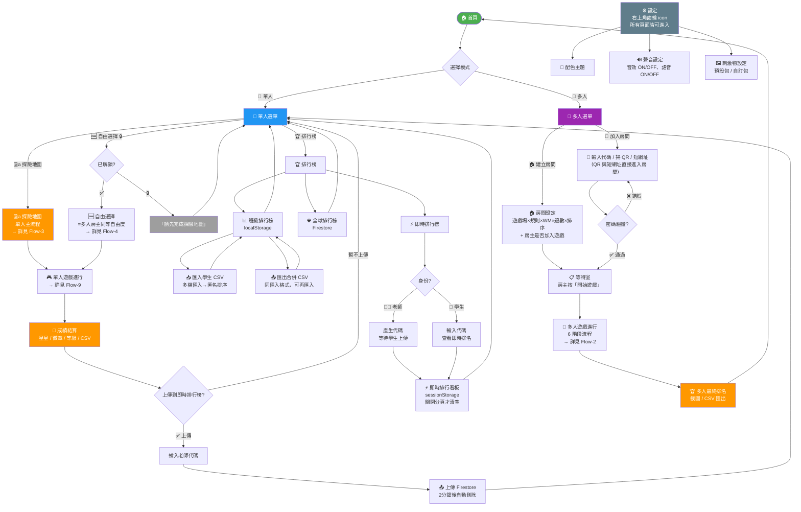

**📌 關鍵設計點**

- **首頁兩大入口**：📱 單人 / 👥 多人，簡潔分流
- **⚙️ 設定 = 全局浮動**：右上角齒輪 icon，任何頁面都能進入（不佔首頁入口）
- **單人主流程 = 探險地圖**：新手唯一入口，12 個探險點逐步解鎖 🆕v4.3
- **自由選擇 = 解鎖後開放**：探險地圖全通過後解鎖，= 多人房主同等自由度 🆕v4.3
- **遊戲場模式已取消**：由探險地圖取代 🆕v4.3
- **通過門檻**：全局 ≥83%（≈5/6 題），依文獻設定
- **排行榜三種**：📊 班級（本地）+ 🌐 全球（Firestore 逐項勾選）+ ⚡ 即時（代碼制，2分鐘生命週期）🆕v4.3
- **CSV 統一格式**：個人 CSV = 班級排行榜 CSV（第一區 14 欄摘要 + 第二區逐題明細），班級匯入只讀第一區 🆕v4.3
- **座號欄位**：學生在設定頁填寫，CSV 第一欄，班級排行榜以座號匿名顯示 🆕v4.3
- **班級排行榜**：匯入多位學生 CSV → 匿名（座號）排序，可選擇排行欄位（最多顯示 5 個）🆕v4.3
- **即時排行榜**：上傳「本次成績」（非累計），重複上傳覆蓋前一筆，看板存 sessionStorage 🆕v4.3
- **多人密碼可選**：房間可設密碼，也可開放加入
- **房主可選擇是否加入遊戲**：不加入則顯示即時狀態儀表板 🆕v4.3
- **QR Code 與短網址直接進入房間**：無須手動輸入代碼，掃描 / 點連結即進入 🔄v4.3

[🔝 回到目錄](#目錄) · [🛠️ 開發規範](開發規範與工具.md#top)

---

<a id="二多人模式kahoot-風格"></a>

## 二、多人模式（Kahoot 風格）

[🔝 回到目錄](#目錄) · [🛠️ 開發規範](開發規範與工具.md#top)

### 2.1 核心特性

| 特性         | 說明                                                                                  |
| ------------ | ------------------------------------------------------------------------------------- |
| **遊戲性質** | 同場競賽（各自節奏）                                                                  |
| **題目同步** | 題目順序一致，但進度獨立                                                              |
| **題目切換** | 答題後立即切換（0秒） ⭐                                                              |
| **即時回饋** | 在原畫面疊加綠/紅框（0.3秒動畫，800ms總延遲） ⭐                                      |
| **完成通知** | 完成整組組合時顯示具體名稱（3秒）；全員完成時廣播「所有玩家已完成」→解鎖總結果按鈕 ⭐ |
| **組合切換** | 各自按開始 → 各自倒數 → 各自開始 ⭐                                                   |
| **遊戲開始** | 僅最開始需所有玩家一起倒數 ⭐                                                         |
| **遊戲組合** | 遊戲場×規則×WM，排列組合自由選 🔄                                                     |
| **工作記憶** | 逐組勾選，附加於每個組合之後 🔄                                                       |

⭐ = v2.0 對話修正的關鍵設計  
🆕 = v3.0 新增  
🔄 = v4.0 新增/變更

[🔝 回到目錄](#目錄) · [🛠️ 開發規範](開發規範與工具.md#top)

---

### 2.2 房間系統

#### 房間代碼

```
預設：空白（房主可自行填寫）
  → 未填：按下「建立房間」後系統自動產生 5 位代碼
  → 有填：依房主填寫內容作為代碼

自動產生規則：
  長度：5 位字元
  格式：英文字母 + 數字（排除 I/O/0/1）
  顯示：H7K 2M（加空格分隔）

功能：代碼 = 短網址 ID
範例：https://game.web.app/r/H7K2M
```

#### 房間設定 🔄

```
基本設定：
  ✅ 房間名稱（有預設，可修改）
  ✅ 房間代碼（預設空白，未填則自動生成，有填依房主內容）
  ✅ 房間密碼（開關式）
  ✅ 房主是否加入遊戲（開關式，預設 ON） 🆕v4.3
    → ON：房主同時是玩家，參與答題
    → OFF：房主不參與遊戲，遊戲開始後顯示即時狀態儀表板

🔄 遊戲組合選擇（= game-session-builder，與自由選擇共用）：
  ✅ 遊戲場複選（可多選 + 全選）
  ✅ 規則複選（可多選 + 全選）
  ✅ WM 逐組勾選（每個選中組合各自決定）
  ✅ 「全選WM」/「全取消WM」按鈕
  ✅ WM 記憶數量隨機（1~n 個位置）
  ✅ 順向/逆向隨機指定
  ✅ 題數每組獨立設定（3/6/12/24 題，預設 6 題）
  ✅ 已選組合拖曳排序
  ✅ 倒數秒數（0/3/5/10秒，預設 3 秒）

進階設定：
  ✅ 顯示即時計分板
  ✅ 顯示答題狀態
  ✅ 顯示組合完成通知
  ✅ 顯示最終排名
  ✅ 新玩家加入等待室時播放提示音效 🆕v4.1
```

#### 組合選擇介面（= game-session-builder，與自由選擇共用）🔄

```
┌─────────────────────────────────────────┐
│ 📌 遊戲組合選擇                          │
│ （= game-session-builder 共用模組）       │
│                                         │
│ ✅ 選擇遊戲場：                         │
│ [🐭 小老鼠] [🐟 釣魚] [全選]           │
│                                         │
│ ✅ 選擇規則（可複選）：                 │
│ [規則一] [規則二] [混合] [全選]         │
│                                         │
│ ✅ WM 設定（逐組勾選）：                │
│ ☑ 🐭規則一+WM  ☐ 🐭規則二+WM  ...     │
│ [全選WM] [全取消WM]                     │
│                                         │
│ ✅ 題數設定（每組 6-30 題，預設 6）：    │
│ 🐭規則一：[⊖] 6 [⊕]                   │
│ 🐭規則二：[⊖] 6 [⊕]                   │
│ 🐭混合：  [⊖] 12 [⊕]（自動×2）       │
│ ...                                     │
│                                         │
│ ✅ 遊戲順序（拖曳排序）：               │
│ ┌─────────────────────────┐             │
│ │ ≡ 1. 🐭 規則一 (6題)    │             │
│ │ ≡ 2. 🐭 規則一+WM       │             │
│ │ ≡ 3. 🐟 混合 (12題)     │             │
│ │ ≡ 4. 🐟 混合+WM         │             │
│ └─────────────────────────┘             │
│                                         │
│ ✅ 倒數秒數：[3] ▼（2-5秒）            │
│                                         │
│ [▶️ 開始遊戲]                            │
└─────────────────────────────────────────┘
```

**技術實作**：

- **game-session-builder 共用模組**：與自由選擇完全一致，多人僅額外加「倒數秒數」
- HTML5 Drag & Drop API（已選組合排序）
- 遊戲場 / 規則分層勾選 → 動態生成可用組合
- WM 逐組勾選 + 全選/全取消按鈕
- 題數每組獨立 stepper（6-30，預設 6，混合自動 ×2）
- 房主建立時預先生成所有組合的題目序列 + WM 參數（方向/數量，序列由 questions 動態擷取）

<a id="flow-6-多人房間建立與加入流程"></a>

#### Flow-6: 多人房間建立與加入流程

> **說明**：房主設定房間 + 玩家加入 + 等待室流程。  
> **對應章節**：§2.2 房間系統、§2.9 邀請功能

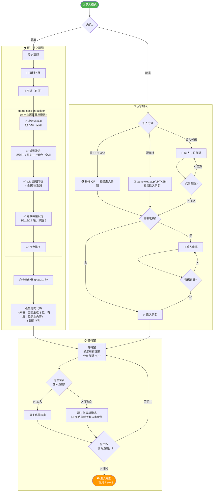

**📌 關鍵設計點**

- **game-session-builder 共用模組**：遊戲場複選 → 規則複選 → WM 逐組勾選 → 題數每組設定 → 拖曳排序（= 自由選擇完全一致）
- **多人額外設定**：房間名稱、密碼、倒數秒數（在 builder 外）
- **房主可選擇是否加入遊戲**：加入則同時是玩家；不加入則顯示即時狀態儀表板（所有玩家的答題進度、組合完成、分數等） 🆕v4.3
- **3 種加入方式**：代碼（手動輸入）、QR Code（掃描即進）、短網址（點連結即進） 🔄v4.3
- **QR 與短網址直接進入房間**：無須手動輸入代碼，僅密碼房需額外輸入密碼 🔄v4.3
- **密碼可選**：房主可自由決定是否設密碼
- **不允許中途加入**：遊戲開始後不可加入
- **題數 6-30**：全模式統一範圍，預設 6 題，每組獨立設定

[🔝 回到目錄](#目錄) · [🛠️ 開發規範](開發規範與工具.md#top)

---

### 2.3 遊戲場與規則系統 🔄

#### 遊戲場總覽

| 遊戲場        | 圖示 | 規則一（建立規則） | 規則二（規則轉換） | 混合規則（混合轉換）     |
| ------------- | ---- | ------------------ | ------------------ | ------------------------ |
| **🐭 小老鼠** | 🧀😺 | 🧀按、😺不按       | 🧀不按、😺按       | 沒人→規則一、有人→規則二 |
| **🐟 釣魚**   | 🐟🦈 | 🐟按、🦈不按       | 🐟不按、🦈按       | 白天→規則一、晚上→規則二 |

#### 規則詳細說明

##### 🐭 小老鼠遊戲場

| 規則                     | 訓練目標            | Go 刺激      | No-Go 刺激     | 條件提示                      |
| ------------------------ | ------------------- | ------------ | -------------- | ----------------------------- |
| **規則一**（建立規則）   | 抑制控制            | 🧀 起司 → 按 | 😺 貓 → 不按   | —                             |
| **規則二**（規則轉換）   | 認知彈性            | 😺 貓 → 按   | 🧀 起司 → 不按 | —                             |
| **混合規則**（混合轉換） | 工作記憶 + 認知彈性 | 依情境切換   | 依情境切換     | 👤 沒人 → 規則A、有人 → 規則B |

**混合規則運作方式**：

```
每一題系統依 80:20 偽隨機決定是否「有人出現」（詳見 §2.4）：🔄v4.3

  沒人出現（套用規則A，佔 80%）：
    🧀 起司 → 按空白鍵（Go）
    😺 貓   → 不要按（No-Go）

  有人出現（套用規則B）：
    🧀 起司 → 不要按（No-Go）
    😺 貓   → 按空白鍵（Go）

視覺提示：
  沒人 → 一般畫面
  有人 → 畫面出現 👤 人物 + 邊框變色
```

##### 🐟 釣魚遊戲場

| 規則                     | 訓練目標            | Go 刺激      | No-Go 刺激     | 條件提示                         |
| ------------------------ | ------------------- | ------------ | -------------- | -------------------------------- |
| **規則一**（建立規則）   | 抑制控制            | 🐟 魚 → 按   | 🦈 鯊魚 → 不按 | —                                |
| **規則二**（規則轉換）   | 認知彈性            | 🦈 鯊魚 → 按 | 🐟 魚 → 不按   | —                                |
| **混合規則**（混合轉換） | 工作記憶 + 認知彈性 | 依情境切換   | 依情境切換     | ☀️ 白天 → 規則A、🌙 晚上 → 規則B |

**混合規則運作方式**：

```
每一題系統依 80:20 偽隨機決定是「白天」或「晚上」（詳見 §2.4）：🔄v4.3

  白天（套用規則A，佔 80%）：
    🐟 魚   → 按空白鍵（Go）
    🦈 鯊魚 → 不要按（No-Go）

  晚上（套用規則B）：
    🐟 魚   → 不要按（No-Go）
    🦈 鯊魚 → 按空白鍵（Go）

視覺提示：
  白天 → ☀️ 明亮海洋背景 + 藍色邊框
  晚上 → 🌙 暗色海洋背景 + 橙黃邊框
```

#### 與 v3.0 場地對應關係

```
v3.0 場地A（起司按貓不按）      → v4.0 小老鼠 × 規則一 ✅
v3.0 場地B（有人時規則改變）     → v4.0 小老鼠 × 混合規則 ✅
v3.0 場地C（魚按鯊魚不按）      → v4.0 釣魚 × 規則一 ✅
v3.0 場地D（白天/晚上規則相反）  → v4.0 釣魚 × 混合規則 ✅
v3.0 場地E（工作記憶）          → v4.0 WM 附加環節（非獨立場地）
                                🔄 新增：小老鼠 × 規則二
                                🔄 新增：釣魚 × 規則二
```

#### 🧠 工作記憶（WM）附加環節

```
✅ WM 不是獨立遊戲場，而是附加在任何規則之後
✅ 每個組合各自決定是否附加 WM
✅ WM 測驗使用位置按鈕記憶（非九宮格）🔄v4.1
✅ 順向/逆向隨機、位置數量隨機
✅ WM 測驗序列由該規則最後 N 題動態擷取（非預先生成）🔄v4.1
✅ 所有玩家的 WM 參數相同（方向 + 數量）
```

<a id="flow-10-gono-go-規則判定引擎"></a>

#### Flow-10: Go/No-Go 規則判定引擎

> **說明**：根據遊戲場 × 規則 × 情境判定正確動作。  
> **對應章節**：§2.3 規則詳細說明

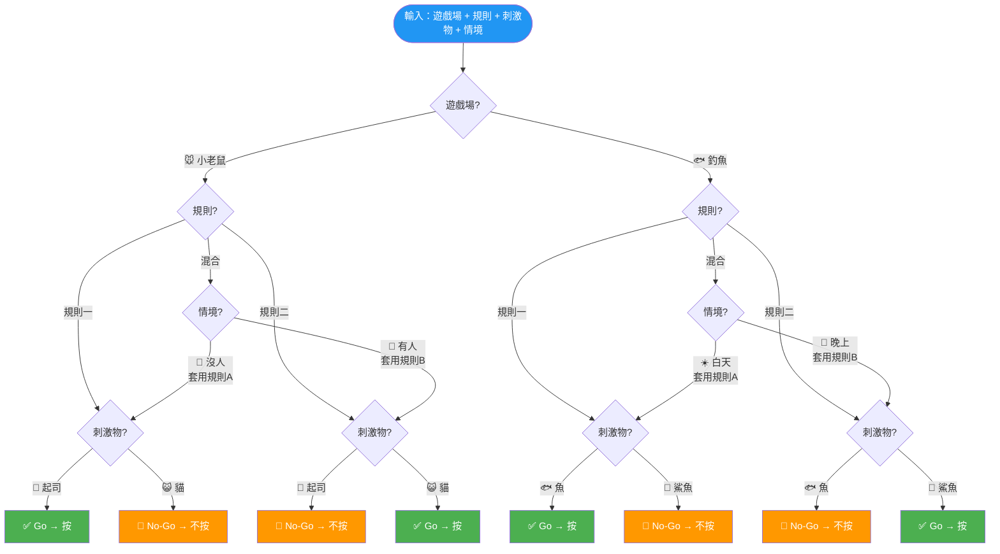

**📌 關鍵設計點**

- **混合規則 = 情境切換**：先看情境（有人/白天 vs 沒人/晚上），再套用對應規則
- **規則一 ↔ 規則二完全相反**：Go 與 No-Go 刺激物互換
- **80:20 比例**：混合規則中 80% 套用規則A、20% 套用規則B
- **視覺提示**：混合時畫面會有明顯的情境視覺提示（人物/邊框色/背景色）

[🔝 回到目錄](#目錄) · [🛠️ 開發規範](開發規範與工具.md#top)

---

### 2.4 題目同步機制 ⭐

#### 核心概念

```
✅ 題目順序同步：所有玩家題目順序一致
✅ 進度獨立：各自答題，互不等待
✅ 立即切換：答題後 0 秒切換下一題
```

#### 題目生成流程 🔄

```
房主建立房間
  ↓
勾選遊戲組合 + 排序 + WM 設定
  ↓
系統自動生成每個組合的題目序列：
  Go/No-Go 比例：🐭 小老鼠 Go 75% : No-Go 25%、🐟 釣魚 Go 80% : No-Go 20% 🆕
  混合規則刺激物比例：每個情境內沿用遊戲場 Go:No-Go 比例 🆕v4.3
  組合1（小老鼠×規則一+WM）：
    題目：[🧀, 😺, 🧀, 🧀, 😺, ...] 共6題
    WM：{方向:隨機, 數量:隨機1~n, 序列:由 questions 最後 N 題動態擷取}
  組合2（小老鼠×規則二）：
    題目：[😺, 🧀, 😺, 😺, 🧀, ...] 共6題
    WM：無
  組合3（釣魚×混合+WM）：
    題目：[{☀️,🐟}, {🌙,🦈}, {☀️,🦈}, ...] 共12題
    WM：{方向:隨機, 數量:隨機1~n, 序列:由 questions 最後 N 題動態擷取}
  ↓
儲存到 Firebase：
  gameCombos[0].questions[]
  gameCombos[0].workingMemoryTest (if enabled)
  gameCombos[1].questions[]
  ...
  ↓
所有玩家讀取相同題目序列
```

#### 混合規則題目結構 🔄

```
混合規則的每一題包含兩層資訊：

小老鼠混合規則：
  {
    context: "noPerson" / "hasPerson",  ← 依 80:20 比例分配
    stimulus: "cheese" / "cat",          ← 依遊戲場比例（Go 75:No-Go 25）🆕v4.3
    correctAction: （由 context + stimulus 推導）
  }

  範例：
    context=hasPerson + stimulus=cheese → correctAction=nopress
    context=noPerson + stimulus=cat     → correctAction=nopress

釣魚混合規則：
  {
    context: "day" / "night",            ← 依 80:20 比例分配
    stimulus: "fish" / "shark",          ← 依遊戲場比例（Go 80:No-Go 20）🆕v4.3
    correctAction: （由 context + stimulus 推導）
  }
```

#### 遊戲進行範例

```
時間點 T1（組合1：小老鼠×規則一）：
  玩家A：正在答題目5 (🧀)
  玩家B：正在答題目2 (😺)
  玩家C：正在答題目8 (🧀)

  → 題目內容相同，但進度獨立

時間點 T2（玩家A答完題目5）：
  玩家A：立即顯示題目6 (😺)
  玩家B：仍在題目2（不受影響）
  玩家C：仍在題目8（不受影響）
```

<a id="flow-14-題目生成流程"></a>

#### Flow-14: 題目生成流程

> **說明**：系統生成題目序列的完整邏輯。  
> **對應章節**：§2.4 題目生成流程

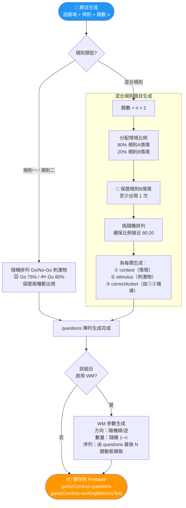

**📌 關鍵設計點**

- **混合規則雙層結構**：每題同時包含 context（情境）+ stimulus（刺激物）
- **80:20 偽隨機**：保證比例接近且規則二至少出現 1 次
- **Go 比例**：🐭 小老鼠 Go:No-Go = 75:25、🐟 釣魚 Go:No-Go = 80:20 🆕
- **混合規則刺激物比例**：每個情境內沿用遊戲場 Go:No-Go 比例（🐭 75:25 / 🐟 80:20）🆕v4.3
- **WM 序列動態擷取**：不預先生成序列，由答題紀錄的最後 N 題提取

[🔝 回到目錄](#目錄) · [🛠️ 開發規範](開發規範與工具.md#top)

---

### 2.5 即時回饋設計 ⭐

#### 視覺設計（在原畫面疊加）

**答對範例**：

```
原題目畫面：
┌────────────────────────────┐
│                            │
│        🧀                  │
│     (起司出現)              │
│                            │
└────────────────────────────┘
       ↓ 玩家按空白鍵
┌────────────────────────────┐
│                            │
│        🧀                  │ ← 刺激物保持
│  ┌──────────────────────┐  │
│  │  ✅ 正確！           │  │ ← 疊加綠框
│  │  +1 分               │  │
│  └──────────────────────┘  │
└────────────────────────────┘
       ↓ 0.3秒淡出動畫
┌────────────────────────────┐
│                            │
│        😺                  │ ← 下一題刺激物
│     (貓咪出現)              │
│                            │
└────────────────────────────┘
```

**答錯範例**：

```
┌────────────────────────────┐
│                            │
│        😺                  │ ← 刺激物保持
│  ┌──────────────────────┐  │
│  │  ❌ 錯誤！           │  │ ← 疊加紅框
│  └──────────────────────┘  │
└────────────────────────────┘
       ↓ 0.3秒淡出動畫
       ↓ 立即顯示下一題
```

#### 技術細節

```
1. 玩家按下空白鍵（或時間到）
2. 記錄答案到 Firebase
3. 在原畫面上方顯示回饋框（CSS absolute positioning）
4. 播放 CSS pulse 動畫（0.3秒 ease-out）
5. 等待剩餘停留時間（0.5秒靜止）
6. 移除回饋元素
7. 更新 currentQuestion++
8. 顯示下一題刺激物

總時長：800ms（= 0.3秒動畫 + 0.5秒靜止停留）
📌 沿用 v14 原型：CSS animation 0.3s + setTimeout 800ms
```

#### 樣式設計

```
答對回饋框：
  背景：綠色漸層 (#4CAF50)
  邊框：深綠色 3px solid
  文字：白色、粗體、大字
  圖示：✅
  動畫：pulse-green 0.3s ease-out（scale(1→1.02→1) + box-shadow 擴散）
  📌 沿用 v14 原型，無 opacity 變化

答錯回饋框：
  背景：紅色漸層 (#F44336)
  邊框：深紅色 3px solid
  文字：白色、粗體、大字
  圖示：❌
  動畫：shake-red 0.2s ease-in-out（translateX ±15px 左右搖晃）
  📌 沿用 v14 原型，無 opacity 變化

🆕v4.1 刺激物本體動畫（與容器動畫同時播放）：
  答對刺激物：pulse-correct 0.5s ease-out（scale(1→1.3→1) + brightness(1.5) + drop-shadow 綠光）
  答錯刺激物：shake-error 0.4s ease-in-out（translateX ±10px + rotate ±5deg + drop-shadow 紅光）
  📌 沿用 v14 原型（index-0204v14 L760-796）
```

[🔝 回到目錄](#目錄) · [🛠️ 開發規範](開發規範與工具.md#top)

---

### 2.6 完成通知設計 ⭐

#### 觸發時機 🔄

```
✅ 完成整組遊戲組合時觸發（規則 + WM 都完成才算）
✅ 全部組合完成時額外觸發「全部完成」通知
❌ 不在「完成每一題」時觸發

通知文字 = 具體組合名稱（非編號）：
  「✅ 小花 完成了 🐭規則一！」
  「✅ 小花 完成了 🐟混合+WM！」
  「🎉 小花 全部完成！」  ← 所有組合都完成時

範例：
  玩家完成「🐭小老鼠×規則一+WM」的最後一題
    → 先進行 WM 測驗
    → WM 完成後：
      Firebase: justCompleted = "🐭規則一+WM"
      通知：「✅ 小花 完成了 🐭規則一+WM！」
      3秒後消失
      Firebase: justCompleted = false
    → 若這是最後一個組合：
      Firebase: allCompleted = true
      通知：「🎉 小花 全部完成！」
      3秒後消失

    → 當所有玩家的 allCompleted 都為 true： 🆕v4.3
      廣播所有玩家：「🎉 所有玩家已完成！」
      Firebase: status → "finished"
      「觀看遊戲總結果」按鈕從 🔒鎖定 → 🔓解鎖
      玩家自行點擊→進入最終排名畫面（截圖 + CSV）
```

#### 顯示位置與樣式

```
位置：畫面右上角（不干擾主視覺）

┌────────────────────────────────┐
│ ┌──────────────────────────┐   │
│ │ ✅ 小花 完成了 🐭規則一！ │   │ ← 右上角
│ └──────────────────────────┘   │
│                                │
│        🐟                      │ ← 主視覺不受影響
│     (繼續遊戲)                  │
│                                │
└────────────────────────────────┘

全部完成時：
┌────────────────────────────────┐
│ ┌──────────────────────────┐   │
│ │ 🎉 小花 全部完成！        │   │ ← 右上角
│ └──────────────────────────┘   │
└────────────────────────────────┘

所有玩家已完成時（全局廣播）： 🆕v4.3
┌────────────────────────────────┐
│ ┌──────────────────────────┐   │
│ │ 🎉 所有玩家已完成！     │   │ ← 置中大字
│ └──────────────────────────┘   │
│                                │
│  [🔓 觀看遊戲總結果]         │ ← 按鈕解鎖可點擊
│                                │
└────────────────────────────────┘

樣式：
  背景：半透明藍色 (rgba(33, 150, 243, 0.9))
  全部完成：半透明金色 (rgba(255, 152, 0, 0.9))
  邊框：圓角 8px
  文字：白色、粗體
  圖示：✅ + 遊戲場圖示 (🐭/🐟)；全部完成用 🎉
  動畫：
    淡入 (0.5秒)
    → 停留 (3秒)
    → 淡出 (0.5秒)
  總時長：4秒
```

#### 多玩家完成時的堆疊

```
若多位玩家接連完成：

┌────────────────────────────────┐
│ ┌──────────────────────────┐   │
│ │ 🎉 小明 全部完成！        │ ← 最新
│ └──────────────────────────┘   │
│ ┌──────────────────────────┐   │
│ │ ✅ 小花 完成了 🐟混合+WM！│ ← 較舊（往下推）
│ └──────────────────────────┘   │
│                                │
│        🐟                      │
│                                │
└────────────────────────────────┘

最多顯示：3個通知（超過則移除最舊的）
```

[🔝 回到目錄](#目錄) · [🛠️ 開發規範](開發規範與工具.md#top)

---

### 2.7 倒數機制 ⭐

#### 適用範圍 🔄

```
✅ 遊戲最開始（第一個組合開始前）
    → 所有玩家「一起」倒數

✅ 組合切換（後續組合開始前）
    → 各自倒數（不用等彼此）

✅ 工作記憶測驗開始前（若該組合啟用 WM）
    → 各自倒數

❌ 題目之間
    → 無倒數，立即切換
```

#### 倒數時長

```
房主可設定：0/3/5/10 秒
預設值：3 秒
```

#### 視覺設計

```
┌────────────────────────────┐
│                            │
│      準備開始！            │
│                            │
│      [3] ← 大數字 120px    │
│                            │
│  🎹 請將手指放在空白鍵上    │
│     ↑ 閃爍動畫              │
│                            │
│  ⏸️ 所有按鈕已鎖定          │
│                            │
│  背景：紅色                │
└────────────────────────────┘
       ↓ 1秒後
┌────────────────────────────┐
│      [2]                   │
│  背景：黃色                │
└────────────────────────────┘
       ↓ 1秒後
┌────────────────────────────┐
│      [1]                   │
│  背景：綠色                │
└────────────────────────────┘
       ↓ 1秒後
┌────────────────────────────┐
│    🚀 開始！               │
│  背景：閃爍白光            │
└────────────────────────────┘
       ↓ 0.5秒後
       題目1出現
```

#### 音效同步

```
數字3：🔊 "滴"（低音）
數字2：🔊 "滴"（中音）
數字1：🔊 "滴"（高音）
開始：🔊 "開始！"（語音）+ 短促音效
```

[🔝 回到目錄](#目錄) · [🛠️ 開發規範](開發規範與工具.md#top)

---

### 2.8 遊戲流程（完整版）⭐🔄

```
━━━━━━━━━━━━━━━━━━━━━━━━━━━
階段 1：遊戲開始（唯一需要一起的時刻）
━━━━━━━━━━━━━━━━━━━━━━━━━━━

所有玩家進入房間
  ↓
房主選擇是否加入遊戲 🆕v4.3
  → 加入：房主同時是玩家，參與答題
  → 不加入：房主進入儀表板模式，即時查看所有玩家的答題進度、組合完成狀態、分數等
  ↓
房主按「開始遊戲」
  ↓
所有玩家一起看到倒數畫面
  ↓
3... 2... 1... 開始！
  ↓
組合1 題目1 開始

━━━━━━━━━━━━━━━━━━━━━━━━━━━
階段 2：組合內遊戲（各自節奏）🔄
━━━━━━━━━━━━━━━━━━━━━━━━━━━

假設組合1 = 小老鼠×規則一 +WM

玩家A：
  題目1 (🧀) → 按空白鍵 → ✅ 正確 +1分（0.3秒動畫）
    → 立即顯示題目2 (😺)
  題目2 (😺) → 沒按 → ✅ 正確 +1分（0.3秒動畫）
    → 立即顯示題目3 (🧀)
  ...
  題目6 → 完成！

玩家B（較慢）：
  題目1 (🧀) → 按空白鍵 → ✅ 正確 +1分（0.3秒動畫）
    → 立即顯示題目2 (😺)
  題目2 (😺) → 按了 → ❌ 錯誤 +0分（0.3秒動畫）
    → 立即顯示題目3 (🧀)
  ...
  （仍在進行中）

玩家C（最快）：
  ...（已完成題目6）

━━━━━━━━━━━━━━━━━━━━━━━━━━━
階段 2.5：工作記憶測驗（若該組合啟用 WM）🔄
━━━━━━━━━━━━━━━━━━━━━━━━━━━

（每位玩家完成組合1 答題後，自動進入 WM 測驗）

玩家C（最快完成答題）：
  ↓
  系統隨機：逆向 / 位置數量=3
  ↓
  📍 位置依序亮起：位置2 → 位置5 → 位置1
  ↓
  🧠 請以「逆向」順序點選：
  玩家點選：位置1 → 位置5 → 位置2
  ↓
  結果：3/3 全對 → 基礎 3分 + 逆向全對獎勵 +2分 = 5分

（其他玩家各自完成答題後，也各自進行 WM 測驗）

→ 其他玩家看到通知：
  「✅ 玩家C 完成了 🐭規則一+WM！」（3秒）

━━━━━━━━━━━━━━━━━━━━━━━━━━━
階段 3：組合完成等待
━━━━━━━━━━━━━━━━━━━━━━━━━━━

玩家C（已完成組合1）：
┌────────────────────────────┐
│ 🎉 太棒了！你完成了！       │
│ 🐭 小老鼠 × 規則一 +WM     │
│                            │
│ 等待其他玩家完成...        │
│                            │
│ 📊 當前排名：              │
│ 1. 玩家C  11分 ✅          │
│ 2. 玩家A   8分 (5/6)      │
│ 3. 玩家B   6分 (4/6)      │
└────────────────────────────┘

━━━━━━━━━━━━━━━━━━━━━━━━━━━
階段 4：組合切換（各自準備）⭐🔄
━━━━━━━━━━━━━━━━━━━━━━━━━━━

所有玩家看到過場畫面：
┌────────────────────────────┐
│ 🎊 組合1 全部完成！        │
│                            │
│ 即將進入：                 │
│ 🐭 小老鼠 × 規則二         │
│                            │
│ ⚠️ 注意！規則改變了：      │
│ 🧀 起司 → 不要按            │
│ 😺 貓   → 按空白鍵          │
│                            │
│ [🔊 聽規則說明]            │
│ [開始] ← 各自按             │
└────────────────────────────┘

玩家C（準備好了）：
  按下「開始」
    ↓
  進入倒數（僅玩家C看到）
    3... 2... 1... 開始！
    ↓
  組合2 題目1 開始
    ↓
  （完成後若該組合有 WM → 自動進入 WM 測驗）

玩家A、B：
  仍在過場畫面
  可隨時按「開始」
  不用等玩家C

━━━━━━━━━━━━━━━━━━━━━━━━━━━
階段 5：等待所有玩家完成 🆕v4.3
━━━━━━━━━━━━━━━━━━━━━━━━━━━

依序進行所有已選組合
  ↓
玩家完成所有組合後：

┌────────────────────────────┐
│ 🎉 太棒了！你完成了！       │
│ 等待其他玩家完成...        │
│                            │
│  [🔒 觀看遊戲總結果]       │ ← 灰色不可點
│                            │
└────────────────────────────┘

  ↓
所有玩家的 allCompleted 都為 true
  ↓
廣播所有玩家：「🎉 所有玩家已完成！」
Firebase: status → "finished"
「觀看遊戲總結果」按鈕 從 🔒鎖定 → 🔓解鎖

┌────────────────────────────┐
│ 🎉 所有玩家已完成！         │
│                            │
│  [🔓 觀看遊戲總結果]       │ ← 可點擊
│                            │
└────────────────────────────┘

  ↓
玩家點擊「觀看遊戲總結果」
  ↓
進入階段 6 最終排名畫面

━━━━━━━━━━━━━━━━━━━━━━━━━━━
階段 6：遊戲結束
━━━━━━━━━━━━━━━━━━━━━━━━━━━

┌────────────────────────────┐
│ 🏆 遊戲結束！              │
│ 最終排名                   │
├────────────────────────────┤
│ 🥇 玩家C  52分  ⭐×4       │
│ 🥈 玩家A  46分  ⭐×3       │
│ 🥉 玩家B  38分  ⭐×2       │
│                            │
│ ℹ️ 星星 = 通過的組合數（離開即清除）│
│                            │
│ ─── 輸出選項 ───           │
│ [📸 下載成績截圖]          │
│ [📊 匯出 CSV 檔案]         │
│                            │
│ [回到首頁]                 │
└────────────────────────────┘
```

#### 多人模式計分規則 🆕v4.1

```
多人模式沿用單人計分系統（§3.3），但僅保留以下獎勵：

  ✅ 基礎分數：答對 +1 分（與單人相同）
  ✅ 🏆 全對獎勵：該規則答對率 100% → +1 分
  ✅ ⚡ 最佳速度：平均反應 < 個人歷史最快 → +1 分

  ❌ 不適用於多人模式的獎勵：
    • 📈 進步獎勵（多人為獨立 session，不比歷史總分）
    • 🌟 首次通關（多人遊戲不紀錄「首次」）

  ℹ️ 原因：多人模式的成績不寫入個人歷史紀錄，
     僅存在 Realtime Database，房主離開遊戲 / 關閉分頁即清空刪除。

  ⭐ 多人模式星星規則 🆕v4.1：
  ✅ 遊戲結束總畫面：按單人規則計算真正的星星（通過≥83%→+1⭐，WM≥83%→+1⭐）
  ❌ 星星不累積到個人紀錄，離開遊戲即清除
  ❌ 其他玩家的遊戲畫面（進行中）不顯示星星
```

#### 房主儀表板模式 🆕v4.3

```
當房主選擇「不加入遊戲」時，遊戲開始後房主畫面顯示即時狀態儀表板：

儀表板內容：
  ✅ 所有玩家的即時答題進度（當前第幾題 / 總題數）
  ✅ 各玩家當前組合完成狀態
  ✅ 各玩家即時分數
  ✅ 組合完成通知（同步顯示）
  ✅ 全部完成時顯示最終排名

注意事項：
  ✅ 房主仍然是房主（可控制遊戲流程）
  ✅ 房主不產生任何遊戲成績 / 不計入排名
  ✅ 房主離開 / 關閉分頁仍觸發 onDisconnect 清理
  ✅ 房主斷線轉移邏輯不受影響（轉移給 joinOrder 最小在線玩家）
```

#### 房主斷線處理 🆕v4.1

```
房主斷線時，按「加入順序」自動轉移房主權限：

  機制：
  1. 系統偵測房主斷線（Firebase onDisconnect）
  2. 按 joinOrder 排序，找到最小 joinOrder 且仍在線的玩家
  3. 將該玩家設為新房主（更新 hostId）
  4. 通知區分： 🆕v4.3
     • 新房主：「房主斷線，你現在是房主」
     • 其他玩家：「房主已變更為 ○○」

  特殊情況：
  ✅ 房主斷線 + 仍有其他玩家 → 轉移房主
  ✅ 房主斷線 + 無其他玩家 → 房間自動關閉
  ✅ 等待中斷線 → 轉移房主 + 新房主可開始遊戲
  ✅ 遊戲中斷線 → 轉移房主 + 遊戲繼續進行
  ✅ 已結束斷線 → 轉移房主 + 結果畫面不受影響（仍可截圖/CSV） 🆕v4.3
  ✅ 斷線玩家的成績即結算（視為退出）

  joinOrder 欄位：
  ✅ 房主 joinOrder = 0
  ✅ 第一個加入的玩家 joinOrder = 1
  ✅ 依此類推
```

<a id="flow-2-多人模式完整流程"></a>

#### Flow-2: 多人模式完整流程

> **說明**：從房主建立房間到最終排名的 6 階段完整生命週期。  
> **對應章節**：§2.5–§2.8 遊戲流程完整版

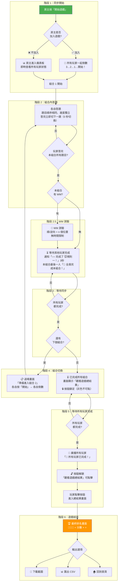

**📌 關鍵設計點**

- **階段 1 唯一同步**：只有最開始需所有人一起倒數
- **房主可選擇不加入遊戲**：不加入則顯示即時狀態儀表板（所有玩家的答題進度、組合完成狀態、分數等） 🆕v4.3
- **階段 4 各自節奏**：組合切換時各自按開始、各自倒數
- **0 秒題目切換**：多人模式答題後立即顯示下一題（無停留）
- **3 秒完成通知**：顯示具體組合名稱（如「🐭規則一+WM」）；全部完成時額外通知「🎉 全部完成！」
- **階段 5 按鈕鎖定機制**：玩家完成所有組合後看到「觀看遊戲總結果」按鈕（🔒 鎖定），等所有玩家都完成後廣播「🎉 所有玩家已完成！」→ 按鈕解鎖（🔓），玩家自行點擊進入總結果畫面 🆕v4.3
- **截圖與 CSV 在總結果畫面**：進入階段 6 最終排名畫面後才能下載截圖與匯出 CSV
- **成績不寫入個人紀錄**：多人成績存 RTDB，房主離開遊戲 / 關閉分頁即清空刪除

<a id="flow-8-房主斷線轉移流程"></a>

#### Flow-8: 房主斷線轉移流程

> **說明**：房主離線時按 joinOrder 自動轉移房主權限。  
> **對應章節**：§2.8 房主斷線處理

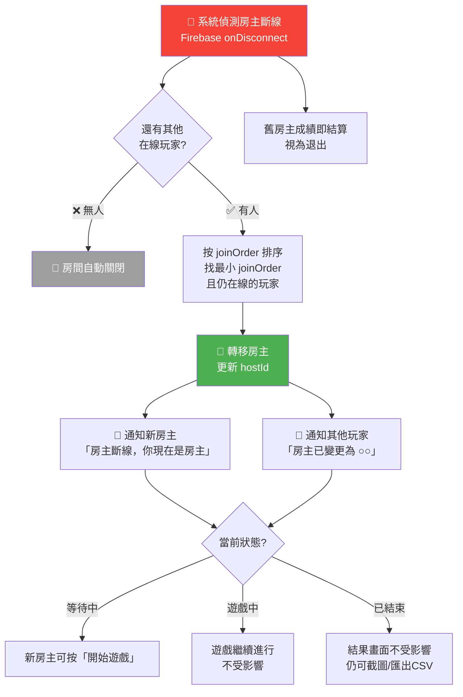

**📌 關鍵設計點**

- **joinOrder 排序**：房主=0，第一個加入=1，依此類推
- **自動無感轉移**：不中斷遊戲進行
- **通知區分**：新房主看到「房主斷線，你現在是房主」；其他玩家看到「房主已變更為 ○○」 🆕v4.3
- **3 種狀態都處理**：等待中（新房主可開始遊戲）、遊戲中（繼續進行）、已結束（結果畫面不受影響） 🆕v4.3
- **斷線者即結算**：離線玩家的已答題目照常計分

[🔝 回到目錄](#目錄) · [🛠️ 開發規範](開發規範與工具.md#top)

---

### 2.9 邀請功能

#### 三種邀請方式

```
方法1：掃描 QR Code（直接進入房間，無須輸入代碼） 🔄v4.3
  ┌──────────┐
  │ [QR碼]   │
  └──────────┘
  前端生成（qrcode.js）

方法2：分享短網址（點連結即進入房間，無須輸入代碼） 🔄v4.3
  https://game.web.app/r/H7K2M
  [📋 複製連結]
  遊戲結束後連結失效

方法3：告訴朋友代碼（手動輸入）
  ┌────────┐
  │ H7K 2M │ ← 大數字顯示
  └────────┘

注意事項 🔄v4.3：
  ✅ QR Code 與短網址：掃描 / 點擊後直接進入房間等待室，無須手動輸入代碼
  ✅ 僅「有密碼的房間」需額外輸入密碼，無密碼房間直接進入
  ✅ 進入等待室後，玩家仍需自行點擊「我準備好了」按鈕
```

[🔝 回到目錄](#目錄) · [🛠️ 開發規範](開發規範與工具.md#top)

---

### 2.10 成績處理 ⭐🔄

#### 分離儲存（不寫入 Firestore）

```
✅ 所有成績僅在 Realtime Database
✅ 房主離開遊戲 / 關閉分頁即清空刪除（onDisconnect + beforeunload）
❌ 不寫入個人歷史紀錄（Firestore）
```

#### 輸出功能

**1. 截圖功能**

```
技術：html2canvas
格式：PNG
檔名：遊戲成績_YYYYMMDD_HHMMSS.png

內容：
┌─────────────────────────────────┐
│ 執行功能訓練遊戲 - 遊戲成績      │
│                                 │
│ 房間名稱：王老師的練習房         │
│ 遊戲日期：2026/02/11 14:30      │
│                                 │
│ 🏆 最終排名                     │
│ ────────────────────            │
│ 🥇 小花  52分  ⭐×4  98%      │
│ 🥈 小明  46分  ⭐×3  92%      │
│ 🥉 小美  38分  ⭐×2  87%      │
│                                 │
│ 完成組合：🐭規則一+WM → 🐭規則二│
│          → 🐟規則二+WM → 🐟混合 │
└─────────────────────────────────┘
```

**2. CSV 匯出 🔄**

```
格式：UTF-8 BOM（Excel 可開啟中文）
檔名：多人遊戲成績_YYYYMMDD_HHMMSS.csv

內容：
排名,暱稱,總分,組合1(🐭規則一),WM1,組合2(🐭規則二),組合3(🐟規則二),WM3,組合4(🐟混合),獎勵分,平均反應
1,小花,52,10,5,9,8,4,8,3,1.5
2,小明,46,9,4,8,7,3,7,3,1.8

欄位說明：
  - 組合欄位：該組合的基礎分數（答對題數）
  - WM欄位：該次 WM 測驗的總分（基礎+全對獎勵）
  - 僅啟用 WM 的組合才有對應 WM 欄位
```

<a id="flow-18-成績輸出流程（截圖＋csv）"></a>

#### Flow-18: 成績輸出流程（截圖＋CSV）

> **說明**：遊戲結束後的成績匯出流程。  
> **對應章節**：§2.10 成績處理、§5.4b 單人 CSV

```mermaid
flowchart TB
    GAME_END([🎉 遊戲結束]) --> MODE{遊戲模式?}

    MODE -->|👥 多人| MP_OUT
    MODE -->|📱 單人| SP_OUT

    subgraph MP_OUT["👥 多人輸出"]
        MP_SCREEN[📸 截圖<br/>html2canvas → PNG<br/>內容：排名+分數+星星]
        MP_CSV[📊 CSV<br/>UTF-8 BOM<br/>欄位：排名/暱稱/總分/<br/>各組合分/WM分/獎勵/avgRT]
    end

    subgraph SP_OUT["📱 單人輸出"]
        SP_CSV[📊 CSV（14 欄摘要 + 11 欄逐題）<br/>UTF-8 BOM<br/>欄位：試驗序號/規則/刺激物/<br/>正確反應/實際反應/正確性/<br/>RT(ms)/結果/遊戲場/情境/時間戳]
        SP_RESULT[結果類型：<br/>Hit / CR / Miss / FA]
    end

    MP_SCREEN --> DOWNLOAD[💾 下載檔案]
    MP_CSV --> DOWNLOAD
    SP_CSV --> DOWNLOAD

    DOWNLOAD --> HOME([🏠 回首頁 / 重新挑戰])

    style GAME_END fill:#4CAF50,color:#fff
    style DOWNLOAD fill:#FF9800,color:#fff
```

**📌 關鍵設計點**

- **UTF-8 BOM**：確保 Excel 能正確開啟中文
- **單人 11 欄**：每個試驗一行，詳細記錄 RT 和結果類型
- **多人匯總**：按玩家匯總，各組合分數分開欄位

[🔝 回到目錄](#目錄) · [🛠️ 開發規範](開發規範與工具.md#top)

---

### 2.11 Firebase 資料結構（v4.0）🔄

```javascript
{
  "rooms": {
    "H7K2M": {
      // ===== 基本資訊 =====
      "roomCode": "H7K2M",
      "roomName": "王老師的練習房",
      "hostId": "user_abc123",
      // ❌ hostTransferOrder 已移除（改用 players/{uid}.joinOrder，避免重複）🔄v4.3
      "hasPassword": true,
      "passwordHash": "hashed_password",
      "hostJoinedGame": true,  // 🆕v4.3 房主是否加入遊戲（false = 儀表板模式）
      "createdAt": 1739001600000,
      "status": "playing", // waiting → playing → finished（房主離開/關閉即刪除）

      // ===== 遊戲開始狀態 =====
      "gameStarted": true,
      "countdownSeconds": 3,

      // ===== 🔄 遊戲組合設定 =====
      "gameSettings": {
        "questionsPerCombo": 6,          // 規則一/二預設 6 題，混合自動 ×2 = 12
        "countdownSeconds": 3
      },

      // ===== 🔄 已選遊戲組合（取代 gameStages）=====
      "gameCombos": [
        {
          "id": "combo_1",
          "gameField": "mouse",
          "gameFieldName": "小老鼠遊戲場",
          "gameFieldIcon": "🐭",
          "ruleType": "rule1",
          "ruleName": "規則一（建立規則）",
          "trainingGoal": "抑制控制",
          "enableWM": true,
          "order": 1,
          "questionsCount": 6,

          // ✅ 題目序列（房主建立時生成）
          "questions": [
            {
              "id": "q1",
              "stimulusType": "cheese",
              "correctAction": "press",
              "context": null   // 規則一/規則二 無條件提示
            },
            {
              "id": "q2",
              "stimulusType": "cat",
              "correctAction": "nopress",
              "context": null
            }
            // ... 共6題
          ],

          // 🔄 WM 測驗（房主建立時生成，若啟用）
          "workingMemoryTest": {
            "direction": "reverse",
            "testCount": 3
            // 🔄v4.1 測驗序列由該組合 questions 最後 testCount 題動態擷取
            // 不預存 sequence 陣列（沿用 v14 原型動態擷取機制）
            // 🔄v4.1 移除 maxPositions（位置按鈕數 = testCount）
          }
        },
        {
          "id": "combo_2",
          "gameField": "mouse",
          "gameFieldName": "小老鼠遊戲場",
          "gameFieldIcon": "🐭",
          "ruleType": "rule2",
          "ruleName": "規則二（規則轉換）",
          "trainingGoal": "認知彈性",
          "enableWM": false,
          "order": 2,
          "questionsCount": 6,
          "questions": [
            {
              "id": "q1",
              "stimulusType": "cat",
              "correctAction": "press",    // 🔄 規則二：貓按
              "context": null
            }
            // ... 共6題
          ],
          "workingMemoryTest": null  // 未啟用 WM
        },
        {
          "id": "combo_3",
          "gameField": "fishing",
          "gameFieldName": "釣魚遊戲場",
          "gameFieldIcon": "🐟",
          "ruleType": "mixed",
          "ruleName": "混合規則（混合轉換）",
          "trainingGoal": "工作記憶+認知彈性",
          "enableWM": true,
          "order": 3,
          "questionsCount": 12,
          "questions": [
            {
              "id": "q1",
              "stimulusType": "fish",
              "correctAction": "press",
              "context": "day"         // 🔄 混合規則有條件提示
            },
            {
              "id": "q2",
              "stimulusType": "shark",
              "correctAction": "press",
              "context": "night"       // 晚上：鯊魚按
            }
            // ... 共12題
          ],
          "workingMemoryTest": {
            "direction": "forward",
            "testCount": 4
            // 🔄v4.1 測驗序列由該組合 questions 最後 testCount 題動態擷取
            // 不預存 sequence 陣列（沿用 v14 原型動態擷取機制）
            // 🔄v4.1 移除 maxPositions（位置按鈕數 = testCount）
          }
        }
      ],

      // ===== 進階設定 =====
      "displaySettings": {
        "showLeaderboard": true,
        "showAnswerStatus": true,
        "showCompletionNotification": true,
        // ❌ 已移除 allowLateJoin（遊戲開始後不可加入）🔄v4.3
        "showFinalRanking": true
      },

      // ===== 🔄 玩家資料 =====
      "players": {
        "user_abc123": {
          "nickname": "小花",
          "isHost": true,
          "online": true,
          "joinOrder": 0,                  // 🆕v4.3 加入順序（房主=0, 第一位玩家=1, 依此類推）
          "joinedAt": 1739001600000,
          "allCompleted": false,            // 🆕v4.3 是否完成所有組合（全員 true → 廣播+解鎖按鈕）

          // ===== 當前進度 =====
          "currentComboIndex": 1,       // 🔄v4.1 修正：combo_1 已完成，準備 combo_2
          "currentQuestion": 0,          // 🔄v4.1 修正：combo_2 尚未開始
          "completedCombos": ["combo_1"],

          // ===== 🔄 組合狀態 =====
          "comboStatus": {
            "combo_1": {
              "started": true,
              "startedAt": 1739001610000,
              "completed": true,           // 🔄v4.1 修正：已完成
              "completedAt": 1739001625000,
              "justCompleted": false,
              "score": 6,                  // 🔄v4.1 修正：6/6 全對
              "bonusScore": 2,             // 🔄v4.1 修正：全對+首次通關

              // 詳細答題記錄
              "answers": [
                {
                  "questionId": "q1",
                  "stimulusType": "cheese",
                  "context": null,
                  "playerAction": "press",
                  "correct": true,
                  "reactionTime": 1.2,
                  "timestamp": 1739001611000
                }
              ],

              // 🔄 WM 測驗結果
              "workingMemoryResult": {
                "direction": "reverse",
                "testCount": 3,
                "expectedSequence": ["cheese", "cat", "cheese"],  // 🔄v4.1 由 questions 最後 N 題動態擷取
                "playerAnswer": ["cheese", "cat", "cheese"],      // 🔄v4.1 玩家 toggle 選擇的刺激物類型
                "correctPositions": 3,
                "isAllCorrect": true,
                "baseScore": 3,
                "allCorrectBonus": 2,
                "totalWmScore": 5,
                "reactionTime": 3.2,
                "timestamp": 1739001620000
              }
            }
          },

          // ===== 總成績 =====
          "totalScore": 13,           // 🔄v4.1 修正：規則 6+2(bonus) + WM 5 = 13
          "totalCorrect": 6,
          "totalQuestions": 6,
          "accuracy": 100
        }
      }
    }
  }
}
```

<a id="flow-17-多人模式-firebase-即時同步流程"></a>

#### Flow-17: 多人模式 Firebase 即時同步流程

> **說明**：多人遊戲中前端與 Realtime Database 的資料同步時機。  
> **對應章節**：§2.11 Firebase 資料結構

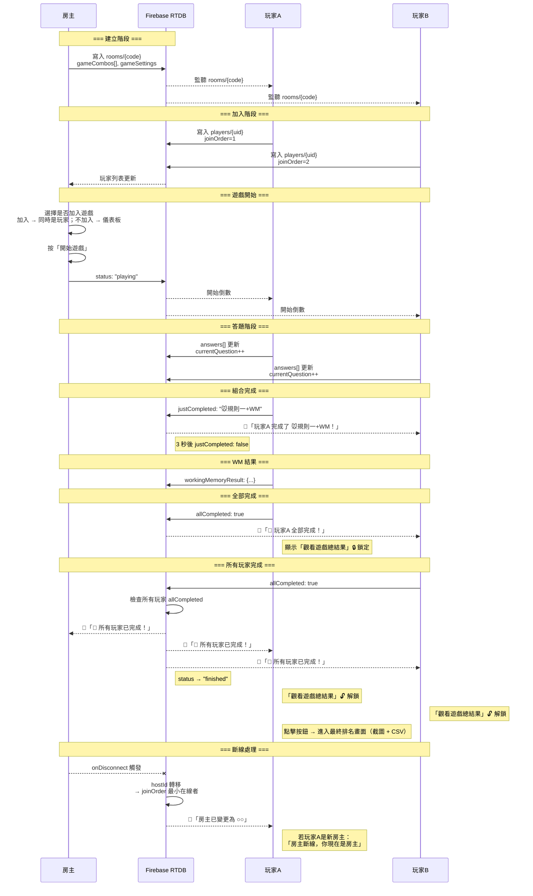

**📌 關鍵設計點**

- **onDisconnect 預設**：房主連上時即設定斷線後的轉移邏輯
- **房主可選擇不加入遊戲**：不加入則進入儀表板模式，即時查看所有玩家狀態 🆕v4.3
- **justCompleted 通知**：完成組合時設為具體組合名 → 3 秒後 false；allCompleted 用於全部完成通知
- **全員完成 broadcast**：當所有玩家 allCompleted: true → 廣播「🎉 所有玩家已完成！」+ status → "finished" + 解鎖「觀看遊戲總結果」按鈕 🆕v4.3
- **房主變更通知區分**：新房主收到「房主斷線，你現在是房主」；其他玩家收到「房主已變更為 ○○」 🆕v4.3
- **各自節奏**：answers[] 各自寫入，不需等待同步

<a id="flow-24-多人房間狀態機"></a>

#### Flow-24: 多人房間狀態機

> **說明**：房間的生命週期狀態轉換。  
> **對應章節**：§2.11 Firebase 資料結構 status 欄位

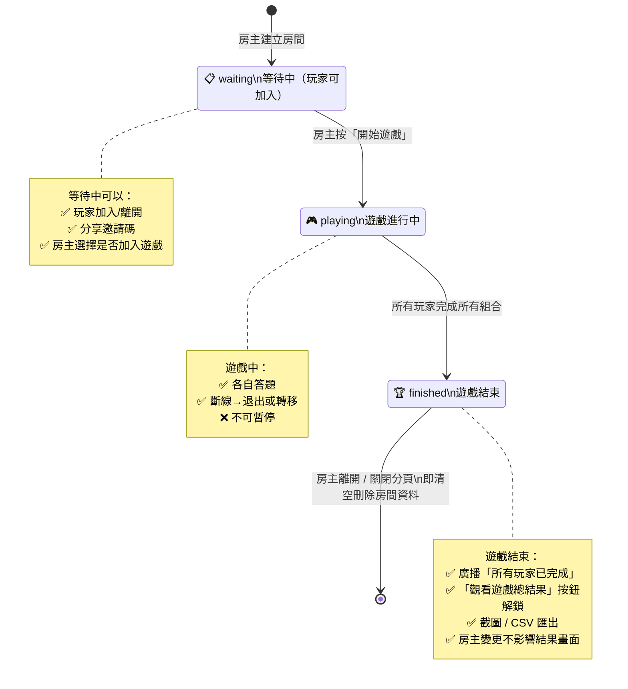

**📌 關鍵設計點**

- **3 個狀態**：waiting → playing → finished
- **playing → finished 觸發**：所有玩家的 allCompleted 都為 true → 廣播「🎉 所有玩家已完成！」→ 解鎖「觀看遊戲總結果」按鈕 🆕v4.3
- **房主可選擇是否加入遊戲**：不加入則顯示即時狀態儀表板 🆕v4.3
- **房主變更通知**：新房主「房主斷線，你現在是房主」；其他玩家「房主已變更為 ○○」 🆕v4.3
- **房主離開即清**：房主離開遊戲 / 關閉分頁即刪除 RTDB 資料（onDisconnect + beforeunload）
- **不可逆**：進入 playing 後不可回到 waiting

<a id="flow-25-單一組合（combo）玩家狀態機"></a>

#### Flow-25: 單一組合（Combo）玩家狀態機

> **說明**：多人模式中每位玩家在一個組合內的狀態進展。  
> **對應章節**：§2.11 comboStatus

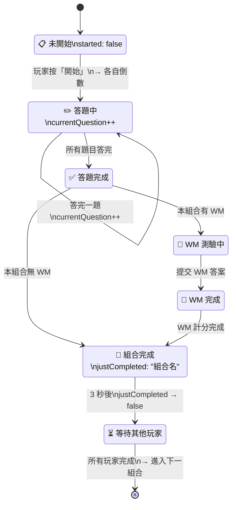

**📌 關鍵設計點**

- **justCompleted 通知**：完成時設為具體組合名（如 "🐭規則一+WM"）觸發通知，3 秒後設 false
- **allCompleted 通知**：全部組合完成時設 true，額外觸發「🎉 全部完成！」
- **WM 可選**：視組合設定決定是否進入 WM
- **各自節奏**：每人獨立推進，完成後等待他人

[🔝 回到目錄](#目錄) · [🛠️ 開發規範](開發規範與工具.md#top)

---

<a id="三單人模式"></a>

## 三、單人模式

[🔝 回到目錄](#目錄) · [🛠️ 開發規範](開發規範與工具.md#top)

### 3.1 核心特性 🔄

| 特性            | 說明                                                                 |
| --------------- | -------------------------------------------------------------------- |
| **資料儲存**    | localStorage（優先）+ Firestore（逐項勾選上傳）🔄v4.3                |
| **題目切換**    | 答題後立即切換（0秒，與多人模式一致）                                |
| **即時回饋**    | 在原畫面疊加綠/紅框（0.3秒動畫，800ms總延遲，與多人模式一致）        |
| **計分系統**    | 答對 +1 分，額外獎勵各 +1 分 🆕                                      |
| **排行榜**      | 班級榜（本地）+ 全球榜（逐項勾選）+ ⚡ 即時榜（代碼制）🔄v4.3        |
| **CSV 匯出** 🔄 | 玩家摘要（14 欄）+ 逐題資料（11 欄）雙區塊，個人=班級統一格式 🔄v4.3 |
| **時間追蹤** 🆕 | 記錄每次遊戲花費時間 + 遊戲遊玩累計時間 🆕v4.3                       |
| **遊戲模式**    | 探險地圖 + 自由選擇 🆕v4.3                                           |
| **預設題數** 🔄 | 規則一 6 題、規則二 6 題、混合 12 題（依文獻設定）🆕v4.1             |
| **混合比例** 🆕 | 混合規則中 80% 規則A情境、20% 規則B情境（依文獻設定）🆕v4.1          |
| **Go 比例** 🆕  | 🐭 小老鼠 Go:No-Go = 75:25、🐟 釣魚 Go:No-Go = 80:20 🆕              |
| **題數可調**    | 使用者可自選題數，混合規則自動 = 規則一/二題數 × 2 🆕v4.1            |
| **工作記憶**    | 附加於規則之後（非獨立遊玩）🔄                                       |
| **觸控支援** 🆕 | 必須支援觸控裝置（iPad / 手機），點擊螢幕 = 按空白鍵 🆕v4.1          |
| **暫停功能** 🆕 | 單人模式可暫停（不計時）+ 退出，多人模式僅可退出 🆕v4.1              |
| **難度保留** 🆕 | 目前不設定難度，但保留開發彈性空間，未來可加入難度分級 🆕v4.1        |

[🔝 回到目錄](#目錄) · [🛠️ 開發規範](開發規範與工具.md#top)

---

### 3.1b 遊戲進行時間機制 🆕v4.1

> **核心參數**：沿用 index-0204v14 已驗證的設計，適用於所有遊戲模式（單人 & 多人）。

#### 試驗時間軸

```
時間 t=0ms
  ↓
  [刺激物出現 🧀/😺/🐟/🦈]  ← 同時播放刺激物語音
  ↓
  （玩家可在 2 秒內按空白鍵 / 點擊螢幕）
  ↓
  t=2000ms  刺激物超時（stimulusDuration）
  ↓
  [回饋動畫：綠✓ 或 紅✗]
  ↓
  t=2800ms  回饋消退（feedbackDuration = 800ms）
  ↓
  [等待下個試驗]
  ↓
  t=3600~4000ms  隨機 ISI（800~1200ms）
  ↓
  [下一刺激物出現]
```

#### 核心時間參數

| 參數               | 值         | 說明                                                    |
| ------------------ | ---------- | ------------------------------------------------------- |
| `stimulusDuration` | **2000ms** | 刺激物展示時限，超時視為「未按」                        |
| `feedbackDuration` | **800ms**  | 答對/答錯回饋停留時長（含 0.3s 動畫 + 0.5s 靜止）🔄v4.1 |
| `isiMin`           | **800ms**  | 試驗間隔最小值                                          |
| `isiMax`           | **1200ms** | 試驗間隔最大值                                          |
| `countdownDefault` | **3 秒**   | 倒數秒數預設值（多人可設 0/3/5/10 秒）                  |

> 📌 **難度保留空間**：以上參數未來可依難度等級調整（如：簡單 3000ms / 普通 2000ms / 困難 1500ms），目前暫不啟用，但程式碼架構需預留 `difficultyLevel` 設定入口。

#### 反應時間（RT）計算方式

```
1. Go 試題（玩家按空白鍵 / 點擊螢幕）：
   RT = 刺激物出現時刻 → 玩家按鍵時刻（毫秒）
   若超過 2000ms 未按 → RT = 0（視為遺漏錯誤 Omission Error）

2. No-Go 試題（玩家正確抑制，不按）：
   RT = 0（因無法測量抑制反應時間）
   不計入「平均反應時間」

3. 平均反應時間（avgRT）：
   ✅ 只計算「Go 正確答對」的試題
   公式：所有（按了空白鍵 且 判定正確）的 RT 平均
   排除：Go 錯誤、所有 No-Go、超時試題

4. ⚡ 最佳速度獎勵：
   比較對象：當前 avgRT vs 該規則該模式的歷史最佳 avgRT
   若 currentAvgRT < bestAvgRT → 獲得 +1 分
   🆕v4.1 首次遊玩（bestAvgRT = null）→ 自動獲得 +1 分，並將當前 avgRT 設為新紀錄
```

#### 觸控操作支援 🆕v4.1

```
✅ 必須支援觸控裝置（iPad / 手機 / 平板）
✅ Go/No-Go 操作：
   鍵盤 → 按空白鍵
   觸控 → 點擊螢幕任意位置
✅ WM 操作：觸控點選位置按鈕
✅ 所有 UI 按鈕皆支援觸控
✅ viewport 設定：禁止縮放（user-scalable=no）
```

#### 暫停 / 中斷功能 🆕v4.1

```
📱 單人模式：
  ✅ 可暫停：
    - 觸發：按 Escape 鍵 / 點擊畫面右上角 ⏸ 按鈕 🆕v4.1
    - 畫面：佔滿整個版面的暫停符號（⏸️）
    - 風格：淡淡的、有透明度（opacity ~0.3）
    - 效果：看不清楚背景遊戲內容（防偷看）
    - 暫停符號本身不強烈，柔和低調
    - 暫停期間不計時（反應時間凍結）
    - 恢復：按空白鍵以繼續 → 恢復計時 🔄v4.3
  ✅ 可退出：
    - 退出後即結算已完成的題目分數
    - 未完成的題目不計分

👥 多人模式：
  ❌ 沒有暫停功能
  ✅ 僅可退出：
    - 退出後即結算該玩家的總分
    - 其他玩家不受影響，繼續遊戲
  ✅ 斷線重連機制 🔄v4.3：
    - 斷線時系統每 5 秒嘗試重連一次
    - 最多嘗試 6 次（共 30 秒）
    - 6 次皆失敗 → 視為退出，即結算該玩家總分
    - 重連成功 → 繼續遊戲（從斷線處接續）
    - 其他玩家不受影響
```

<a id="flow-9-單一試驗（trial）時間軸流程"></a>

#### Flow-9: 單一試驗（Trial）時間軸流程

> **說明**：一題從刺激物出現到下一題的完整時間線。  
> **對應章節**：§3.1b 遊戲進行時間機制

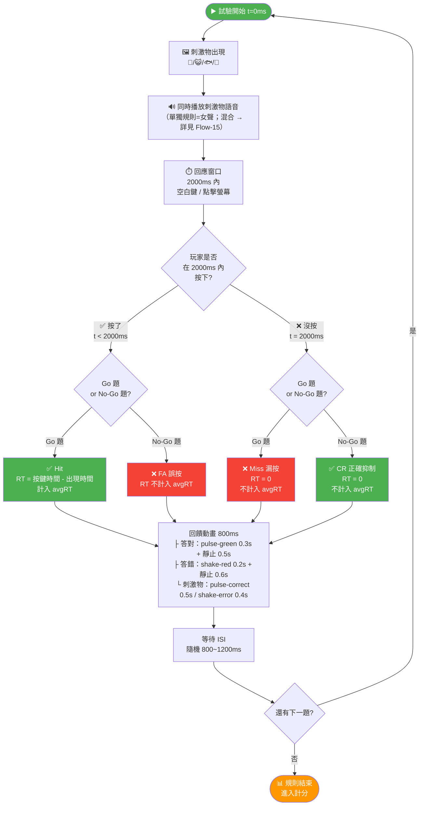

**📌 關鍵設計點**

- **2000ms 回應窗口**：超時即判定為「沒按」
- **4 種結果**：Hit（Go 正確）、CR（No-Go 正確）、Miss（Go 漏按）、FA（No-Go 誤按）
- **avgRT 只計 Hit**：僅 Go 正確答對的 RT 計入平均
- **雙層動畫**：容器動畫（0.3s/0.2s）+ 刺激物動畫（0.5s/0.4s）同時播放
- **800ms 總停留**：CSS 動畫 + 靜止，整體 800ms 後消退

<a id="flow-7-暫停與退出流程"></a>

#### Flow-7: 暫停與退出流程

> **說明**：單人暫停/退出 vs 多人退出/斷線處理。  
> **對應章節**：§3.1b 暫停/中斷功能

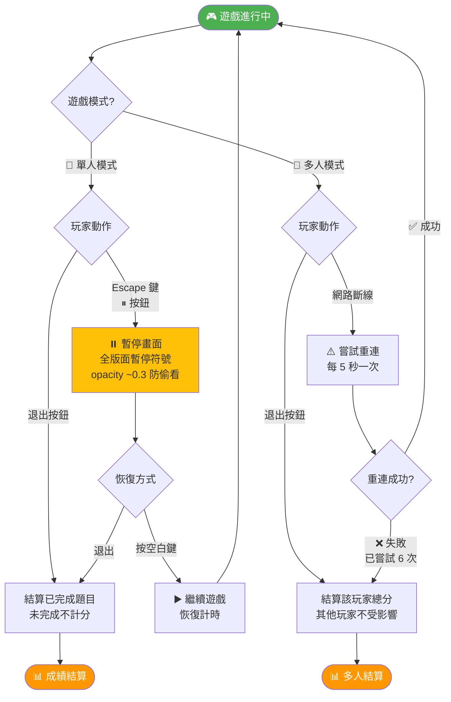

**📌 關鍵設計點**

- **暫停觸發**：Escape 鍵或右上角 ⏸ 按鈕
- **空白鍵恢復**：按空白鍵以繼續遊戲 🔄v4.3
- **暫停不計時**：反應時間凍結
- **多人無暫停**：僅可退出
- **多人斷線重連**：每 5 秒嘗試一次 × 最多 6 次 = 30 秒，仍失敗即結算總分 🔄v4.3

<a id="flow-28-反應時間（rt）計算流程"></a>

#### Flow-28: 反應時間（RT）計算流程

> **說明**：各種情境下 RT 的計算規則與 avgRT 判定。  
> **對應章節**：§3.1b 反應時間計算方式

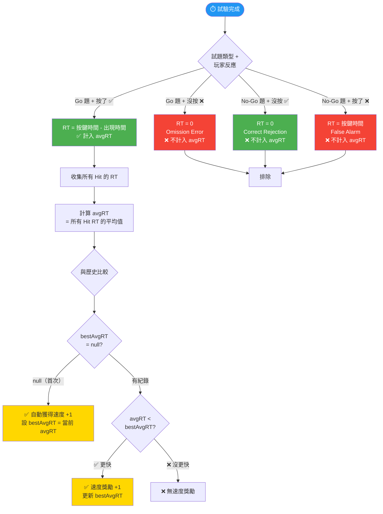

**📌 關鍵設計點**

- **只計 Hit**：avgRT 只包含 Go 正確按鍵的反應時間
- **首次自動 +1**：bestAvgRT=null 時直接獲得速度獎勵
- **No-Go 不計 RT**：抑制反應無法測量反應時間

[🔝 回到目錄](#目錄) · [🛠️ 開發規範](開發規範與工具.md#top)

---

### 3.2 兩種遊戲模式 🔄v4.3

> **🆕v4.3 重大架構變更**：
>
> - 取消遊戲場模式、取消標準模式、取消雙路線切換
> - 新增「探險地圖」作為單人唯一起始流程
> - 自由模式更名為「自由選擇」，探險地圖全通過後解鎖
> - 自由選擇 = 多人房主同等自由度，共用 game-session-builder 模組

#### 模式總覽

| 模式            | 選擇自由度     | 解鎖條件             | 適合對象   | 流程                                 |
| --------------- | -------------- | -------------------- | ---------- | ------------------------------------ |
| **🗺️ 探險地圖** | 無（逐步解鎖） | 預設開放（唯一起始） | 一般訓練   | 2地圖×6探險點，逐步解鎖 🆕v4.3       |
| **🆓 自由選擇** | 全部自選       | 探險地圖 12 點全通過 | 針對性練習 | =多人房主同等自由度，共用模組 🆕v4.3 |

#### 🗺️ 探險地圖模式 🆕v4.3

```
地圖畫面：
┌─────────────────────────────────────────┐
│ 🗺️ 探險地圖 — 🐭 小老鼠冒險            │
│                                         │
│  ⭐①  ⭐②  ⭐③  🟡④  ⬜⑤  ⬜⑥      │
│  R1   R1+WM  R2   R2+WM  混合  混合+WM  │
│                                         │
│  ⬜ = 未解鎖（灰色+🔒）                 │
│  🟡 = 當前可玩（發光動畫）              │
│  ⭐ = 已通過（顯示累計星星數）          │
│                                         │
│  🔒 地圖 2：🐟 釣魚冒險                 │
│  （地圖 1 全通過後解鎖）                │
│                                         │
│  🔒 解鎖自由選擇                        │
│  （12 點全通過後解鎖）                  │
└─────────────────────────────────────────┘

探險地圖結構（ADVENTURE_MAPS Config 可調）：

  🐭 地圖 1：小老鼠冒險（6 個探險點）
    ① 🐭R1      — 規則一 n 題
    ② 🐭R1+WM   — 規則一 n 題 + 🧠WM
    ③ 🐭R2      — 規則二 n 題
    ④ 🐭R2+WM   — 規則二 n 題 + 🧠WM
    ⑤ 🐭混合    — 混合 n×2 題（80:20）
    ⑥ 🐭混合+WM — 混合 n×2 題 + 🧠WM

  🐟 地圖 2：釣魚冒險（6 個探險點）
    ⑦ 🐟R1      — 規則一 n 題
    ⑧ 🐟R1+WM   — 規則一 n 題 + 🧠WM
    ⑨ 🐟R2      — 規則二 n 題
    ⑩ 🐟R2+WM   — 規則二 n 題 + 🧠WM
    ⑪ 🐟混合    — 混合 n×2 題（80:20）
    ⑫ 🐟混合+WM — 混合 n×2 題 + 🧠WM

遊戲流程（強制逐步解鎖）🆕v4.3：
  進入探險地圖 → 顯示地圖畫面
    ↓
  點擊當前可玩的探險點（🟡）
    ↓
  純規則探險點（①③⑤⑦⑨⑪）：
    規則 n 題 → 計分 → ≥83% 通過
    ↓
  規則+WM 探險點（②④⑥⑧⑩⑫）：
    規則 n 題 → 計分 → 🧠WM 測驗 → WM 計分
    通過條件：規則≥83% AND WM≥83% 🆕v4.3
    ↓
  通過 → ⭐ 解鎖下一探險點
  未通過 → 可重玩此探險點
    ↓
  地圖 1 六點全通過 → 🎉 解鎖地圖 2
  地圖 2 六點全通過 → 🎉🎉 慶祝動畫 → 解鎖自由選擇

星星系統（無限累計）🆕v4.3：
  ✅ 規則通過（≥83%）→ +1⭐
  ✅ WM 通過（≥83%）→ +1⭐
  ✅ WM 全對 Bonus → 額外⭐（依 §3.4 公式）
  ✅ 每次重玩都可累計（不封頂）
  ✅ 已通過探險點可重玩刷星星，不影響解鎖進度

可分次遊玩：
  ✅ 今天玩到③，明天繼續④（進度存 localStorage）
  ✅ 每次進入顯示上次進度

混合規則情境分配（依文獻）🆕v4.1：
  ✅ 規則A情境：80%（預設 12 題中約 9-10 題）
  ✅ 規則B情境：20%（預設 12 題中約 2-3 題）
  ✅ 使用偽隨機分配，確保比例接近 80:20
  ✅ 保證規則B情境至少出現 1 次

Config 結構（ADVENTURE_MAPS）🆕v4.3：
  ✅ 陣列式設定，可彈性調整探險點排列順序
  ✅ 每個探險點指定：遊戲場、規則、是否含WM、題數
  ✅ 未來可擴充更多地圖或調整順序

  JavaScript 定義（adventure-maps-config.js）🆕v4.3：
  const ADVENTURE_MAPS = [
    {
      id: "mouse",
      name: "🐭 小老鼠冒險",
      icon: "🐭",
      points: [
        { id: "mouse_r1",       field: "mouse", rule: "rule1", hasWM: false, questionsCount: 6 },
        { id: "mouse_r1_wm",    field: "mouse", rule: "rule1", hasWM: true,  questionsCount: 6 },
        { id: "mouse_r2",       field: "mouse", rule: "rule2", hasWM: false, questionsCount: 6 },
        { id: "mouse_r2_wm",    field: "mouse", rule: "rule2", hasWM: true,  questionsCount: 6 },
        { id: "mouse_mixed",    field: "mouse", rule: "mixed", hasWM: false, questionsCount: 12 },
        { id: "mouse_mixed_wm", field: "mouse", rule: "mixed", hasWM: true,  questionsCount: 12 }
      ]
    },
    {
      id: "fishing",
      name: "🐟 釣魚冒險",
      icon: "🐟",
      points: [
        { id: "fishing_r1",       field: "fishing", rule: "rule1", hasWM: false, questionsCount: 6 },
        { id: "fishing_r1_wm",    field: "fishing", rule: "rule1", hasWM: true,  questionsCount: 6 },
        { id: "fishing_r2",       field: "fishing", rule: "rule2", hasWM: false, questionsCount: 6 },
        { id: "fishing_r2_wm",    field: "fishing", rule: "rule2", hasWM: true,  questionsCount: 6 },
        { id: "fishing_mixed",    field: "fishing", rule: "mixed", hasWM: false, questionsCount: 12 },
        { id: "fishing_mixed_wm", field: "fishing", rule: "mixed", hasWM: true,  questionsCount: 12 }
      ]
    }
  ];
```

#### 🆓 自由選擇模式 🆕v4.3

> **🔒 解鎖條件**：探險地圖 12 個探險點全部通過後解鎖。
> 未解鎖時顯示「🔒 解鎖自由選擇」，點擊顯示「請先完成探險地圖」。
> 教師用 `?unlock=all` 可直接解鎖。

```
選擇介面（= game-session-builder 模組，與多人房主共用）：
┌────────────────────────────────────────┐
│ 🆓 自由選擇                            │
│                                        │
│ ✅ 選擇遊戲場：                        │
│ [🐭 小老鼠] [🐟 釣魚] [全選]          │
│                                        │
│ ✅ 選擇規則（可複選）：                │
│ [規則一] [規則二] [混合] [全選]        │
│                                        │
│ ✅ WM 設定（逐組勾選）：               │
│ ☑ 🐭規則一+WM  ☐ 🐭規則二+WM  ...    │
│ [全選WM] [全取消WM]                    │
│                                        │
│ ✅ 題數設定（每組 6-30 題，預設 6）：   │
│ 🐭規則一：[⊖] 6 [⊕]                  │
│ 🐭規則二：[⊖] 6 [⊕]                  │
│ 🐭混合：  [⊖] 12 [⊕]（自動×2）      │
│ ...                                    │
│                                        │
│ ✅ 遊戲順序（拖曳排序）：              │
│ ┌─────────────────────────┐            │
│ │ ≡ 1. 🐭 規則一 (6題)    │            │
│ │ ≡ 2. 🐭 規則一+WM       │            │
│ │ ≡ 3. 🐟 混合 (12題)     │            │
│ │ ≡ 4. 🐟 混合+WM         │            │
│ └─────────────────────────┘            │
│                                        │
│ [▶️ 開始遊戲]                          │
└────────────────────────────────────────┘

遊戲流程（組合切換與多人模式一致）🔄v4.3：
  透過 game-session-builder 選擇組合
    ↓
  第一組合：過場畫面（顯示規則說明）→ 按「開始」→ 倒數 3-2-1 → 開始答題
    ↓
  組合完成 → 小結算（規則得分 + WM 得分）
    ↓
  還有下個組合？
    → 有：過場畫面（「準備進入組合 N」+ 規則說明）→ 按「開始」→ 倒數 → 下一組合
    → 無：全部完成！
    ↓
  成績大結算 + CSV 匯出

組合切換過場規則（= 多人階段 4 同流程）🆕v4.3：
  ✅ 過場畫面顯示下一組合名稱 + 規則說明
  ✅ 播放規則說明語音（如「小老鼠混合規則」）
  ✅ 玩家自行按「開始」按鈕
  ✅ 按下後 3-2-1 倒數 → 開始答題
  ✅ 共用 shared/combo-transition.html 頁面 🔄v4.3

備註：
  ✅ = 多人房主同等自由度（共用 game-session-builder 模組）🆕v4.3
  ✅ 可複選遊戲場×規則，任意排列組合
  ✅ WM 逐組獨立勾選 + 全選/全取消按鈕
  ✅ 拖曳排序自訂遊戲順序
  ✅ 題數每組獨立設定（6-30 題，預設 6 題）
  ✅ 探險地圖 12 點全通過後解鎖 🆕v4.3
  ✅ 教師用 ?unlock=all 可解鎖全部

singleplayer/result.html 雙模式行為 🆕v4.3：
  ✅ 探險地圖模式：單組合小結算
    ─ 顯示：規則得分 + ⭐星星判定 + WM 得分（若有）+ 通過/未通過
    ─ 按鈕：「🗺️ 回探險地圖」/「🔁 重玩此探險點」
  ✅ 自由選擇模式：多組合大結算
    ─ 顯示：各組合明細 + 總分 + CSV 匯出 + 截圖
    ─ 按鈕：「📊 匯出 CSV」/「📸 下載截圖」/「🔁 重新挑戰」/「🏠 回單人選單」
  ✅ 透過 URL 參數區分：?mode=adventure or ?mode=free-select
```

<a id="flow-3-單人探險地圖模式流程"></a>

#### Flow-3: 單人探險地圖模式流程

> **說明**：單人主流程，2 張探險地圖各 6 個探險點，逐步解鎖，全通過解鎖自由選擇。  
> **對應章節**：§3.2 探險地圖模式 🆕v4.3

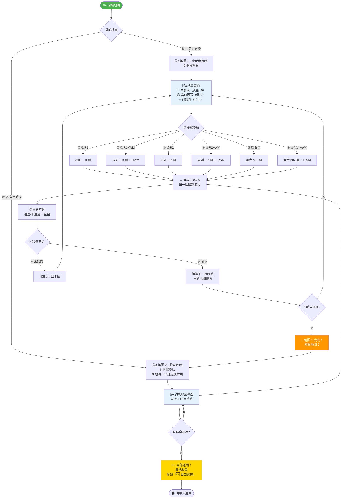

**📌 關鍵設計點**

- **單人唯一起始流程**：探險地圖取代遊戲場模式 + 標準模式 🆕v4.3
- **2 張地圖，各 6 探險點**：①R1 → ②R1+WM → ③R2 → ④R2+WM → ⑤混合 → ⑥混合+WM
- **強制逐步解鎖**：通過①才能玩②，依此類推
- **可分次遊玩**：今天玩到③，明天繼續④（進度 localStorage 儲存）
- **探險點 3 狀態**：⬜ 未解鎖 / 🟡 當前可玩 / ⭐ 已通過
- **已通過可重玩**：星星無限累計，不影響解鎖進度
- **Config 可調順序**：ADVENTURE_MAPS 陣列可彈性調整探險點排列
- **地圖 1 全通過 → 解鎖地圖 2**；**12 點全通過 → 解鎖自由選擇**

<a id="flow-4-單人自由選擇模式流程"></a>

#### Flow-4: 單人自由選擇模式流程

> **說明**：探險地圖全通過後解鎖，= 多人房主同等自由度，共用 game-session-builder 模組。  
> **對應章節**：§3.2 自由選擇模式 🆕v4.3

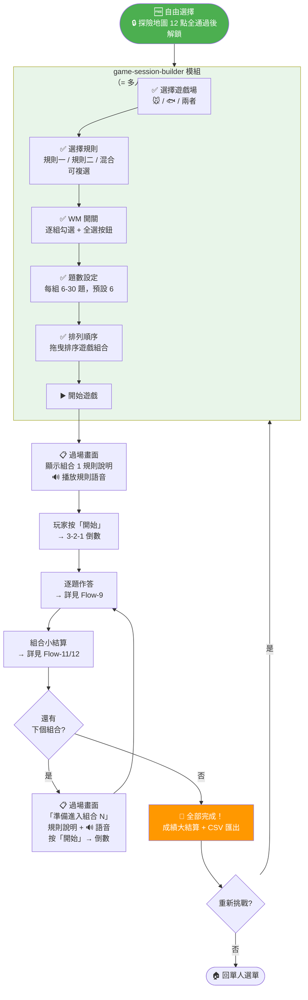

**📌 關鍵設計點**

- **探險地圖 12 點全通過後解鎖** 🆕v4.3
- **= 多人房主同等自由度**：共用 game-session-builder 模組
- **組合切換與多人一致**：過場畫面 → 規則說明語音 → 按開始 → 倒數 → 開始 🆕v4.3
- **共用 shared/combo-transition.html**：多人/自由選擇同頁面 🆕v4.3
- **可複選遊戲場×規則**：任意排列組合
- **拖曳排序**：自訂遊戲順序
- **WM 逐組勾選**：每組獨立決定 + 全選/全取消
- **教師覆寫**：`?unlock=all` 可跳過所有鎖定

<a id="flow-5-探險地圖單一探險點流程"></a>

#### Flow-5: 探險地圖單一探險點流程

> **說明**：探險地圖上點擊一個探險點後的完整遊玩流程（純規則 or 規則+WM）。  
> **對應章節**：§3.2 探險地圖模式 🆕v4.3

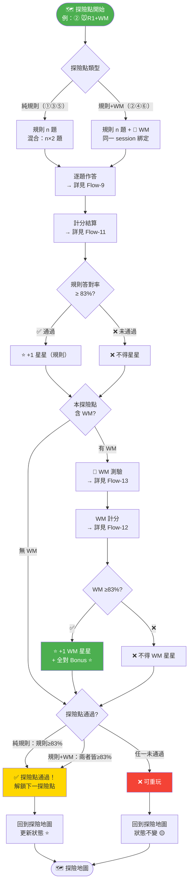

**📌 關鍵設計點**

- **兩種探險點**：純規則（①③⑤）vs 規則+WM（②④⑥）
- **規則+WM 綁定**：同一 session 連續完成，WM 回憶「剛才」的刺激物
- **通過條件**：純規則 = 規則≥83%；規則+WM = 兩者皆≥83% 🆕v4.3
- **星星無限累計**：規則通過 +1⭐，WM 通過 +1⭐，WM 全對 Bonus ⭐（每次重玩都可累計）
- **WM Bonus 星星**：逆向全對 n≥2 → +(n-1)⭐；順向全對 2-6 → +1⭐，7-9 → +2⭐，n≥10 → +(n-7)⭐
- **未通過不解鎖**：可重玩此探險點，不影響其他進度

[🔝 回到目錄](#目錄) · [🛠️ 開發規範](開發規範與工具.md#top)

---

### 3.3 計分系統（v3.0 改版，v4.0 沿用）🆕

#### 計分原則

```
✅ 簡單明確：答對 = +1 分
✅ 額外獎勵：達成條件 = 各 +1 分
✅ 不使用乘法加權
```

#### 基礎計分（適用所有規則）

```
每題答對 → +1 分
每題答錯 → +0 分

範例：6 題答對 5 題 → 基礎 5 分
```

#### 額外獎勵（每項各 +1 分）

| 獎勵        | 條件                                | 額外分數 |
| ----------- | ----------------------------------- | -------- |
| 🏆 全對獎勵 | 該規則答對率 100%                   | +1 分    |
| ⚡ 最佳速度 | 平均反應 < 個人該規則最快紀錄       | +1 分    |
| 📈 進步獎勵 | 總分 > 個人該規則最佳紀錄           | +1 分    |
| 首次通關    | 首次通過該遊戲場×該規則（不分模式） | +1 分    |

#### 計算範例

```
小老鼠×規則一（預設 6 題為例）：

範例1 - 高手：
  答對：6/6 → 基礎 6 分
  🏆 全對獎勵      +1（答對率 100%）
  ⚡ 最佳速度      +1（平均 1.2 秒 < 歷史最快 1.5 秒）
  📈 進步獎勵      +1（8 分 > 歷史最佳 7 分）
  🌟 首次通關      +1（第一次完成）
  ─────────────
  最終得分：10 分

範例2 - 普通：
  答對：4/6 → 基礎 4 分
  🏆 全對獎勵      ✗（未全對）
  ⚡ 最佳速度      +1（比上次快）
  📈 進步獎勵      ✗（未超越紀錄）
   首次通關      ✗（非首次）
  ─────────────
  最終得分：5 分
```

#### 獎勵細節說明

**1. 最佳速度獎勵**

```
條件：平均反應時間 < 個人該規則該模式最快紀錄

紀錄分開：
  小老鼠×規則一：最快 1.5 秒
  小老鼠×規則二：最快 1.8 秒
  小老鼠×混合規則：最快 2.0 秒
  釣魚×規則一：最快 1.6 秒
  ...

判斷：
  本次平均 1.2 秒 < 歷史最快 1.5 秒
  → ✅ 獲得最佳速度 +1 分

🆕v4.1 首次遊玩邊界條件：
  若 bestAvgRT = null（該規則從未玩過）
  → ✅ 自動獲得最佳速度 +1 分
  → 將當前 avgRT 設為該規則的 bestAvgRT 紀錄

反應時間計算方式（詳見 §3.1b）🆕v4.1：
  ✅ 只計算 Go 正確答對的試題 RT
  ✅ No-Go 試題、超時試題不計入
```

**2. 進步獎勵**

```
條件：最終分數（含其他獎勵）> 該規則個人最佳紀錄

計算順序：
  1. 基礎分數 + 其他獎勵（全對、速度、完美、首次）
  2. 比對歷史最佳紀錄
  3. 若超越 → +1 分
  4. 更新歷史最佳紀錄

避免循環：
  進步獎勵不參與比對，僅在判定後才加上
```

**3. 首次通關獎勵**

```
條件：首次通過（≥83%）該遊戲場×該規則

範例：
  首次通過「小老鼠×規則一」→ ✅ +1 分
  再次通過「小老鼠×規則一」→ ❌ 不獲得
  首次通過「小老鼠×規則二」→ ✅ +1 分（不同規則）
  首次通過「釣魚×規則一」→ ✅ +1 分（不同遊戲場）

共享規則 🆕v4.3：
  ✅ 同一遊戲場×規則共享 firstClear（不分探險點、不分模式）
  ✅ 不分 WM：🐭R1 與 🐭R1+WM 共享同一個 firstClear
  ✅ 不分模式：探險地圖或自由選擇首次通過皆算
  ✅ bestAvgRT 同理：同一遊戲場×規則共享最佳平均 RT
  ✅ 紀錄位置：adventureProgress.fieldRuleRecords
  ✅ bestScore 獨立：每個探險點各自保留最佳成績
```

<a id="flow-11-計分系統流程（單一規則）"></a>

#### Flow-11: 計分系統流程（單一規則）

> **說明**：一個規則完成後的完整計分流程，含 4 種額外獎勵。  
> **對應章節**：§3.3 計分系統

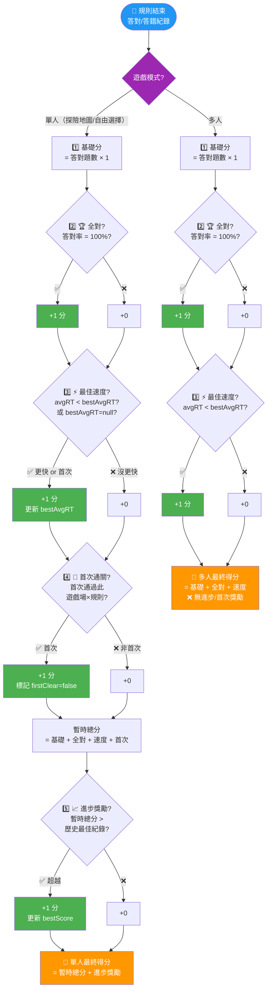

**📌 關鍵設計點**

- **🟣 模式分支**：入口即區分單人（4 種獎勵）vs 多人（2 種獎勵）🆕v4.3
- **計算順序很重要**：進步獎勵最後判定，避免循環
- **首次遊玩 bestAvgRT=null → 自動 +1**：邊界條件已處理
- **多人模式簡化**：僅保留全對 + 最佳速度，無進步/首次（成績不記錄歷史）
- **每項各 +1**：不使用乘法加權，簡單明確

[🔝 回到目錄](#目錄) · [🛠️ 開發規範](開發規範與工具.md#top)

---

### 3.4 工作記憶計分系統 🆕🔄

#### 遊戲機制 🔄v4.1

```
1. 系統隨機決定：順向（Forward）或 逆向（Reverse）
2. 系統隨機決定：記憶位置數量（1 ~ n 個）
   ✅ n = 1 ~ 該輪規則的題數（例：規則一 6 題 → n = 1~6）🆕v4.1
3. 🔊 語音播報規則：「請照順序點選！」或「請倒著點選！」🆕v4.1
4. 畫面顯示 n 個位置按鈕依序亮起（位置按鈕，非九宮格）🔄v4.1
5. 玩家需按照指定方向（順向/逆向）依序點選位置按鈕
6. ✅ 無時間限制，但系統記錄完成時間（RT）🆕v4.1
7. 每答對一個位置 → +1 分
8. 全對時 → 依規則給予額外獎勵

位置按鈕機制（非九宮格）🆕v4.1：
  ✅ 每個位置是一個可點擊/觸控的按鈕
  ✅ 點擊後循環切換狀態：
      🐭 小老鼠遊戲場：❓（預設）→ 🧀（起司）→ 🐈‍⬛（貓咪）→ ❓
      🐟 釣魚遊戲場：❓（預設）→ 🐟（小魚）→ 🦈（鲨魚）→ ❓
  ✅ 玩家將每個位置設定為記憶中的刺激物
  ✅ 設定完成後按「確認」提交答案
  ✅ 支援觸控點選（iPad / 手機）🆕v4.1
```

> **🔄 v4.0 變更**：WM 不再是獨立場地（E），而是附加在每個規則之後的測驗環節。核心機制與計分公式沿用 v3.0，不變。

#### 基礎計分

```
每答對一個位置 → +1 分

範例：
  序列長度 = 4，答對 3 個位置
  → 基礎分數 = 3 分
```

#### 全對額外獎勵（Bonus）

##### 逆向（Reverse）全對獎勵

```
公式：位置數量 n ≥ 2 時，獎勵 = n - 1 分

| 位置數量 (n) | 全對獎勵 | 說明 |
|:---:|:---:|:---|
| 1 | +0（無獎勵） | 僅基礎分 +1 |
| 2 | +1 | 逆向記住 2 個位置 |
| 3 | +2 | 逆向記住 3 個位置 |
| 4 | +3 | 逆向記住 4 個位置 |
| 5 | +4 | 逆向記住 5 個位置 |
| 6 | +5 | 依此類推... |
| n | +(n-1) | 通用公式 |
```

##### 順向（Forward）全對獎勵

```
分段公式：

| 位置數量 (n) | 全對獎勵 | 說明 |
|:---:|:---:|:---|
| 1 | +0（無獎勵） | 僅基礎分 +1 |
| 2~6 | +1 | 基礎順向記憶 |
| 7~9 | +2 | 中等難度 |
| 10 | +3 | 公式：n-7 |
| 11 | +4 | 公式：n-7 |
| 12 | +5 | 公式：n-7 |
| n (n≥10) | +(n-7) | 通用公式 |
```

#### WM 額外獎勵

| 獎勵        | 條件                    | 額外分數 |
| ----------- | ----------------------- | -------- |
| ⚡ 最佳速度 | 完成速度 < 個人最快紀錄 | +1 分    |

> **備註**：WM 的額外獎勵僅保留「最佳速度」。全對獎勵已由上方的方向×數量公式涵蓋，不再額外 +1。

#### 計算範例

```
━━━ 範例1：逆向，位置數量=4，全對 ━━━
基礎分：4 分（4/4 位置全對）
全對獎勵：+3 分（逆向 n=4 → n-1=3）
最佳速度：+1 分（比上次快）
─────────
總計：8 分

━━━ 範例2：順向，位置數量=5，全對 ━━━
基礎分：5 分（5/5 位置全對）
全對獎勵：+1 分（順向 n=5 在 2~6 區間 → +1）
最佳速度：+0 分（沒比上次快）
─────────
總計：6 分

━━━ 範例3：順向，位置數量=11，全對 ━━━
基礎分：11 分（11/11 位置全對）
全對獎勵：+4 分（順向 n=11 → n-7=4）
最佳速度：+1 分
─────────
總計：16 分

━━━ 範例4：逆向，位置數量=3，答對2個 ━━━
基礎分：2 分（2/3 位置答對）
全對獎勵：+0 分（未全對，不適用）
最佳速度：+0 分
─────────
總計：2 分

━━━ 範例5：順向或逆向，位置數量=1，全對 ━━━
基礎分：1 分（1/1 位置答對）
全對獎勵：+0 分（n=1 時無獎勵）
─────────
總計：1 分
```

#### WM 顯示介面 🔄v4.1

```
━━━ 步驟 1：系統展示序列 ━━━
┌────────────────────────────┐
│ 🧠 工作記憶測驗             │
├────────────────────────────┤
│                            │
│ 方向：逆向（Reverse）🔄    │
│ 位置數量：4 個              │
│ ✅ 無時間限制             🆕v4.1 │
│                            │
│ 系統依序展示中...         │
│                            │
│ ①[🧀]→②[🐈‍⬛]→③[🧀]→④[🐈‍⬛]  │
│   ↑                        │
│ 位置按鈕依序亮起          │
│ （小老鼠遊戲場範例）       │
│                            │
│ 🔔 請以「逆向」順序點選！   │
│                            │
└────────────────────────────┘

━━━ 步驟 2：玩家作答 ━━━
┌────────────────────────────┐
│ 🧠 工作記憶測驗             │
├────────────────────────────┤
│                            │
│ 請點選位置按鈕還原序列： │
│ （點擊/觸控循環切換狀態） │
│                            │
│  ①[❓]  ②[❓]  ③[🧀]  ④[❓] │
│      ↑↑                    │
│    點擊後循環：              │
│    ❓ → 🧀 → 🐈‍⬛ → ❓      │
│                            │
│ [確認提交]                  │
│                            │
└────────────────────────────┘
       ↓ 玩家確認提交後
┌────────────────────────────┐
│ 🎉 工作記憶測驗完成！       │
├────────────────────────────┤
│ 答對位置：4 / 4 ✓           │
│ 完成速度：3.2 秒            │
│                            │
│ ─── 分數計算 ───           │
│ 基礎分數：4 分              │
│ 🏆 逆向全對獎勵：+3 分      │
│ ⚡ 最佳速度：+1 分          │
│ ════════════════           │
│ 工作記憶得分：8 分 🎊       │
│                            │
│ [繼續]                     │
└────────────────────────────┘
```

<a id="flow-12-wm-計分系統流程"></a>

#### Flow-12: WM 計分系統流程

> **說明**：WM 測驗的完整計分流程，含順向/逆向不同公式。  
> **對應章節**：§3.4 工作記憶計分系統

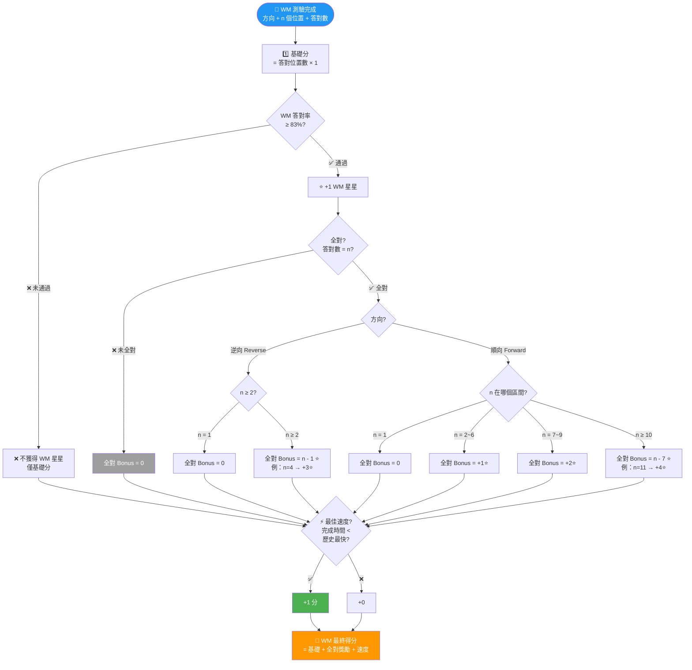

**📌 關鍵設計點**

- **WM 通過門檻 ≥83%**：答對率 ≥83% → +1⭐ WM 星星 🆕v4.3
- **全對才有 Bonus⭐**：通過後若全對 → 額外 Bonus 星星（依公式）
- **逆向獎勵更高**：逆向 n=4 全對 → +3⭐；順向 n=4 全對 → +1⭐
- **無時間限制**：但系統記錄完成時間，用於速度獎勵比較

<a id="flow-13-wm-測驗遊戲流程"></a>

#### Flow-13: WM 測驗遊戲流程

> **說明**：WM 測驗從系統展示到玩家作答的完整互動流程。  
> **對應章節**：§3.4 遊戲機制、WM 顯示介面

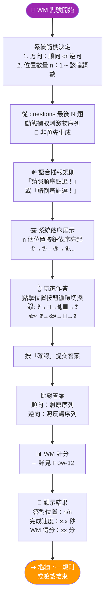

**📌 關鍵設計點**

- **動態擷取序列**：WM 序列由該規則 questions 最後 N 題擷取（方案 C）
- **Toggle 按鈕**：點擊循環 ❓→刺激物A→刺激物B→❓
- **無時間限制**：不限作答時間，但記錄完成速度
- **支援觸控**：所有位置按鈕支援觸控點擊

[🔝 回到目錄](#目錄) · [🛠️ 開發規範](開發規範與工具.md#top)

---

### 3.5 成績顯示介面 🆕🔄

#### 單一規則完成

```
┌────────────────────────────┐
│ 🎉 規則完成！              │
│ 🐭 小老鼠 × 規則一         │
├────────────────────────────┤
│ 答對題數：6 / 6 ✓          │
│ 平均反應：1.2 秒           │
│ 連續答對：6 題（最長）     │
│ 獲得星星：⭐ × 1（通過即得）  │
│                            │
│ ─── 分數計算 ───           │
│ 基礎分數：6 分             │
│                            │
│ 🎁 額外獎勵：              │
│ 🏆 全對獎勵      +1 分     │
│ ⚡ 最佳速度      +1 分     │
│    💬 比上次快 0.3 秒！     │
│ 📈 進步獎勵      +1 分     │
│    💬 超越紀錄 1 分！       │
│ � 首次通關      +1 分     │
│    💬 第一次完成此規則！    │
│                            │
│ ════════════════           │
│ 規則得分：10 分 🎊         │
│                            │
│ 💡 個人最佳紀錄已更新！    │
│                            │
│ [繼續 → 🧠 WM 測驗]        │
└────────────────────────────┘
```

#### 探險地圖模式總結 🆕v4.3

```
┌────────────────────────────────┐
│ 🎉 探險點完成！                │
│ ② 🐭R1+WM 通過！              │
├────────────────────────────────┤
│                                │
│ 📋 規則一（建立規則）          │
│   答對：6/6    得分：11分      │
│   ⭐ +1 星星（規則通過）       │
│                                │
│ 🧠 WM 測驗                    │
│   答對：4/4   得分：8分        │
│   （逆向 4位全對）             │
│   ⭐ +1 星星（WM 通過）        │
│   ⭐ +3 Bonus（逆向全對 n-1）  │
│                                │
│ ════════════════════           │
│ 探險點總分：19 分 🎊          │
│ 獲得星星：⭐ ×5               │
│                                │
│ ✅ 解鎖下一探險點：③ 🐭R2     │
│                                │
│ [回到探險地圖] [重新挑戰]      │
└────────────────────────────────┘
```

[🔝 回到目錄](#目錄) · [🛠️ 開發規範](開發規範與工具.md#top)

---

### 3.6 排行榜系統（三軌制）🔄v4.3

#### 本地班級排行榜（localStorage）

```
完全離線，隱私安全

功能：
✅ 匯入多位學生的個人 CSV → 自動讀取第一區摘要，匿名（座號）排序 🔄v4.3
✅ 匯出所有已匯入學生合併為一個 CSV 檔案 🔄v4.3
✅ 匯出格式 = 匯入格式 = 個人 CSV 第一區（round-trip 相容）🆕v4.3
✅ 匯入時可選擇「要排行哪些欄位」，一次最多顯示 5 個欄位 🆕v4.3
✅ 教師不需手動建立班級，直接匯入學生 CSV 即可

匯入流程：
  1. 老師點擊「📥 匯入學生 CSV」
  2. 選擇多個學生的個人 CSV 檔案（支援多檔選取）
  3. 系統自動讀取每個 CSV 的第一區（14 欄摘要），忽略第二區（逐題資料）
  4. 彈出「選擇排行欄位」對話框（一次最多勾選 5 個）
  5. 以匿名方式顯示：座號 + 已選欄位的成績
  6. 自動依所選欄位排序（第一個勾選欄位 = 主排序維度）

可選排行欄位（14 欄中可勾選，最多 5 個）：
  ☐ 總星星數      ☐ 等級          ☐ 題數設定
  ☐ 通過數        ☐ 最佳成績總和  ☐ 最佳平均RT
  ☐ 規則星星累計  ☐ WM星星累計    ☐ 首次通關數
  ☐ 最快完成時間  ☐ 該次花費時間  ☐ 遊戲累計時間
  （座號和暱稱不算在 5 個內，座號必顯示，暱稱必隱藏）

預設排行欄位（首次匯入時預選）：
  ✅ 總星星數 > ✅ 最佳成績總和 > ✅ 最快完成時間
  （= 排行榜三維度排序）

匯出流程：
  1. 老師點擊「📤 匯出合併 CSV」
  2. 系統將所有已匯入的學生資料合併為一個 CSV
  3. 格式 = 個人 CSV 第一區（14 欄），每位學生一行
  4. 可再次匯入（round-trip 相容）

匯入/匯出 CSV 格式（= 個人 CSV 第一區 14 欄）：
  座號, 暱稱, 總星星數, 等級, 題數設定, 通過數,
  最佳成績總和, 最佳平均RT, 規則星星累計, WM星星累計,
  首次通關數, 最快完成時間總和, 該次花費時間, 遊戲累計時間

  ⚠️ 暱稱欄位在排行榜「顯示」時隱藏（僅顯示座號 + 選擇欄位）
  ⚠️ 暱稱欄位在檔案中保留（供老師識別用）
  ⚠️ 座號固定顯示，不算在 5 個可選欄位中

介面：
┌──────────────────────────────────────────────┐
│       📊 班級排行榜                          │
├──────────────────────────────────────────────┤
│ 顯示欄位：[⭐星星][📊成績][⏱️速度][+新增]   │
│ （最多 5 個，點擊可更換）                    │
│                                              │
│ 排名  座號   ⭐星星  📊成績  ⏱️速度         │
│ 🥇 1  03號   128⭐   156分   42:30           │
│ 🥈 2  17號   128⭐   148分   51:15           │
│ 🥉 3  08號   115⭐   142分   38:20           │
│    4  21號    98⭐   130分   45:10           │
│    5  12號    85⭐   120分   52:00           │
│                                              │
│ 已匯入：25 位學生                            │
│                                              │
│ [📥 匯入學生 CSV] [📤 匯出合併 CSV]         │
│ [🔧 更換排行欄位] [🗑️ 清除所有資料]         │
└──────────────────────────────────────────────┘
```

#### ⚡ 即時排行榜（Firestore 暫存，代碼制）🆕v4.3

```
用途：教室即時互動排名（非永久儲存）

=== 老師端 ===
  1. 老師進入「⚡ 即時排行榜」
  2. 點擊「產生代碼」→ 系統生成 6 位代碼（如：K7M 2X）
  3. 老師將代碼告訴全班 / 投影顯示
  4. 即時排行看板自動更新（有學生上傳就刷新）
  5. 資料儲存在瀏覽器記憶體（離開頁面即刪除）

=== 學生端 ===
  1. 學生完成遊戲 → 成績結算頁面
  2. 出現選項：「📤 上傳到即時排行榜」
  3. 輸入老師給的代碼
  4. 上傳「本次成績」到 Firestore（非總體累計）🔄v4.3
     → 本次得分、本次星星、本次花費時間
  5. 學生可玩多次，選擇最好的一次上傳 🆕v4.3
  6. 重複上傳同一代碼 → 覆蓋前一筆（以 nickname 為 key）🆕v4.3
  7. Firestore 資料刪除條件（三擇一，任一成立即刪除）🔄v4.3：
     ① 成功在即時排行榜出現資料（老師端讀取成功）
     ② 老師關閉分頁 / 關閉瀏覽器
     ③ 上傳後 2 分鐘自動刪除（TTL）

=== 資料生命週期 ===
  學生上傳「本次成績」→ Firestore 暫存
    ↓
  若同一 nickname 重複上傳 → 覆蓋前一筆 🆕v4.3
    ↓
  老師端即時監聽 → 讀取到後顯示在看板
    ↓
  觸發刪除（三擇一，任一成立即刪除）🔄v4.3：
    ① 成功在即時排行榜出現資料（老師端讀取成功後刪除）
    ② 老師關閉分頁/瀏覽器（beforeunload 觸發批次刪除）
    ③ 上傳後 2 分鐘自動刪除（TTL）
    ↓
  老師端看板資料保留在 sessionStorage 🔄v4.3
  （重整頁面不消失，關閉分頁/瀏覽器才清空）
    ↓
  老師關閉分頁 / 關閉瀏覽器 → sessionStorage 清空

老師端介面：
┌──────────────────────────────────────┐
│       ⚡ 即時排行榜                  │
├──────────────────────────────────────┤
│                                      │
│  代碼：  ┌────────┐                  │
│          │ K7M 2X │ ← 大字顯示      │
│          └────────┘                  │
│  [📋 複製代碼] [🔄 重新產生]         │
│                                      │
│  ─────────────────────               │
│  📡 等待學生上傳中...（3/25 已收到）  │
│                                      │
│  排名  暱稱   ⭐星星  📊成績  ⏱️速度 │
│  🥇 1  小花   45⭐    156分   42:30  │
│  🥈 2  小明   42⭐    148分   51:15  │
│  🥉 3  小華   38⭐    142分   38:20  │
│                                      │
│  ⚠️ 此排行榜為即時暫存               │
│     離開頁面後資料將清空             │
└──────────────────────────────────────┘

學生端（遊戲結算頁面）：
┌──────────────────────────────────────┐
│ ✅ 遊戲完成！                        │
├──────────────────────────────────────┤
│ 你的成績：15分  ⭐×8（累積）          │
│                                      │
│ ─────────────────────                │
│ 📤 上傳到即時排行榜？                │
│                                      │
│ 輸入老師的代碼：                     │
│ ┌──────────────┐                     │
│ │ K7M 2X       │                     │
│ └──────────────┘                     │
│ [上傳] [跳過]                        │
│                                      │
│ ─────────────────────                │
│ 📤 上傳到全球排行榜？                │
│ （依個人設定勾選項目上傳）           │
│ [上傳已勾選項目] [暫不上傳]          │
└──────────────────────────────────────┘

Firestore 結構（暫存）：
  /liveLeaderboards/{code}/entries/{nickname}
  // ⚠️ 以 nickname 為 document ID → 重複上傳自動覆蓋 🆕v4.3
  {
    nickname: "小花",
    seatNumber: "03",
    thisScore: 11,            // 🔄v4.3 本次得分（非總體累計）
    thisStars: 5,             // 🔄v4.3 本次獲得星星
    thisTime: 52000,          // 🔄v4.3 本次花費時間（ms）
    uploadedAt: Timestamp,
    expiresAt: Timestamp      // uploadedAt + 2 分鐘
  }

安全規則：
  ✅ 任何人可寫入（匿名登入）
  ✅ 僅代碼持有者可讀取
  ✅ 同一 nickname 重複上傳 → 覆蓋（學生選最好成績上傳）🆕v4.3
  ✅ 刪除條件（三擇一）🔄v4.3：
     ① 成功在即時排行榜出現資料（老師端讀取成功）
     ② 老師關閉分頁/瀏覽器（beforeunload 批次刪除）
     ③ 上傳後 2 分鐘自動刪除（TTL）
  ✅ 身份選擇（老師/學生）無強制驗證，honor-based 🆕v4.3
  ❌ 不可修改他人資料
  ❌ 不永久儲存任何資料
```

#### 全球排行榜（Firestore，逐項勾選上傳）🔄v4.3

**上傳控制**：

```
預設：全部關閉（不自動上傳任何資料）

設定頁面：
┌──────────────────────────────────┐
│       ⚙️ 設定 > 雲端上傳        │
├──────────────────────────────────┤
│ 🌐 全球排行榜上傳（逐項勾選）    │
│                                  │
│ 📋 玩家基本資訊                  │
│ ☐ 暱稱 (nickname)               │
│ ☐ 總星星數 (totalStars)          │
│ ☐ 等級 (level)                   │
│ ☐ 徽章 (badges)                  │
│ ☐ 題數設定 (questionCountPrefs)  │
│                                  │
│ 📊 探險點成績資料                │
│ ☐ 通過狀態 (passed)              │
│ ☐ 最佳成績 (bestScore)           │
│ ☐ 最佳平均RT (bestAvgRT)         │
│ ☐ 規則星星累計 (starsEarned)     │
│ ☐ WM星星累計 (wmStarsEarned)     │
│ ☐ 首次通關 (firstClear)          │
│ ☐ 最快完成時間 (bestTime)        │
│                                  │
│ 💡 說明：                        │
│ • 每項獨立開關，自由選擇         │
│ • 預設全部關閉                   │
│ • 僅個人可操作，班級端不可上傳   │
│ • 排行榜至少需勾選 nickname +    │
│   totalStars 才可參與排名        │
│                                  │
│ [全選] [全不選] [儲存設定]       │
└──────────────────────────────────┘

遊戲結束提示：
┌──────────────────────────────────┐
│ ✅ 遊戲完成！                    │
├──────────────────────────────────┤
│ 你的成績：15分  ⭐×8（累積）      │
│ 已儲存到本地班級排行榜 ✓         │
│                                  │
│ ─────────────────────            │
│ 上傳到全球排行榜？               │
│                                  │
│ 目前已勾選上傳：                 │
│  ✅ 暱稱  ✅ 總星星數  ✅ 等級   │
│  ✅ 最佳成績  ✅ 最快完成時間     │
│                                  │
│ [上傳已勾選項目] [暫不上傳]      │
│ [前往設定調整]                   │
│ ☐ 記住我的選擇                   │
└──────────────────────────────────┘
```

**隱私保護**：

```
✅ 每個欄位獨立 ON/OFF，使用者完全掌控 🆕v4.3
✅ 全球排行榜不顯示班級代碼
✅ 排行榜最低需求：nickname + totalStars
✅ 個人逐項選擇上傳
✅ 未上傳的欄位在排行榜顯示「–」，排序時視為最低優先 🆕v4.3
❌ 班級端不可上傳全班資料
❌ 不打包上傳（非全有或全無）🆕v4.3
```

#### 排行榜三維度排序 🆕v4.3

```
排名優先順序：
  1️⃣ 總星星數（主要維度）— 越多越高
  2️⃣ 最佳成績總和（次要維度）— 12 探險點各最佳分數加總
  3️⃣ 通關速度（第三維度）— 12 探險點總完成時間，越短越高

排行榜顯示：
┌──────────────────────────────────────────────┐
│ 🏆 排行榜                                    │
├──────────────────────────────────────────────┤
│ 排名   暱稱     ⭐星星   📊成績   ⏱️速度    │
│ 🥇 1   小花     128⭐    156分    42:30     │
│ 🥈 2   小明     128⭐    148分    51:15     │
│ 🥉 3   小華     115⭐    142分    38:20     │
│    4   阿毛      98⭐    130分    45:10     │
│    5   小美      85⭐    120分    52:00     │
└──────────────────────────────────────────────┘

備註：
  ✅ 星星數相同時比成績，成績也相同時比速度
  ✅ 通關速度 = 12 探險點各自最快完成時間加總
  ✅ 只有已通過的探險點計入速度排行
```

<a id="flow-19-排行榜雙軌制資料流"></a>

#### Flow-19: 排行榜雙軌制資料流

> **說明**：本地班級榜 vs 全球榜的資料流動。  
> **對應章節**：§3.6 排行榜系統

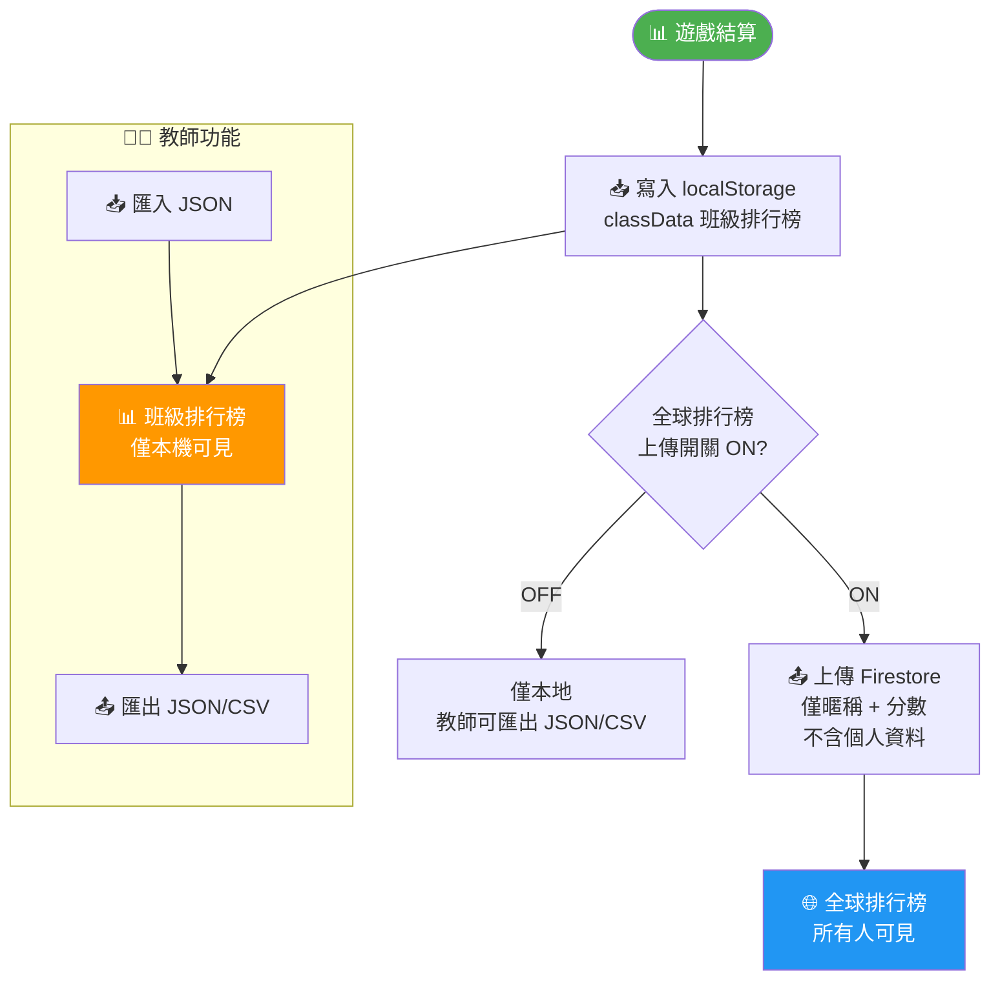

**📌 關鍵設計點**

- **預設不上傳**：全球榜需使用者主動開啟
- **隱私保護**：上傳僅暱稱+分數，不含真實身份
- **教師匯出入**：班級資料支援 JSON/CSV 匯出與匯入還原

[🔝 回到目錄](#目錄) · [🛠️ 開發規範](開發規範與工具.md#top)

---

### 3.7 徽章系統（18個）🔄

> **🆕v4.1**：獲得徽章時，除了解鎖音效，還會語音播報徽章名稱（例：「獲得小老鼠冒險家！」），增強多感官回饋。

#### 基礎徽章（5個）🔄

| 徽章 | 名稱         | 條件                             |
| ---- | ------------ | -------------------------------- |
| 🐭🏆 | 小老鼠冒險家 | 通過（≥83%）小老鼠遊戲場所有規則 |
| 🐟🏆 | 釣魚大冒險家 | 通過（≥83%）釣魚遊戲場所有規則   |
| 🔄⭐ | 規則轉換大師 | 通過（≥83%）任一遊戲場的規則二   |
| 🎯✨ | 混合高手     | 通過（≥83%）任一遊戲場的混合規則 |
| 🧠💫 | 記憶達人     | 完成 5 次 WM 測驗                |

#### 進階徽章（5個）🔄

| 徽章 | 名稱       | 條件                           |
| ---- | ---------- | ------------------------------ |
| ⚡👑 | 速度之王   | 平均反應<2秒                   |
| 💯🏅 | 完美主義者 | 任一規則全對                   |
| 📈🚀 | 進步之星   | 總分超越個人最佳紀錄           |
| 🧠⭐ | 記憶之星   | WM 測驗全對（任一次）          |
| 🏅🎊 | 全制霸     | 通過（≥83%）所有遊戲場所有規則 |

#### 特殊徽章（8個）🔄

| 徽章 | 名稱       | 條件                                 | 提示            |
| ---- | ---------- | ------------------------------------ | --------------- |
| 🌟🌈 | 七彩收藏家 | 獲得7個不同徽章                      | 收集更多徽章... |
| 🦸‍♂️⚔️ | 不屈勇士   | 未達標後立刻重試並達標（≈83%）🔄v4.1 | 跌倒了要...     |

> **🆕v4.1 不屈勇士條件說明**：
>
> - 「未達標」：答對率 < 83%（例：6 題中答對不到 5 題）→ 即系統級「未通過」🆕v4.2
> - 「立刻重試」：在「遊戲結束畫面」按「重新挑戰」按鈕
> - 「達標」：重試後答對率 ≥ 83%（約 5/6）
> - ❌ **離開網站不算「立刻重試」**：必須在同一 session 內完成

| 🌅☀️ | 早起鳥兒 | 上午8點前遊玩 | 早起的鳥兒... |
| 🌙💪 | 懸梁刺骨 | 晚上22點～早上8點之間遊玩 | 夜深了還在... |
| 🎮🕹️ | 遊戲達人 | 累積遊玩10次 | 持續練習... |
| 🏅🔰 | 徽章強者 | 集滿所有基礎徽章（5個） | — |
| 🏅🎖️ | 徽章專家 | 集滿所有進階徽章（5個） | — |
| 🏅👑 | 徽章職人大師 | 集滿基礎（5）+ 進階（5）+ 不屈勇士 + 早起鳥兒 + 懸梁刺骨 + 遊戲達人 | — |

<a id="flow-23-徽章判定狀態機"></a>

#### Flow-23: 徽章判定狀態機

> **說明**：18 個徽章的觸發條件決策樹。  
> **對應章節**：§3.7 徽章系統

```mermaid
flowchart TB
    TRIGGER([🎯 遊戲結算<br/>觸發徽章判定]) --> B_GROUP{徽章類別}

    B_GROUP --> BASIC
    B_GROUP --> ADVANCED
    B_GROUP --> SPECIAL

    subgraph BASIC["🏅 基礎徽章（5 個）"]
        B1{🐭 小老鼠<br/>3 規則都 ≥83%?}
        B1 -->|✅| B1_Y[🐭🏆 小老鼠冒險家]
        B2{🐟 釣魚<br/>3 規則都 ≥83%?}
        B2 -->|✅| B2_Y[🐟🏆 釣魚大冒險家]
        B3{任一遊戲場<br/>規則二 ≥83%?}
        B3 -->|✅| B3_Y[🔄⭐ 規則轉換大師]
        B4{任一遊戲場<br/>混合 ≥83%?}
        B4 -->|✅| B4_Y[🎯✨ 混合高手]
        B5{WM 完成<br/>≥ 5 次?}
        B5 -->|✅| B5_Y[🧠💫 記憶達人]
    end

    subgraph ADVANCED["🥇 進階徽章（5 個）"]
        A1{avgRT < 2 秒?}
        A1 -->|✅| A1_Y[⚡👑 速度之王]
        A2{任一規則<br/>100% 答對?}
        A2 -->|✅| A2_Y[💯🏅 完美主義者]
        A3{總分 ><br/>歷史最佳?}
        A3 -->|✅| A3_Y[📈🚀 進步之星]
        A4{WM 任一次<br/>全對?}
        A4 -->|✅| A4_Y[🧠⭐ 記憶之星]
        A5{所有遊戲場<br/>所有規則 ≥83%?}
        A5 -->|✅| A5_Y[🏅🎊 全制霸]
    end

    subgraph SPECIAL["🏅 特殊徽章（8 個）"]
        H2{已獲得<br/>≥ 7 不同徽章?}
        H2 -->|✅| H2_Y[🌟🌈 七彩收藏家]
        H3{未達標 → 重試<br/>→ 達標 ≥83%<br/>同 session?}
        H3 -->|✅| H3_Y[🦸‍♂️⚔️ 不屈勇士]
        H4{時間 < 8:00?}
        H4 -->|✅| H4_Y[🌅☀️ 早起鳥兒]
        H4b{時間 ≥ 22:00<br/>OR < 8:00?}
        H4b -->|✅| H4b_Y[🌙💪 懸梁刺骨]
        H5{累積遊玩<br/>≥ 10 次?}
        H5 -->|✅| H5_Y[🎮🕹️ 遊戲達人]
        S1{集滿基礎<br/>5 個?}
        S1 -->|✅| S1_Y[🏅🔰 徽章強者]
        S2{集滿進階<br/>5 個?}
        S2 -->|✅| S2_Y[🏅🎖️ 徽章專家]
        S3{集滿基礎+進階<br/>+不屈勇士+早起鳥兒<br/>+懸梁刺骨+遊戲達人?}
        S3 -->|✅| S3_Y[🏅👑 徽章職人大師]
    end

    style TRIGGER fill:#2196F3,color:#fff
```

**📌 關鍵設計點**

- **3 類 18 個**：基礎 5 + 進階 5 + 特殊 8
- **獲得時語音播報**：「獲得小老鼠冒險家！」
- **不屈勇士**：未通過（<83%）→ 同 session 重試 → 通過（≥83%）即觸發
- **特殊徽章含提示**：部分特殊徽章有提示文字引導但不明示條件
- **懸梁刺骨**：晚上 22:00 ～ 早上 8:00 之間遊玩即觸發
- **集滿類徽章**：徽章強者（集滿基礎）、徽章專家（集滿進階）、徽章職人大師（集滿全部指定徽章）

<a id="flow-27-不屈勇士徽章觸發流程"></a>

#### Flow-27: 不屈勇士徽章觸發流程

> **說明**：特殊徽章「不屈勇士」的精確觸發條件。  
> **對應章節**：§3.7 特殊徽章

```mermaid
flowchart TB
    FINISH([📝 規則結束]) --> ACC{答對率?}

    ACC -->|≥ 83%| NO_TRIGGER[不觸發<br/>（本身就達標了）]
    ACC -->|< 83%| UNDER[📌 標記為「未達標」<br/>記錄 session ID]

    UNDER --> ACTION{玩家動作?}
    ACTION -->|🏠 離開網站| CANCEL[❌ 重置標記<br/>離開不算重試]
    ACTION -->|🔄 按「重新挑戰」| RETRY[🔄 開始重試<br/>同一 session]

    RETRY --> RETRY_FINISH[📝 重試完成]
    RETRY_FINISH --> RETRY_ACC{重試答對率?}

    RETRY_ACC -->|≥ 83%| BADGE[🦸‍♂️⚔️ 獲得「不屈勇士」！<br/>🔊 語音播報徽章名稱]
    RETRY_ACC -->|< 83%| NO_BADGE[❌ 未達標<br/>可再次重試]

    NO_BADGE --> ACTION

    style FINISH fill:#2196F3,color:#fff
    style BADGE fill:#FFD700,color:#333
    style CANCEL fill:#9E9E9E,color:#fff
```

**📌 關鍵設計點**

- **83% 門檻**（≈5/6）：與系統級通過門檻一致，即「失敗後重試並通過」
- **同 session 限定**：離開網站後重置，不算「立刻重試」
- **可多次嘗試**：未達標可持續重試直到達標
- **用「達標/未達標」**：避免與系統「通過/失敗」混淆

[🔝 回到目錄](#目錄) · [🛠️ 開發規範](開發規範與工具.md#top)

---

### 3.8 等級系統 🔄

> **🆕v4.1**：升級時除了升級音效，還會語音播報新等級名稱（例：「恭喜升級為破殼雞！」）。

> **🔄v4.3 星星定義**：規則通過（≥83%）→ +1⭐，WM 通過（≥83%）→ +1⭐，WM 全對→ Bonus⭐。「通過」=「獲得星星」，兩者等同。星星可重複獲得，無限累計。

```
星星獲取規則 🔄v4.3：
  ✅ 探險點規則通過（≥83%）→ +1⭐
  ✅ 探險點 WM 通過（≥83%）→ +1⭐ 🆕v4.3（原為全對才給）
  ✅ WM 全對 Bonus → 額外⭐（依逆向/順向公式，見 §3.4）
  ❌ 規則答對率 < 83% → 不獲得規則星星
  ❌ WM 答對率 < 83% → 不獲得 WM 星星（仍得基礎分 + 速度獎勵）
  ✅ 同一探險點重複通過 → 每次都獲得星星（可無限累積）

  WM 通過定義 🔄v4.3：
  ✅ WM 答對率 ≥83% = WM 通過 = 獲得 WM 星星 🆕v4.3
  ✅ WM 全對時額外獲得全對 Bonus⭐（依逆向/順向公式，見 §3.4）
  ❌ WM 答對率 < 83% = 不通過 = 不獲得 WM 星星（仍計算基礎分）

  每次探險點可獲得星星：
  純規則探險點：最多 1⭐（規則通過）
  規則+WM 探險點：1⭐（規則）+ 1⭐（WM 通過）+ Bonus⭐（WM 全對）
  ✅ 累積無上限：星星隨遊玩次數持續增長

Level 1 (0-10星)   → 🥚 蛋寶寶
Level 2 (11-20星)  → 🐣 破殼雞
Level 3 (21-40星)  → 🐥 小雞仔
Level 4 (41-60星)  → 🐓 雞大王
Level 5 (61+星)    → 🦅 金鷹王者

顯示介面：
┌────────────────────────────┐
│   你的成長階段               │
│                            │
│        🐣                  │
│     破殼雞                  │
│                            │
│  累積星星：15 顆            │
│                            │
│  [▓▓▓▓▓▓░░░░]             │
│  距離下一階段：還差 6 顆星  │
└────────────────────────────┘
```

<a id="flow-22-星星與等級狀態機"></a>

#### Flow-22: 星星與等級狀態機

> **說明**：星星累積 → 等級升級的狀態轉換。  
> **對應章節**：§3.8 等級系統

```mermaid
stateDiagram-v2
    [*] --> 蛋寶寶

    蛋寶寶: 🥚 蛋寶寶\n0-10 ⭐
    破殼雞: 🐣 破殼雞\n11-20 ⭐
    小雞仔: 🐥 小雞仔\n21-40 ⭐
    雞大王: 🐓 雞大王\n41-60 ⭐
    金鷹王者: 🦅 金鷹王者\n61+ ⭐

    蛋寶寶 --> 破殼雞: 累積 11 ⭐\n🔊 語音播報升級
    破殼雞 --> 小雞仔: 累積 21 ⭐\n🔊 語音播報升級
    小雞仔 --> 雞大王: 累積 41 ⭐\n🔊 語音播報升級
    雞大王 --> 金鷹王者: 累積 61 ⭐\n🔊 語音播報升級

    note right of 蛋寶寶
        星星來源（探險地圖 🆕v4.3）：
        ✅ 規則通過 ≥83% → +1⭐（每次重玩都累計）
        ✅ WM 通過 ≥83% → +1⭐（每次重玩都累計）
        ✅ WM 全對 Bonus → 額外⭐（依公式）
        單次探險點最多：1⭐規則 + 1⭐WM + Bonus⭐
        累積無上限
    end note
```

**📌 關鍵設計點**

- **星星可重複**：同探險點重複通過每次都累計⭐
- **WM 通過門檻 ≥83%**：WM ≥83% → +1⭐；全對另有 Bonus⭐ 🆕v4.3
- **WM Bonus 公式**：逆向 n≥2 → +(n-1)⭐；順向 2-6 → +1⭐，7-9 → +2⭐，n≥10 → +(n-7)⭐
- **等級只升不降**：星星只增不減
- **升級語音**：升級時語音播報新等級名稱

<a id="flow-26-通過／失敗判定與後續處理流程"></a>

#### Flow-26: 通過／失敗判定與後續處理流程

> **說明**：探險地圖探險點完成後的通過判定 + 連鎖效果。  
> **對應章節**：§3.8–§3.9 星星/解鎖系統 🆕v4.3

```mermaid
flowchart TB
    FINISH([📝 規則完成<br/>答對率計算完畢]) --> PASS{答對率<br/>≥ 83%<br/>（≈5/6 題）?}

    PASS -->|✅ 通過| SUCCESS
    PASS -->|❌ 未通過| FAIL

    subgraph SUCCESS["✅ 通過效果"]
        S1[⭐ +1 星星（規則）]
        S2[📊 計入探險地圖<br/>通過進度]
        S3[🔊 語音播報通過]
        S5{首次通過?}
        S5 -->|是| S5_Y[🌟 首次通關 +1 分<br/>標記 firstClear=false]
        S5 -->|否| S5_N[無額外]
        S6[🏅 觸發徽章判定<br/>→ 詳見 Flow-23]
        S7[📊 更新 localStorage<br/>bestScore / starsEarned]
    end

    subgraph FAIL["❌ 未通過效果"]
        F1[❌ 不得星星]
        F2[❌ 不計入通過進度]
        F3[可重新遊玩]
        F4{同 session<br/>重試後通過?}
        F4 -->|是| F4_Y[🦸‍♂️ 不屈勇士徽章<br/>→ 詳見 Flow-27]
    end

    SUCCESS --> WM_CHECK
    FAIL --> WM_CHECK

    WM_CHECK{本探險點<br/>含 WM?}
    WM_CHECK -->|有 WM| WM[🧠 WM 測驗<br/>→ 詳見 Flow-13]
    WM_CHECK -->|無 WM| UNLOCK_CHECK

    WM --> WM_PASS{WM ≥83%?}
    WM_PASS -->|✅| WM_STAR[⭐ +1 WM 星星<br/>+ 全對 Bonus ⭐]
    WM_PASS -->|❌| WM_NO[僅基礎分<br/>❌ 無 WM 星星]

    WM_STAR --> UNLOCK_CHECK
    WM_NO --> UNLOCK_CHECK

    UNLOCK_CHECK{探險點通過判定}
    UNLOCK_CHECK -->|純規則：規則≥83%| UNLOCK[🔓 解鎖下一探險點]
    UNLOCK_CHECK -->|規則+WM：兩者皆≥83%| UNLOCK
    UNLOCK_CHECK -->|任一未達標| NO_UNLOCK[❌ 未解鎖<br/>可重玩此探險點]

    UNLOCK --> MAP_CHECK{最後一點?}
    MAP_CHECK -->|地圖1第6點| MAP2_UNLOCK[🎉 解鎖地圖 2]
    MAP_CHECK -->|地圖2第6點| FREE_UNLOCK[🎉🎉 解鎖自由選擇！<br/>慶祝動畫]
    MAP_CHECK -->|其他| NEXT[➡️ 回到探險地圖]

    NO_UNLOCK --> NEXT
    MAP2_UNLOCK --> NEXT
    FREE_UNLOCK --> NEXT

    style FINISH fill:#2196F3,color:#fff
    style SUCCESS fill:#E8F5E9
    style FAIL fill:#FFEBEE
    style FREE_UNLOCK fill:#FFD700,color:#333
```

**📌 關鍵設計點**

- **通過 = 得星**：規則≥83% 獲得 1⭐
- **WM 通過門檻 ≥83%**：WM ≥83% → +1⭐ + 全對 Bonus⭐ 🆕v4.3
- **探險點通過判定**：純規則只看規則；規則+WM 兩者皆需≥83% 🆕v4.3
- **解鎖連鎖**：通過→解鎖下一探險點→地圖完成→解鎖下一地圖→全通關→解鎖自由選擇
- **不屈勇士**：未通過 → 同 session 重試 → 通過 → 觸發特殊徽章
- **WM 星星獨立**：規則未通過仍可嘗試 WM（但探險點不算通過）

[🔝 回到目錄](#目錄) · [🛠️ 開發規範](開發規範與工具.md#top)

---

### 3.9 關卡解鎖系統 🔄v4.3

> **🆕v4.3 重大變更**：取消雙路線（路線A/B）、取消 UNLOCK_START_MODE。
> 改為探險地圖逐步解鎖，唯一路徑。
> 解鎖時會語音播報解鎖內容，搭配視覺解鎖動畫同步播放。

#### 解鎖機制 🔄v4.3

```
探險地圖逐步解鎖（唯一路徑）🆕v4.3：

  🐭 地圖 1：小老鼠冒險（6 個探險點，逐步解鎖）
    ① 🐭R1     ← 初始可玩 🟡
    ② 🐭R1+WM  ← ①通過後解鎖（規則≥83%）
    ③ 🐭R2     ← ②通過後解鎖（規則≥83% AND WM≥83%）
    ④ 🐭R2+WM  ← ③通過後解鎖
    ⑤ 🐭混合   ← ④通過後解鎖
    ⑥ 🐭混合+WM ← ⑤通過後解鎖

  🐟 地圖 2：釣魚冒險（地圖 1 全通過後解鎖）
    ⑦ 🐟R1     ← ⑥通過後解鎖（地圖 1 完成！🎉）
    ⑧ 🐟R1+WM  ← ⑦通過後解鎖
    ⑨ 🐟R2     ← ⑧通過後解鎖
    ⑩ 🐟R2+WM  ← ⑨通過後解鎖
    ⑪ 🐟混合   ← ⑩通過後解鎖
    ⑫ 🐟混合+WM ← ⑪通過後解鎖

  🆓 自由選擇 ← ⑫通過後解鎖（全部通關！🎉🎉 慶祝動畫）

探險點通過條件 🆕v4.3：
  純規則探險點（①③⑤⑦⑨⑪）：規則答對率 ≥83%
  規則+WM 探險點（②④⑥⑧⑩⑫）：規則≥83% AND WM≥83%
  ✅ 兩者皆須達標才算通過

解鎖條件 🔄v4.3：
  ✅ 「通過」=「獲得星星 + 解鎖下一點」
  ✅ 通過定義：答對率 ≥ 83%（依文獻設定，≈6 題中答對 5 題以上）
  ✅ 自訂題數時通過門檻 = 答對 83%
  ✅ 規則通過 → +1⭐；WM 通過 → +1⭐ + Bonus⭐
  ❌ 任一未達標 → 不解鎖，可重玩

已取消 🆕v4.3：
  ❌ UNLOCK_START_MODE（不再有路線選擇）
  ❌ ?startMode=standard（不再有標準模式優先）
  ❌ 遊戲場模式（由探險地圖取代）
  ❌ 標準模式（由探險地圖取代）
  ❌ 雙路線切換（只有探險地圖→自由選擇）

保留 🆕v4.3：
  ✅ ?unlock=all 跳過所有鎖定（教師/研究者用）
```

#### ~~每個規則的雙模式~~ → 已取消 🆕v4.1

> **❗ v4.1 決策**：挑戰模式已取消。原設計為「正式模式 + 挑戰模式（題數 ×1.5）」，現簡化為單一模式。
>
> 原因：
>
> 1. 一般模式已可自選題數，挑戰模式不再必要
> 2. 簡化 UI 與開發複雜度
> 3. 減少解鎖語音檔案數量（10 → 4）

```
✅ 現行架構：
  每個遊戲場 × 每個規則 = 單一模式
  題數可自選（預設 6 題）
  無額外解鎖門檻

❌ 已取消：
  • 挑戰模式（題數 ×1.5）
  • 挑戰模式解鎖語音（6 個）
  • 正式模式達標才能解鎖挑戰模式的機制
```

#### 教師覆寫

```
✅ 教師用 ?unlock=all 解鎖全部
✅ 解鎖全部 = 所有遊戲場×所有規則×所有模式
✅ 無限免費重試
✅ 可重複挑戰刷新紀錄
```

<a id="flow-21-關卡解鎖狀態機"></a>

#### Flow-21: 關卡解鎖狀態機

> **說明**：探險地圖 12 個探險點的逐步解鎖狀態機。  
> **對應章節**：§3.9 關卡解鎖系統 🆕v4.3

```mermaid
stateDiagram-v2
    [*] --> 地圖1_探險點1

    state 地圖1_小老鼠冒險 {
        地圖1_探險點1: ① 🐭R1 🟡（初始可玩）
        地圖1_探險點2: ② 🐭R1+WM 🔒
        地圖1_探險點3: ③ 🐭R2 🔒
        地圖1_探險點4: ④ 🐭R2+WM 🔒
        地圖1_探險點5: ⑤ 🐭混合 🔒
        地圖1_探險點6: ⑥ 🐭混合+WM 🔒

        地圖1_探險點1 --> 地圖1_探險點2: ①通過\n規則≥83%
        地圖1_探險點2 --> 地圖1_探險點3: ②通過\n規則≥83% AND WM≥83%
        地圖1_探險點3 --> 地圖1_探險點4: ③通過\n規則≥83%
        地圖1_探險點4 --> 地圖1_探險點5: ④通過\n規則≥83% AND WM≥83%
        地圖1_探險點5 --> 地圖1_探險點6: ⑤通過\n規則≥83%
    }

    地圖1_探險點6 --> 地圖2_探險點1: ⑥通過\n規則≥83% AND WM≥83%\n🎉 地圖 1 完成！

    state 地圖2_釣魚冒險 {
        地圖2_探險點1: ⑦ 🐟R1 🟡
        地圖2_探險點2: ⑧ 🐟R1+WM 🔒
        地圖2_探險點3: ⑨ 🐟R2 🔒
        地圖2_探險點4: ⑩ 🐟R2+WM 🔒
        地圖2_探險點5: ⑪ 🐟混合 🔒
        地圖2_探險點6: ⑫ 🐟混合+WM 🔒

        地圖2_探險點1 --> 地圖2_探險點2: ⑦通過\n規則≥83%
        地圖2_探險點2 --> 地圖2_探險點3: ⑧通過\n規則≥83% AND WM≥83%
        地圖2_探險點3 --> 地圖2_探險點4: ⑨通過\n規則≥83%
        地圖2_探險點4 --> 地圖2_探險點5: ⑩通過\n規則≥83% AND WM≥83%
        地圖2_探險點5 --> 地圖2_探險點6: ⑪通過\n規則≥83%
    }

    地圖2_探險點6 --> 自由選擇: ⑫通過\n規則≥83% AND WM≥83%\n🎉🎉 全部通關！

    自由選擇: 🆓 自由選擇 解鎖！\n= 多人房主同等自由度

    note right of 地圖1_小老鼠冒險
        探險點 3 狀態：
        ⬜ 未解鎖（灰色+🔒）
        🟡 當前可玩（發光）
        ⭐ 已通過（顯示星星）
        已通過可重玩，星星無限累計
    end note

    note right of 地圖2_釣魚冒險
        通過條件：
        純規則點（奇數）：規則 ≥83%
        規則+WM 點（偶數）：兩者皆 ≥83%
        教師覆寫：?unlock=all
    end note
```

**📌 關鍵設計點**

- **唯一解鎖路徑**：探險地圖 → 逐步解鎖（取消雙路線） 🆕v4.3
- **12 個探險點**：2 地圖 × 6 點 = ①~⑫，強制依序
- **通過條件**：純規則≥83%；規則+WM 兩者皆≥83% 🆕v4.3
- **跨 session 保存**：進度存 localStorage，今天玩到③，明天繼續④
- **已通過可重玩**：星星無限累計，不影響解鎖進度
- **教師覆寫**：`?unlock=all` 跳過所有鎖定
- **Config 可調**：ADVENTURE_MAPS 陣列可彈性調整探險點排列
- **不再有 UNLOCK_START_MODE**：已取消雙路線切換 🆕v4.3

[🔝 回到目錄](#目錄) · [🛠️ 開發規範](開發規範與工具.md#top)

---

<a id="四多感官設計聲音配色與刺激物系統"></a>

## 四、多感官設計（聲音、配色與刺激物系統）

**本章整合聲音設計、配色主題系統、刺激物彈性系統**

[🔝 回到目錄](#目錄) · [🛠️ 開發規範](開發規範與工具.md#top)

### 4.1 聲音系統核心原則 🔄

```
✅ 「多一個感官輸入，多一個理解機會」
✅ 視覺為主（必要），聽覺為輔（增強）
✅ 無聲音 100% 可玩，有聲音體驗更佳
✅ 遊戲內建完整預設音效 🆕v4.1
✅ 使用者可自由替換所有音效 🆕v4.1
✅ 刺激物出現時念出刺激物名稱 🆕v4.1
✅ 關鍵時刻語音播報（WM 規則、徽章、等級、解鎖）🆕v4.1
❌ 不含背景音樂（BGM）— 已取消 🆕v4.1
✅ 簡化為兩個主開關：「音效」與「語音」 🆕v4.1
```

[🔝 回到目錄](#目錄) · [🛠️ 開發規範](開發規範與工具.md#top)

### 4.2 聲音分類與應用場景 🔄

| 分類                   | 說明                               | 可替換    | 預設音效範例                        |
| ---------------------- | ---------------------------------- | --------- | ----------------------------------- |
| **🗣️ 規則說明語音**    | 每個規則開始前的語音指導           | ✅        | 「看到起司，按空白鍵！」            |
| **🔊 回饋音效**        | 答對/答錯/徽章/升級                | ✅        | 叮（答對）、噗（答錯）              |
| **📢 刺激物語音** 🆕   | 刺激物出現時念出名稱（男女聲雙軌） | ✅        | 👩「起司」👨「起司」                |
| **~~🎵 背景音樂~~**    | ~~各遊戲場主題音樂~~               | ❌ 已取消 | ~~小老鼠輕快曲、海洋悠閒曲~~ 🆕v4.1 |
| **🔔 刺激音效**        | 題目出現的提示音                   | ✅        | 彈出音效                            |
| **⏱️ 倒數音效**        | 3-2-1-開始                         | ✅        | 逐秒嗶聲                            |
| **🧠 WM 音效**         | 位置亮起/回答正確/錯誤/規則語音    | ✅        | 亮起提示音、「請順向點選」          |
| **🏅 成就播報語音** 🆕 | 徽章名稱/等級名稱/解鎖通知念出     | ✅        | 「獲得小老鼠冒險家！」              |
| **👥 多人通知音效** 🆕 | 玩家加入/完成通知                  | ✅        | 玩家加入提示音                      |
| **🖱️ UI 音效**         | 按鈕點擊、頁面切換                 | ✅        | 點擊聲                              |

[🔝 回到目錄](#目錄) · [🛠️ 開發規範](開發規範與工具.md#top)

### 4.2.1 刺激物語音系統（男女聲性別切換）🆕v4.1

> **核心功能**：刺激物出現時，系統自動播放該刺激物名稱的語音，增強多感官輸入。  
> **關鍵設計**：在混合規則中，**聲音性別 = 規則切換的聽覺提示**，女聲代表規則一、男聲代表規則二。

```
運作方式：
  1. 刺激物出現在畫面上（視覺）
  2. 同時播放該刺激物名稱語音（聽覺）
  3. 玩家根據規則判斷是否按空白鍵

聲音性別規則：
  📌 規則一（單獨）：👩 女聲念刺激物名稱
  📌 規則二（單獨）：👩 女聲念刺激物名稱
  📌 混合規則：
      規則A情境 → 👩 女聲念刺激物名稱
      規則B情境 → 👨 男聲念刺激物名稱

完整對應表：

  🐭 小老鼠遊戲場：
  ──────────────────────────────────────────────────
  規則一（單獨）：
    🧀 Go    → 👩 女聲「起司」
    😺 No-Go → 👩 女聲「貓咪」

  規則二（單獨）：
    🧀 Go/No-Go → 👩 女聲「起司」
    😺 Go/No-Go → 👩 女聲「貓咪」

  混合規則：
    沒人（規則A情境）→ 👩 女聲「起司」/「貓咪」
    有人（規則B情境）→ 👨 男聲「起司」/「貓咪」
  ──────────────────────────────────────────────────

  🐟 釣魚遊戲場：
  ──────────────────────────────────────────────────
  規則一（單獨）：
    🐟 Go    → 👩 女聲「魚」
    🦈 No-Go → 👩 女聲「鯊魚」

  規則二（單獨）：
    🐟 Go/No-Go → 👩 女聲「魚」
    🦈 Go/No-Go → 👩 女聲「鯊魚」

  混合規則：
    白天（規則A情境）→ 👩 女聲「魚」/「鯊魚」
    晚上（規則B情境）→ 👨 男聲「魚」/「鯊魚」
  ──────────────────────────────────────────────────

設計原則：
  ✅ 規則一 & 規則二單獨遊玩時：全程女聲（無性別切換）
  ✅ 混合規則時：聲音性別即時變換，提示目前是哪個規則情境
  ✅ 多感官提示：視覺（條件提示物）+ 聽覺（聲音性別）同時提示
  ✅ 對聽障幼兒的價值：多一個感官管道區分規則切換
  ✅ 語音在刺激物出現時立即播放（不等待動畫完成）
  ✅ 語音不影響遊戲計時（不會因為語音長度影響判斷時間）
  ✅ 語音可單獨關閉（不影響其他音效）
  ✅ 替換刺激物包時，對應男女聲語音一同替換
  ✅ 語音檔案定義在 stimuli-config.js 中

遊戲說明時必須向玩家解釋：
  ✅ 「這個遊戲有兩個聲音！」
  ✅ 「女生的聲音（播放範例）= 規則一」
  ✅ 「男生的聲音（播放範例）= 規則二」
  ✅ 「聽到女生說『起司』→ 照規則一玩」
  ✅ 「聽到男生說『起司』→ 照規則二玩」
```

<a id="flow-15-刺激物語音性別判定流程"></a>

#### Flow-15: 刺激物語音性別判定流程

> **說明**：刺激物出現時決定播放男聲或女聲。  
> **對應章節**：§4.2.1 刺激物語音系統

```mermaid
flowchart TB
    INPUT([🔊 刺激物出現<br/>需要播放語音]) --> VOICE_ON{🗣️ 語音開關<br/>ON?}

    VOICE_ON -->|OFF| SILENT[🔇 不播放語音]
    VOICE_ON -->|ON| RULE{當前規則?}

    RULE -->|規則一（單獨）| FEMALE[👩 女聲<br/>播放刺激物名稱]
    RULE -->|規則二（單獨）| FEMALE
    RULE -->|混合規則| CONTEXT{當前情境?}

    CONTEXT -->|規則A情境<br/>🐭沒人 / 🐟白天| FEMALE
    CONTEXT -->|規則B情境<br/>🐭有人 / 🐟晚上| MALE[👨 男聲<br/>播放刺激物名稱]

    style INPUT fill:#2196F3,color:#fff
    style FEMALE fill:#E91E63,color:#fff
    style MALE fill:#2196F3,color:#fff
    style SILENT fill:#9E9E9E,color:#fff
```

**📌 關鍵設計點**

- **聲音性別 = 規則提示**：混合規則中，男/女聲幫助孩子辨識當前套用的規則（A or B）
- **規則一/二單獨時統一女聲**：因為不需要聲音區分
- **語音開關獨立**：關閉語音不影響遊戲可玩性

[🔝 回到目錄](#目錄) · [🛠️ 開發規範](開發規範與工具.md#top)

### 4.2.2 可替換回饋音效 🆕v4.1

```
回饋音效分類：
  ├── 答對音效：正確回饋聲（預設：叮～✨）
  ├── 答錯音效：錯誤回饋聲（預設：噗～）
  ├── 徽章解鎖音效：獲得徽章時（預設：🎉 慶祝旋律）
  ├── 升級音效：等級提升時（預設：🎶 升級音樂）
  └── 遊戲完成音效：規則結束時（預設：🏁 完成音樂）

替換方式：
  ✅ 研究者：透過進階設定上傳自訂音效檔案
  ✅ 幼兒：透過簡易介面選擇預設音效主題包
  ✅ 支援格式：MP3、WAV、OGG
  ✅ 建議長度：回饋音效 ≤ 1 秒、語音指導 ≤ 5 秒
```

[🔝 回到目錄](#目錄) · [🛠️ 開發規範](開發規範與工具.md#top)

### 4.2.3 可替換規則說明語音 🆕v4.1

```
規則說明語音：
  🐭 小老鼠 規則一：「看到起司就按空白鍵，看到貓咪不要按！」
  🐭 小老鼠 規則二：「注意！現在規則反過來了！看到起司不要按，看到貓咪才要按！」
  🐭 小老鼠 混合：
    「這次有兩個規則會交替出現！」
    「聽到女生的聲音，就照規則一玩：起司按、貓咪不按」
    「聽到男生的聲音，就照規則二玩：起司不按、貓咪按」
    「注意聽是誰的聲音喔！」
  🐟 釣魚 規則一：「看到魚就按空白鍵，看到鯊魚不要按！」
  🐟 釣魚 規則二：「注意！看到魚不要按，看到鯊魚才要按！」
  🐟 釣魚 混合：
    「這次有兩個規則會交替出現！」
    「聽到女生的聲音，就照規則一玩：魚按、鯊魚不按」
    「聽到男生的聲音，就照規則二玩：魚不按、鯊魚按」
    「注意聽是誰的聲音喔！」

替換方式：
  ✅ 研究者可錄製或上傳自訂語音（支援台灣手語影片、口語、文字+TTS）
  ✅ 可為不同語言/溝通模式準備不同語音包
  ✅ 預設提供：中文語音 + 文字動畫
  ✅ 混合規則說明必須包含男女聲提示的說明
```

[🔝 回到目錄](#目錄) · [🛠️ 開發規範](開發規範與工具.md#top)

### 4.2.4 語音播報系統 🆕v4.1

> **核心理念**：在關鍵時刻以語音播報強化多感官回饋，讓聽障幼兒多一個感官管道接收訊息。

#### ① 工作記憶規則語音

```
WM 測驗開始時，語音念出測驗規則：

語音內容：
  👩 順向：「請照順序點選！」（wm-forward.mp3）
  👩 逆向：「請倒著點選！」（wm-reverse.mp3）

播放時機：
  ✅ WM 測驗畫面顯示「方向：順向/逆向」時立即播放
  ✅ 語音 + 文字 + 圖示 同時呈現（多感官）
  ✅ 語音播完後才開始位置亮起序列
  ✅ 可替換：研究者可上傳自訂語音
```

#### ② 刺激物選擇語音

```
在設定頁面選擇刺激物包時，播放對應刺激物語音：

播放時機：
  ✅ 幼兒選擇刺激物包時 → 播放該包的 Go 刺激物女聲語音
     例：選到「預設（起司/貓咪）」→ 播放 👩「起司」
     例：選到「海洋（魚/鯊魚）」→ 播放 👩「魚」
  ✅ 研究者預覽刺激物時 → 播放對應語音
  ✅ 使用現有刺激物語音檔（voiceFemale），不需額外檔案

音檔來源：
  ✅ 直接複用 stimuli-config 中的 voiceFemale 檔案
  ✅ 無需新增額外語音檔案
```

#### ③ 徽章名稱播報

```
獲得徽章時，除了解鎖音效，還語音念出徽章名稱：

播放順序：
  1. 🎉 徽章解鎖音效（badge-unlock.mp3）
  2. 👩 語音播報：「獲得 ○○○！」

語音檔案（18 個徽章 = 18 個語音檔）：
  基礎徽章（5個）：
    badge-mouse-adventurer.mp3     →「獲得小老鼠冒險家！」
    badge-fishing-adventurer.mp3   →「獲得釣魚大冒險家！」
    badge-rule-switcher.mp3        →「獲得規則轉換大師！」
    badge-mixed-master.mp3         →「獲得混合高手！」
    badge-memory-expert.mp3        →「獲得記憶達人！」

  進階徽章（5個）：
    badge-speed-king.mp3           →「獲得速度之王！」
    badge-perfectionist.mp3        →「獲得完美主義者！」
    badge-progress-star.mp3        →「獲得進步之星！」
    badge-memory-star.mp3          →「獲得記憶之星！」
    badge-all-clear.mp3            →「獲得全制霸！」

  特殊徽章（8個）：
    badge-rainbow-collector.mp3    →「獲得七彩收藏家！」
    badge-brave-warrior.mp3        →「獲得不屈勇士！」
    badge-early-bird.mp3           →「獲得早起鳥兒！」
    badge-night-owl.mp3            →「獲得懸梁刺骨！」
    badge-game-master.mp3          →「獲得遊戲達人！」
    badge-badge-strong.mp3         →「獲得徽章強者！」
    badge-badge-expert.mp3         →「獲得徽章專家！」
    badge-badge-grandmaster.mp3    →「獲得徽章職人大師！」

播放設定：
  ✅ 語音在解鎖音效結束後播放（不重疊）
  ✅ 可替換：研究者可上傳自訂徽章語音
  ✅ 可關閉：跟隨「🗣️ 語音」開關
```

#### ④ 等級名稱播報

```
升級時，除了升級音效，還語音念出新等級名稱：

播放順序：
  1. 🎶 升級音效（level-up.mp3）
  2. 👩 語音播報：「恭喜升級為 ○○○！」

語音檔案（5 個等級 = 5 個語音檔）：
  level-1-egg.mp3                  →「你是蛋寶寶！」
  level-2-hatching.mp3             →「恭喜升級為破殼雞！」
  level-3-chick.mp3                →「恭喜升級為小雞仔！」
  level-4-rooster.mp3              →「恭喜升級為雞大王！」
  level-5-eagle.mp3                →「恭喜升級為金鷹王者！」

播放設定：
  ✅ 語音在升級音效結束後播放（不重疊）
  ✅ level-1 語音在首次建立角色時播放
  ✅ level-2~5 語音在升級時播放
  ✅ 可替換：研究者可上傳自訂等級語音
  ✅ 可關閉：跟隨「🗣️ 語音」開關
```

#### ⑤ 解鎖通知語音 🔄v4.3

```
規則解鎖時，語音念出解鎖內容：

語音檔案（規則解鎖 4 個 + 里程碑 2 個 = 共 6 個）🔄v4.3：
  🐭 小老鼠遊戲場：
    unlock-mouse-rule2.mp3         →「小老鼠規則二已解鎖！」
    unlock-mouse-mixed.mp3         →「小老鼠混合規則已解鎖！」

  🐟 釣魚遊戲場：
    unlock-fishing-rule2.mp3       →「釣魚規則二已解鎖！」
    unlock-fishing-mixed.mp3       →「釣魚混合規則已解鎖！」

  🏆 里程碑解鎖 🆕v4.3：
    unlock-map2.mp3                →「恭喜解鎖釣魚冒險地圖！」
    unlock-free-choice.mp3         →「恭喜解鎖自由選擇！」

  ❌ 已取消的挑戰模式解鎖語音（6 個）：
    unlock-*-rule1-challenge.mp3   → 已移除
    unlock-*-rule2-challenge.mp3   → 已移除
    unlock-*-mixed-challenge.mp3   → 已移除

播放時機：
  ✅ 達成解鎖條件時立即播放
  ✅ 搭配視覺解鎖動畫同步播放
  ✅ 可替換：研究者可上傳自訂語音
  ✅ 可關閉：跟隨「🗣️ 語音」開關
```

#### ⑥ 多人模式：玩家加入提示音效

```
等待室中有新玩家加入時，播放提示音效：

音效檔案：
  player-join.mp3                  → 清脆提示音（如「叮咚～」）

播放時機：
  ✅ 新玩家加入等待室時播放
  ✅ 所有已在等待室的玩家都會聽到
  ✅ 不包含語音播報玩家名稱（僅音效提示）
  ✅ 可替換：研究者可上傳自訂音效
  ✅ 可關閉：跟隨「🔊 音效」開關
```

#### 語音播報系統總覽

| 類別           | 觸發時機         | 語音檔數量       | 新增音檔 |
| -------------- | ---------------- | ---------------- | -------- |
| WM 規則語音    | WM 測驗開始      | 2 個             | ✅ 新增  |
| 刺激物選擇語音 | 設定頁選擇刺激物 | 0 個             | 複用既有 |
| 徽章名稱播報   | 徽章解鎖         | 18 個            | ✅ 新增  |
| 等級名稱播報   | 等級提升         | 5 個             | ✅ 新增  |
| 解鎖通知語音   | 規則/里程碑解鎖  | **6 個** 🔄v4.3  | ✅ 新增  |
| 玩家加入音效   | 等待室新玩家     | 1 個             | ✅ 新增  |
| **合計**       |                  | **32 個** 🔄v4.3 |          |

> 🔄v4.3 變更：解鎖語音從 4 個增加為 6 個（新增地圖 2 + 自由選擇里程碑語音）。合計 = 2+0+18+5+6+1 = 32 個。

[🔝 回到目錄](#目錄) · [🛠️ 開發規範](開發規範與工具.md#top)

### 4.3 音效控制介面 🔄v4.1

> **🆕v4.1 重要變更**：從 10 個分類開關簡化為 **2 個主開關**（音效 vs 語音），降低使用複雜度。

```
音效設定頁面：
┌──────────────────────────────────────┐
│ 🔊 聲音設定                    🆕v4.1│
├──────────────────────────────────────┤
│                                      │
│ 🔊 總音量：                          │
│ [━━━━━━━━●━━] 80%                    │
│                                      │
│ === 主開關（兩個）===                │
│                                      │
│ 🔊 音效                             │
│ [━━━●━━━━━] ON                       │
│ 含：回饋音效、刺激音效、倒數音效、   │
│     WM 音效、UI 音效、多人通知       │
│                                      │
│ 🗣️ 語音                             │
│ [━━━●━━━━━] ON                       │
│ 含：規則說明語音、刺激物語音、       │
│     徽章播報、等級播報、解鎖播報、   │
│     WM 規則語音                      │
│                                      │
│ === 🎨 音效主題（幼兒簡易選擇）===   │
│ ● 預設音效包                         │
│ ○ 可愛動物音效包                     │
│ ○ 音樂盒音效包                       │
│ ○ 自訂音效包（研究者上傳）           │
│                                      │
│ [⚙️ 進階設定（研究者）]              │
│                                      │
│ === 快速切換 ===                      │
│ 🔊 / 🔇（遊戲畫面右上角）           │
└──────────────────────────────────────┘

進階設定（研究者專用）：
┌──────────────────────────────────────┐
│ ⚙️ 進階聲音設定（研究者）            │
├──────────────────────────────────────┤
│                                      │
│ === 替換個別音效 ===                  │
│                                      │
│ 🗣️ 規則說明語音：                    │
│ [小老鼠規則一] 📎 目前：default.mp3  │
│   [📤 上傳替換] [🔄 恢復預設]        │
│ [小老鼠規則二] 📎 目前：default.mp3  │
│   [📤 上傳替換] [🔄 恢復預設]        │
│ ...（每個組合皆可單獨替換）          │
│                                      │
│ 🔊 回饋音效：                        │
│ [答對音效] 📎 目前：ding.mp3         │
│   [📤 上傳替換] [🔄 恢復預設]        │
│ [答錯音效] 📎 目前：buzz.mp3         │
│   [📤 上傳替換] [🔄 恢復預設]        │
│                                      │
│ 📢 刺激物語音（男女聲雙軌）：        │
│ [🧀 起司 👩女聲] 📎 cheese-f.mp3     │
│   [📤 上傳替換] [🔄 恢復預設]        │
│ [🧀 起司 👨男聲] 📎 cheese-m.mp3     │
│   [📤 上傳替換] [🔄 恢復預設]        │
│ [😺 貓咪 👩女聲] 📎 cat-f.mp3        │
│   [📤 上傳替換] [🔄 恢復預設]        │
│ [😺 貓咪 👨男聲] 📎 cat-m.mp3        │
│   [📤 上傳替換] [🔄 恢復預設]        │
│ ...(每個刺激物皆有男女聲兩個檔案) │
│                                      │
│ === 音效包管理 ===                    │
│ [📦 匯出目前音效包]                  │
│ [📥 匯入音效包]                      │
│ [🔄 全部恢復預設]                    │
│                                      │
└──────────────────────────────────────┘
```

[🔝 回到目錄](#目錄) · [🛠️ 開發規範](開發規範與工具.md#top)

### 4.3.1 聲音系統 Config 結構 🆕v4.1

```javascript
// sound-config.js

const SOUND_PACKS = {
  // ===== 預設音效包 =====
  default: {
    packName: "預設音效",

    // --- 回饋音效 ---
    feedback: {
      correct: { file: "audio/feedback/correct-ding.mp3", label: "答對 - 叮" },
      incorrect: {
        file: "audio/feedback/incorrect-buzz.mp3",
        label: "答錯 - 噗",
      },
      badge: { file: "audio/feedback/badge-unlock.mp3", label: "徽章解鎖" },
      levelUp: { file: "audio/feedback/level-up.mp3", label: "升級" },
      complete: { file: "audio/feedback/game-complete.mp3", label: "遊戲完成" },
    },

    // --- 規則說明語音 ---
    ruleGuide: {
      mouse: {
        rule1: {
          file: "audio/guide/mouse-rule1.mp3",
          label: "小老鼠規則一說明",
        },
        rule2: {
          file: "audio/guide/mouse-rule2.mp3",
          label: "小老鼠規則二說明",
        },
        mixed: {
          file: "audio/guide/mouse-mixed.mp3",
          label: "小老鼠混合規則說明",
        },
      },
      fishing: {
        rule1: {
          file: "audio/guide/fishing-rule1.mp3",
          label: "釣魚規則一說明",
        },
        rule2: {
          file: "audio/guide/fishing-rule2.mp3",
          label: "釣魚規則二說明",
        },
        mixed: {
          file: "audio/guide/fishing-mixed.mp3",
          label: "釣魚混合規則說明",
        },
      },
    },

    // --- 刺激物語音（男女聲雙軌）---
    stimulusVoice: {
      mouse: {
        go: {
          female: {
            file: "audio/voice/female/cheese.mp3",
            label: "👩 女聲「起司」",
          },
          male: {
            file: "audio/voice/male/cheese.mp3",
            label: "👨 男聲「起司」",
          },
        },
        noGo: {
          female: {
            file: "audio/voice/female/cat.mp3",
            label: "👩 女聲「貓咪」",
          },
          male: { file: "audio/voice/male/cat.mp3", label: "👨 男聲「貓咪」" },
        },
      },
      fishing: {
        go: {
          female: {
            file: "audio/voice/female/fish.mp3",
            label: "👩 女聲「魚」",
          },
          male: { file: "audio/voice/male/fish.mp3", label: "👨 男聲「魚」" },
        },
        noGo: {
          female: {
            file: "audio/voice/female/shark.mp3",
            label: "👩 女聲「鯊魚」",
          },
          male: {
            file: "audio/voice/male/shark.mp3",
            label: "👨 男聲「鯊魚」",
          },
        },
      },
    },

    // --- ❗ 背景音樂已取消 🆕v4.1 ---
    // bgm: { ... } → 已移除，不再提供背景音樂

    // --- 🆕 WM 規則語音 ---
    wmGuide: {
      forward: {
        file: "audio/voice/wm/wm-forward.mp3",
        label: "「請照順序點選！」",
      },
      reverse: {
        file: "audio/voice/wm/wm-reverse.mp3",
        label: "「請倒著點選！」",
      },
    },

    // --- 🆕 徽章名稱播報語音 ---
    badgeVoice: {
      mouseAdventurer: {
        file: "audio/voice/badge/badge-mouse-adventurer.mp3",
        label: "「獲得小老鼠冒險家！」",
      },
      fishingAdventurer: {
        file: "audio/voice/badge/badge-fishing-adventurer.mp3",
        label: "「獲得釣魚大冒險家！」",
      },
      ruleSwitcher: {
        file: "audio/voice/badge/badge-rule-switcher.mp3",
        label: "「獲得規則轉換大師！」",
      },
      mixedMaster: {
        file: "audio/voice/badge/badge-mixed-master.mp3",
        label: "「獲得混合高手！」",
      },
      memoryExpert: {
        file: "audio/voice/badge/badge-memory-expert.mp3",
        label: "「獲得記憶達人！」",
      },
      speedKing: {
        file: "audio/voice/badge/badge-speed-king.mp3",
        label: "「獲得速度之王！」",
      },
      perfectionist: {
        file: "audio/voice/badge/badge-perfectionist.mp3",
        label: "「獲得完美主義者！」",
      },
      progressStar: {
        file: "audio/voice/badge/badge-progress-star.mp3",
        label: "「獲得進步之星！」",
      },
      memoryStar: {
        file: "audio/voice/badge/badge-memory-star.mp3",
        label: "「獲得記憶之星！」",
      },
      allClear: {
        file: "audio/voice/badge/badge-all-clear.mp3",
        label: "「獲得全制霸！」",
      },
      rainbowCollector: {
        file: "audio/voice/badge/badge-rainbow-collector.mp3",
        label: "「獲得七彩收藏家！」",
      },
      braveWarrior: {
        file: "audio/voice/badge/badge-brave-warrior.mp3",
        label: "「獲得不屈勇士！」",
      },
      earlyBird: {
        file: "audio/voice/badge/badge-early-bird.mp3",
        label: "「獲得早起鳥兒！」",
      },
      gameMaster: {
        file: "audio/voice/badge/badge-game-master.mp3",
        label: "「獲得遊戲達人！」",
      },
      nightOwl: {
        file: "audio/voice/badge/badge-night-owl.mp3",
        label: "「獲得懸梁刺骨！」",
      },
      badgeStrong: {
        file: "audio/voice/badge/badge-badge-strong.mp3",
        label: "「獲得徽章強者！」",
      },
      badgeExpert: {
        file: "audio/voice/badge/badge-badge-expert.mp3",
        label: "「獲得徽章專家！」",
      },
      badgeGrandmaster: {
        file: "audio/voice/badge/badge-badge-grandmaster.mp3",
        label: "「獲得徽章職人大師！」",
      },
    },

    // --- 🆕 等級名稱播報語音 ---
    levelVoice: {
      level1: {
        file: "audio/voice/level/level-1-egg.mp3",
        label: "「你是蛋寶寶！」",
      },
      level2: {
        file: "audio/voice/level/level-2-hatching.mp3",
        label: "「恭喜升級為破殼雞！」",
      },
      level3: {
        file: "audio/voice/level/level-3-chick.mp3",
        label: "「恭喜升級為小雞仔！」",
      },
      level4: {
        file: "audio/voice/level/level-4-rooster.mp3",
        label: "「恭喜升級為雞大王！」",
      },
      level5: {
        file: "audio/voice/level/level-5-eagle.mp3",
        label: "「恭喜升級為金鷹王者！」",
      },
    },

    // --- 🆕 解鎖通知語音（已簡化，取消挑戰模式）🔄v4.1 ---
    unlockVoice: {
      mouseRule2: {
        file: "audio/voice/unlock/unlock-mouse-rule2.mp3",
        label: "「小老鼠規則二已解鎖！」",
      },
      mouseMixed: {
        file: "audio/voice/unlock/unlock-mouse-mixed.mp3",
        label: "「小老鼠混合規則已解鎖！」",
      },
      fishingRule2: {
        file: "audio/voice/unlock/unlock-fishing-rule2.mp3",
        label: "「釣魚規則二已解鎖！」",
      },
      fishingMixed: {
        file: "audio/voice/unlock/unlock-fishing-mixed.mp3",
        label: "「釣魚混合規則已解鎖！」",
      },
      // ❌ 已取消的挑戰模式解鎖語音（6 個）：
      // mouseRule1Challenge, mouseRule2Challenge, mouseMixedChallenge
      // fishingRule1Challenge, fishingRule2Challenge, fishingMixedChallenge
    },

    // --- 其他音效 ---
    sfx: {
      stimulusAppear: { file: "audio/sfx/pop.mp3", label: "刺激物出現" },
      countdown: { file: "audio/sfx/countdown-beep.mp3", label: "倒數嗶聲" },
      countdownGo: { file: "audio/sfx/countdown-go.mp3", label: "開始！" },
      wmHighlight: { file: "audio/sfx/wm-highlight.mp3", label: "WM 位置亮起" },
      wmCorrect: { file: "audio/sfx/wm-correct.mp3", label: "WM 回答正確" },
      wmIncorrect: { file: "audio/sfx/wm-incorrect.mp3", label: "WM 回答錯誤" },
      buttonClick: { file: "audio/sfx/click.mp3", label: "按鈕點擊" },
      pageTransition: { file: "audio/sfx/transition.mp3", label: "頁面切換" },
      playerJoin: {
        file: "audio/sfx/player-join.mp3",
        label: "🆕 玩家加入提示",
      },
    },
  },

  // ===== 未來可擴充：替代音效包 =====
  // "cute-animals": { ... }  // 可愛動物音效包
  // "music-box": { ... }     // 音樂盒音效包
};

// 當前使用的音效包
let currentSoundPack = "default";

// 自訂覆蓋（使用者替換的個別音效）
let soundOverrides = {};
// 例如：{ "feedback.correct": "custom/my-ding.mp3" }
```

<a id="flow-29-聲音系統播放決策流程"></a>

#### Flow-29: 聲音系統播放決策流程

> **說明**：遊戲事件觸發聲音時的開關判定與 fallback。  
> **對應章節**：§4.2–§4.3 聲音分類與控制

```mermaid
flowchart TB
    EVENT([🎯 遊戲事件觸發]) --> CLASSIFY{事件分類}

    CLASSIFY -->|音效類| SFX_CHECK{🔊 音效開關<br/>ON?}
    CLASSIFY -->|語音類| VOICE_CHECK{🗣️ 語音開關<br/>ON?}

    SFX_CHECK -->|OFF| SILENT_SFX[🔇 不播放]
    SFX_CHECK -->|ON| SFX_PLAY

    VOICE_CHECK -->|OFF| SILENT_VOICE[🔇 不播放]
    VOICE_CHECK -->|ON| VOICE_PLAY

    subgraph SFX_PLAY["🔊 音效播放"]
        SFX_LIST[音效事件：<br/>✅ 答對叮 / 答錯噗<br/>✅ 倒數嗶<br/>✅ WM 位置亮起<br/>✅ 按鈕點擊<br/>✅ 玩家加入通知<br/>✅ 徽章解鎖<br/>✅ 等級升級]
    end

    subgraph VOICE_PLAY["🗣️ 語音播放"]
        VOICE_LIST[語音事件：<br/>✅ 規則說明語音<br/>✅ 刺激物語音（男/女聲）<br/>✅ 徽章名稱播報<br/>✅ 等級名稱播報<br/>✅ 解鎖通知播報<br/>✅ WM 規則播報]
    end

    SFX_LIST --> FALLBACK
    VOICE_LIST --> FALLBACK

    subgraph FALLBACK["🔄 Fallback 機制"]
        FB1{自訂音效<br/>存在?}
        FB1 -->|✅| FB_OK[播放自訂]
        FB1 -->|❌| FB2{預設音效<br/>存在?}
        FB2 -->|✅| FB_DEFAULT[播放預設]
        FB2 -->|❌| FB_SKIP[靜默跳過<br/>console.warn]
    end

    style EVENT fill:#2196F3,color:#fff
    style SILENT_SFX fill:#9E9E9E,color:#fff
    style SILENT_VOICE fill:#9E9E9E,color:#fff
```

**📌 關鍵設計點**

- **兩個主開關**：🔊 音效 和 🗣️ 語音，各自獨立
- **無 BGM**：已取消背景音樂
- **三級 Fallback**：自訂 → 預設 → 靜默跳過
- **不彈錯誤**：缺失時只 console.warn

[🔝 回到目錄](#目錄) · [🛠️ 開發規範](開發規範與工具.md#top)

---

### 4.4 配色主題系統 🔄

> **🔄 v4.0 新設計**：配色改為「主題切換」機制，使用者可在預設主題間切換，未來可自訂擴充。

#### 4.4.1 核心設計理念

**視覺優先原則**

- 利用聽障學生的視覺處理優勢
- 色彩作為主要的資訊傳遞管道
- 每個遊戲組合有可辨識的色彩

**可及性設計**

- 符合 WCAG 2.1 AA 級對比度標準
- 考量色盲友善（不僅依賴顏色，也有形狀/文字/邊框輔助）
- 跨裝置顯示一致性

**主題切換設計**

- 以「一組顏色」為切換單位
- 預設兩組主題 + 未來可自訂
- 設定儲存在 localStorage

#### 4.4.2 基礎色彩（主題共用，不隨主題切換）

```css
:root {
  /* === 背景與文字（所有主題共用）=== */
  --bg-dark: #1a2332; /* 深藍灰背景（主要背景色） */
  --text-white: #ffffff; /* 純白文字（主要文字色） */
  --text-light: #ecf0f1; /* 淺灰文字（次要文字、說明） */

  /* === 功能色彩（所有主題共用）=== */
  --primary-blue: #3498db; /* 主要藍色（標題、強調） */
  --success-green: #2ecc71; /* 成功綠色（正確回饋） */
  --error-red: #e74c3c; /* 錯誤紅色（錯誤回饋） */
  --accent-yellow: #ffd700; /* 強調黃色（高亮、重點標記） */
  --practice-teal: #1abc9c; /* 青綠色（練習模式） */

  /* === 工作記憶色（所有主題共用）=== */
  --wm-color: #5c6bc0; /* 靛藍色（WM 測驗） */
}
```

#### 4.4.3 主題 A：遊戲場主色（預設）

**設計概念**：同一遊戲場使用同色系，規則以明度/飽和度區分。

```css
[data-theme="field-primary"] {
  /* === 🐭 小老鼠遊戲場 — 暖色系 === */
  --mouse-rule1: #e67e22; /* 規則一：橘色（基準） */
  --mouse-rule2: #eb984e; /* 規則二：淺橘（降低飽和度） */
  --mouse-mixed: #dc7633; /* 混合規則：深橘（加深） */

  /* === 🐟 釣魚遊戲場 — 冷色系 === */
  --fishing-rule1: #3498db; /* 規則一：藍色（基準） */
  --fishing-rule2: #5dade2; /* 規則二：淺藍（降低飽和度） */
  --fishing-mixed: #2e86c1; /* 混合規則：深藍（加深） */
}
```

**色彩對照表（主題A）**

| 組合      | 色碼      | 色系 | 視覺特徵       |
| --------- | --------- | ---- | -------------- |
| 🐭 規則一 | `#e67e22` | 橘   | 基準暖色       |
| 🐭 規則二 | `#eb984e` | 淺橘 | 柔和、轉換提示 |
| 🐭 混合   | `#dc7633` | 深橘 | 深沉、複合提示 |
| 🐟 規則一 | `#3498db` | 藍   | 基準冷色       |
| 🐟 規則二 | `#5dade2` | 淺藍 | 柔和、轉換提示 |
| 🐟 混合   | `#2e86c1` | 深藍 | 深沉、複合提示 |
| 🧠 WM     | `#5c6bc0` | 靛藍 | 專注、記憶     |

#### 4.4.4 主題 B：規則獨立色

**設計概念**：每個遊戲場×規則組合有完全不同的顏色，區分度最高。

```css
[data-theme="rule-independent"] {
  /* === 🐭 小老鼠遊戲場 === */
  --mouse-rule1: #e67e22; /* 規則一：橘色 */
  --mouse-rule2: #e74c3c; /* 規則二：紅色 */
  --mouse-mixed: #f39c12; /* 混合規則：金色 */

  /* === 🐟 釣魚遊戲場 === */
  --fishing-rule1: #3498db; /* 規則一：藍色 */
  --fishing-rule2: #9b59b6; /* 規則二：紫色 */
  --fishing-mixed: #1abc9c; /* 混合規則：青綠色 */
}
```

**色彩對照表（主題B）**

| 組合      | 色碼      | 色名   | 色彩心理學         |
| --------- | --------- | ------ | ------------------ |
| 🐭 規則一 | `#e67e22` | 橘色   | 溫暖友善、建立基礎 |
| 🐭 規則二 | `#e74c3c` | 紅色   | 警示、規則改變     |
| 🐭 混合   | `#f39c12` | 金色   | 混合、複雜挑戰     |
| 🐟 規則一 | `#3498db` | 藍色   | 冷靜、海洋基調     |
| 🐟 規則二 | `#9b59b6` | 紫色   | 神秘、規則轉換     |
| 🐟 混合   | `#1abc9c` | 青綠色 | 靈活、日夜交替     |
| 🧠 WM     | `#5c6bc0` | 靛藍   | 專注、記憶         |

#### 4.4.5 主題切換介面 🔄

```
設定頁面（個人資訊）🆕v4.3：
┌──────────────────────────────┐
│ 👤 個人資訊                  │
├──────────────────────────────┤
│ 暱稱：[小花]                │
│ 座號：[03]  ← 🆕v4.3       │
│                              │
│ 💡 座號用於 CSV 匯出及      │
│    班級排行榜匿名顯示       │
│ [儲存]                       │
└──────────────────────────────┘

設定頁面：
┌──────────────────────────────┐
│ 🎨 配色主題設定              │
├──────────────────────────────┤
│                              │
│ ● 主題A：遊戲場主色（預設）  │
│   🐭 [■][■][■] 暖橘色系     │
│   🐟 [■][■][■] 冷藍色系     │
│                              │
│ ○ 主題B：規則獨立色          │
│   🐭 [■][■][■] 橘/紅/金     │
│   🐟 [■][■][■] 藍/紫/綠     │
│                              │
│ ─── 預覽 ───                │
│ [即時預覽目前選擇的主題]     │
│                              │
│ [套用主題]                   │
└──────────────────────────────┘

技術實作：
  ✅ 切換 <html data-theme="..."> 屬性
  ✅ localStorage 記住偏好
  ✅ 頁面載入時自動套用
  ✅ 未來可新增自訂主題
```

#### 4.4.6 功能色系統（回饋機制，主題共用）

| 功能    | 色碼      | CSS 變數          | 使用情境           | 視覺呈現      |
| ------- | --------- | ----------------- | ------------------ | ------------- |
| ✅ 正確 | `#2ecc71` | `--success-green` | 正確回饋、成功訊息 | 綠色邊框+叮聲 |
| ❌ 錯誤 | `#e74c3c` | `--error-red`     | 錯誤回饋、警告訊息 | 紅色邊框+噗聲 |
| ⚠️ 警示 | `#FFD700` | `--accent-yellow` | 提示訊息、注意事項 | 黃色邊框      |
| ℹ️ 資訊 | `#3498db` | `--primary-blue`  | 一般資訊、標題     | 藍色標題列    |

#### 4.4.7 條件提示配色

**小老鼠混合規則 — 有人/沒人**

```css
/* 沒人（套用規則A）→ 一般畫面 */
.context-no-person {
  border: 4px solid var(--current-combo-color);
}

/* 有人（套用規則B）→ 強化邊框 */
.context-has-person {
  border: 6px solid #ff6b6b; /* 粉紅色人物邊框 */
  box-shadow: 0 0 20px rgba(255, 107, 107, 0.5);
}
```

**釣魚混合規則 — 白天/晚上**

```css
/* 白天（套用規則A）→ 明亮海洋 */
.context-day {
  background: linear-gradient(135deg, #3498db 0%, #2980b9 100%);
  border: 4px solid var(--primary-blue);
}
.context-day::before {
  content: "☀️";
}

/* 晚上（套用規則B）→ 暗色海洋 */
.context-night {
  background: linear-gradient(135deg, #34495e 0%, #2c3e50 100%);
  border: 6px solid #f39c12; /* 橙黃色夜晚邊框 */
  box-shadow: 0 0 30px rgba(243, 156, 18, 0.4);
}
.context-night::before {
  content: "🌙";
}
```

#### 4.4.8 正確/錯誤回饋動畫

```css
/* 📌 沿用 v14 原型（index-0204v14 L658-758）*/
.correct-feedback {
  border: 6px solid var(--success-green);
  animation: pulse-green 0.3s ease-out; /* 🔄v4.1 修正：v14=0.3s */
  border-color: var(--success-green) !important;
}
@keyframes pulse-green {
  0% {
    transform: scale(1);
    box-shadow: 0 0 0 0 rgba(46, 204, 113, 0.7);
  }
  50% {
    transform: scale(1.02);
    box-shadow: 0 0 0 15px rgba(46, 204, 113, 0);
  }
  100% {
    transform: scale(1);
    box-shadow: 0 0 0 0 rgba(46, 204, 113, 0);
  }
}

.incorrect-feedback {
  border: 6px solid var(--error-red);
  animation: shake-red 0.2s ease-in-out; /* 🔄v4.1 修正：v14=0.2s */
  border-color: var(--error-red) !important;
}
@keyframes shake-red {
  0%,
  100% {
    transform: translateX(0);
  }
  25% {
    transform: translateX(-15px); /* 🔄v4.1 修正：v14=±15px */
  }
  75% {
    transform: translateX(15px);
  }
}

/* 🆕v4.1 刺激物本體動畫（沿用 v14 原型 L760-796）*/
.correct-flash {
  animation: pulse-correct 0.5s ease-out;
  filter: drop-shadow(0 0 20px #2ecc71);
}
@keyframes pulse-correct {
  0% {
    transform: translateX(-50%) scale(1);
  }
  50% {
    transform: translateX(-50%) scale(1.3);
    filter: brightness(1.5);
  }
  100% {
    transform: translateX(-50%) scale(1);
  }
}

.error-flash {
  animation: shake-error 0.4s ease-in-out;
  filter: drop-shadow(0 0 20px #e74c3c);
}
@keyframes shake-error {
  0%,
  100% {
    transform: translateX(-50%) rotate(0deg);
  }
  25% {
    transform: translateX(calc(-50% - 10px)) rotate(-5deg);
  }
  75% {
    transform: translateX(calc(-50% + 10px)) rotate(5deg);
  }
}
```

#### 4.4.9 對比度檢查表（WCAG 2.1 AA 級）

**文字對比度**

| 組合                            | 對比度  | 是否通過  |
| ------------------------------- | ------- | --------- |
| 白色文字 + 深藍灰背景 (#1a2332) | 12.63:1 | ✅ AAA 級 |
| 淺灰文字 + 深藍灰背景           | 10.42:1 | ✅ AAA 級 |
| 黃色強調 + 深藍灰背景           | 10.89:1 | ✅ AAA 級 |

**主題A 元件對比度**

| 組合                    | 對比度 | 是否通過      |
| ----------------------- | ------ | ------------- |
| 橘色 (#e67e22) + 深藍灰 | 4.25:1 | ✅ AA 級      |
| 淺橘 (#eb984e) + 深藍灰 | 5.12:1 | ✅ AA 級      |
| 藍色 (#3498db) + 深藍灰 | 3.82:1 | ⚠️ 需加粗邊框 |
| 淺藍 (#5dade2) + 深藍灰 | 5.47:1 | ✅ AA 級      |

**主題B 元件對比度**

| 組合                    | 對比度 | 是否通過      |
| ----------------------- | ------ | ------------- |
| 橘色 (#e67e22) + 深藍灰 | 4.25:1 | ✅ AA 級      |
| 紅色 (#e74c3c) + 深藍灰 | 4.12:1 | ✅ AA 級      |
| 金色 (#f39c12) + 深藍灰 | 5.89:1 | ✅ AA 級      |
| 藍色 (#3498db) + 深藍灰 | 3.82:1 | ⚠️ 需加粗邊框 |
| 紫色 (#9b59b6) + 深藍灰 | 3.67:1 | ⚠️ 需加粗邊框 |
| 青綠 (#1abc9c) + 深藍灰 | 4.89:1 | ✅ AA 級      |

#### 4.4.10 簡報與遊戲配色對應

| 簡報元素     | 遊戲元素 | 色碼（主題B） |
| ------------ | -------- | ------------- |
| 投影片背景   | 網頁背景 | `#1a2332`     |
| 投影片標題   | 頁面標題 | `#3498db`     |
| 小老鼠規則一 | 遊戲畫面 | `#e67e22`     |
| 小老鼠規則二 | 遊戲畫面 | `#e74c3c`     |
| 小老鼠混合   | 遊戲畫面 | `#f39c12`     |
| 釣魚規則一   | 遊戲畫面 | `#3498db`     |
| 釣魚規則二   | 遊戲畫面 | `#9b59b6`     |
| 釣魚混合     | 遊戲畫面 | `#1abc9c`     |
| WM 測驗      | 遊戲畫面 | `#5c6bc0`     |
| 正確回饋     | 正確動畫 | `#2ecc71`     |
| 錯誤回饋     | 錯誤動畫 | `#e74c3c`     |

#### 4.4.11 配色快速參考（列印用）

```
=== 主題A（遊戲場主色）===
🐭 規則一 橘色 #e67e22
🐭 規則二 淺橘 #eb984e
🐭 混合   深橘 #dc7633
🐟 規則一 藍色 #3498db
🐟 規則二 淺藍 #5dade2
🐟 混合   深藍 #2e86c1

=== 主題B（規則獨立色）===
🐭 規則一 橘色 #e67e22
🐭 規則二 紅色 #e74c3c
🐭 混合   金色 #f39c12
🐟 規則一 藍色 #3498db
🐟 規則二 紫色 #9b59b6
🐟 混合   青綠 #1abc9c

=== 共用色 ===
🧠 WM    靛藍 #5c6bc0
✅ 正確  #2ecc71
❌ 錯誤  #e74c3c
⚠️ 練習  #1abc9c
📊 標題  #3498db
⭐ 強調  #FFD700

=== 基礎色 ===
背景 #1a2332
文字 #FFFFFF
次要 #ecf0f1
```

[🔝 回到目錄](#目錄) · [🛠️ 開發規範](開發規範與工具.md#top)

---

### 4.5 刺激物彈性系統 🔄

> **🔄 v4.0 新增**：設計一套可方便切換刺激物、條件提示、背景的 config 系統，方便未來擴充或研究用途。

#### 4.5.1 設計理念

```
✅ 所有刺激物、條件提示、背景、聲音均由 config 檔定義
✅ 更換 config 即可切換整套視覺與聲音，不需修改遊戲邏輯程式碼
✅ 遊戲邏輯（Go/No-Go/規則切換）與視覺/聲音呈現完全分離
✅ 支援 emoji、SVG 圖檔（自訂包限上傳 SVG 檔）
✅ 刺激物包含對應語音檔案（念出刺激物名稱）🆕v4.1
```

#### 4.5.1b 使用者存取控制 🆕v4.1

> **研究者與幼兒皆可切換刺激物，但存取層級不同。**

```
🔬 研究者模式（進階設定）：
  ✅ 存取方式：?mode=researcher 或設定頁面輸入密碼
  ✅ 可以：
    - 新增 / 編輯 / 刪除刺激物包
    - 上傳自訂 SVG 檔（僅限 SVG 格式）
    - 上傳自訂語音檔案
    - 調整 Go/No-Go 對應關係
    - 修改條件提示物、背景
    - 匯出 / 匯入完整 config 檔案
    - 替換個別音效檔案
  ✅ 介面：完整的 config 編輯器 + 檔案上傳

👶 幼兒模式（簡單外觀選擇）：
  ✅ 存取方式：預設可見，無需密碼
  ✅ 可以：
    - 從預設刺激物包中選擇（圖示按鈕）
    - 預覽刺激物外觀（大圖預覽）
    - 選擇音效主題包（簡易選擇）
  ✅ 不可以：
    - 上傳自訂檔案
    - 編輯 config 結構
    - 刪除已有刺激物包
  ✅ 介面：圖示化選擇卡片

幼兒模式選擇介面：
┌──────────────────────────────────┐
│ 🎨 選擇遊戲外觀                    │
├──────────────────────────────────┤
│                                  │
│ ┌────────┐ ┌────────┐       │
│ │ 🧀 😺  │ │ 🐰 🐺  │       │
│ │ 🐟 🦈  │ │ 🦋 🕷️  │       │
│ │預設外觀  │ │可愛動物  │       │
│ │  ✅      │ │          │       │
│ └────────┘ └────────┘       │
│                                  │
│ [套用] [取消]                    │
└──────────────────────────────────┘
```

#### 4.5.2 Config 檔案結構

```javascript
// stimuli-config.js

const STIMULI_PACKS = {
  // ===== 預設刺激物包 =====
  default: {
    packName: "預設（小老鼠與釣魚）",

    // --- 小老鼠遊戲場 ---
    mouse: {
      fieldName: "小老鼠遊戲場",
      fieldIcon: "🐭",

      // Go/No-Go 刺激物
      goStimulus: {
        emoji: "🧀",
        label: "起司",
        svgFile: "stimuli/cheese.svg", // SVG 圖檔路徑
        altText: "一塊黃色起司",
        voiceFemale: "audio/voice/female/cheese.mp3", // 🆕v4.1 女聲（規則一/單獨規則）
        voiceMale: "audio/voice/male/cheese.mp3", // 🆕v4.1 男聲（混合規則二）
        voiceLabel: "起司",
      },
      noGoStimulus: {
        emoji: "😺",
        label: "貓咪",
        svgFile: "stimuli/cat.svg",
        altText: "一隻貓咪",
        voiceFemale: "audio/voice/female/cat.mp3", // 🆕v4.1
        voiceMale: "audio/voice/male/cat.mp3", // 🆕v4.1
        voiceLabel: "貓咪",
      },

      // 混合規則的條件提示
      contextIndicator: {
        type: "presence", // 有人/沒人
        present: {
          emoji: "🧑",
          label: "有人",
          svgFile: "stimuli/person.svg",
          borderColor: "#ff6b6b",
          glowColor: "rgba(255, 107, 107, 0.5)",
        },
        absent: {
          label: "沒人",
          // 無額外視覺（一般畫面）
        },
      },

      // 背景
      backgrounds: {
        rule1: { cssClass: "bg-forest", label: "森林" },
        rule2: { cssClass: "bg-forest-reverse", label: "森林（反轉）" },
        mixed: { cssClass: "bg-village", label: "村莊" },
      },
    },

    // --- 釣魚遊戲場 ---
    fishing: {
      fieldName: "釣魚遊戲場",
      fieldIcon: "🐟",

      goStimulus: {
        emoji: "🐟",
        label: "魚",
        svgFile: "stimuli/fish.svg",
        altText: "一條魚",
        voiceFemale: "audio/voice/female/fish.mp3", // 👩 女聲語音
        voiceMale: "audio/voice/male/fish.mp3", // 👨 男聲語音
        voiceLabel: "魚",
      },
      noGoStimulus: {
        emoji: "🦈",
        label: "鯊魚",
        svgFile: "stimuli/shark.svg",
        altText: "一隻鯊魚",
        voiceFemale: "audio/voice/female/shark.mp3", // 👩 女聲語音
        voiceMale: "audio/voice/male/shark.mp3", // 👨 男聲語音
        voiceLabel: "鯊魚",
      },

      contextIndicator: {
        type: "dayNight", // 白天/晚上
        day: {
          emoji: "☀️",
          label: "白天",
          svgFile: "stimuli/sun.svg",
          borderColor: "#3498db",
          backgroundGradient: "linear-gradient(135deg, #3498db, #2980b9)",
        },
        night: {
          emoji: "🌙",
          label: "晚上",
          svgFile: "stimuli/moon.svg",
          borderColor: "#f39c12",
          backgroundGradient: "linear-gradient(135deg, #34495e, #2c3e50)",
          glowColor: "rgba(243, 156, 18, 0.4)",
        },
      },

      backgrounds: {
        rule1: { cssClass: "bg-ocean-day", label: "白天海洋" },
        rule2: { cssClass: "bg-ocean-night", label: "夜晚海洋" },
        mixed: { cssClass: "bg-ocean-mixed", label: "海洋（日夜交替）" },
      },
    },
  },

  // ===== 未來可擴充：替代刺激物包 =====
  // "animals": { ... }  // 例如：兔子/狼、蝴蝶/蜘蛛
  // "fruits": { ... }   // 例如：蘋果/辣椒、香蕉/茄子
};

// 當前使用的刺激物包
let currentPack = "default";
```

#### 4.5.3 可切換項目一覽

| 項目              | 說明                        | Config 路徑                        | 範例                      |
| ----------------- | --------------------------- | ---------------------------------- | ------------------------- |
| **Go 刺激物**     | 玩家應按空白鍵的物件        | `goStimulus.emoji / svgFile`       | 🧀 → 🐰                   |
| **No-Go 刺激物**  | 玩家不應按的物件            | `noGoStimulus.emoji / svgFile`     | 😺 → 🐺                   |
| **條件提示物**    | 混合規則的情境線索          | `contextIndicator`                 | 👤有人/沒人 → 🔔有聲/無聲 |
| **邊框顏色**      | 條件提示的視覺強化          | `contextIndicator.*.borderColor`   | #ff6b6b → #00ff00         |
| **背景**          | 遊戲區域的背景樣式          | `backgrounds.*.cssClass`           | 森林 → 草原               |
| **刺激物語音** 🆕 | 男女聲雙軌（性別=規則提示） | `goStimulus.voiceFemale/voiceMale` | 👩「起司」/👨「起司」     |
| **音效包** 🆕     | 回饋音效、規則說明等        | `SOUND_PACKS.*`                    | 預設 → 可愛動物           |

#### 4.5.4 切換流程

```
步驟1：準備新的刺激物包（JSON / JS config）
步驟2：將新包加入 STIMULI_PACKS 物件
步驟3：修改 currentPack 變數（或透過設定 UI 選擇）
步驟4：遊戲自動載入新的刺激物/背景

不需修改的部分：
  ❌ 遊戲邏輯（Go/No-Go 判斷）
  ❌ 計分系統
  ❌ WM 測驗機制
  ❌ Firebase 資料結構
  ❌ 回饋動畫
```

#### 4.5.5 渲染系統

```javascript
// 遊戲渲染時，統一從 config 讀取刺激物
function renderStimulus(stimulusType, gameField) {
  const pack = STIMULI_PACKS[currentPack];
  const field = pack[gameField]; // "mouse" or "fishing"

  const stimulus =
    stimulusType === "go" ? field.goStimulus : field.noGoStimulus;

  // 優先使用 SVG，fallback 到 emoji
  if (stimulus.svgFile) {
    return ``;
  } else {
    return `<span class="stimulus-emoji">${stimulus.emoji}</span>`;
  }
}

// 🆕 刺激物語音播放（根據規則情境選擇男/女聲）
function playStimulusVoice(stimulusType, gameField, ruleContext) {
  const pack = STIMULI_PACKS[currentPack];
  const field = pack[gameField];
  const stimulus =
    stimulusType === "go" ? field.goStimulus : field.noGoStimulus;

  if (!soundSettings.stimulusVoice) return;

  // 根據規則情境決定聲音性別
  // ruleContext: "rule1" | "rule2" | "mixed-rule1" | "mixed-rule2"
  let voiceFile;
  if (ruleContext === "mixed-rule2") {
    // 混合規則中的規則B情境 → 男聲
    voiceFile = stimulus.voiceMale;
  } else {
    // 規則一、規則二（單獨）、混合規則中的規則A情境 → 女聲
    voiceFile = stimulus.voiceFemale;
  }

  if (voiceFile) {
    const audio = new Audio(voiceFile);
    audio.play();
  }
}

// 刺激物顯示流程（視覺 + 語音同步）
function showStimulus(stimulusType, gameField, ruleContext) {
  // 1. 視覺渲染
  const html = renderStimulus(stimulusType, gameField);
  document.querySelector(".stimulus-area").innerHTML = html;

  // 2. 同時播放語音（不阻塞遊戲計時）
  // ruleContext 決定男女聲
  playStimulusVoice(stimulusType, gameField, ruleContext);

  // 3. 開始計時等待玩家回應
  startResponseTimer();
}

/*
  ruleContext 參數說明：
  - "rule1"       → 規則一單獨遊玩 → 👩 女聲
  - "rule2"       → 規則二單獨遊玩 → 👩 女聲
  - "mixed-rule1" → 混合規則中的規則A情境 → 👩 女聲
  - "mixed-rule2" → 混合規則中的規則B情境 → 👨 男聲

  小老鼠混合範例：
    沒人 → showStimulus("go", "mouse", "mixed-rule1") → 👩「起司」
    有人 → showStimulus("go", "mouse", "mixed-rule2") → 👨「起司」

  釣魚混合範例：
    白天 → showStimulus("go", "fishing", "mixed-rule1") → 👩「魚」
    晚上 → showStimulus("go", "fishing", "mixed-rule2") → 👨「魚」
*/

// 條件提示渲染
function renderContext(contextValue, gameField) {
  const pack = STIMULI_PACKS[currentPack];
  const indicator = pack[gameField].contextIndicator;

  if (indicator.type === "presence") {
    if (contextValue === "hasPerson") {
      // 顯示人物 + 變更邊框
      applyBorderEffect(indicator.present);
    }
  } else if (indicator.type === "dayNight") {
    if (contextValue === "night") {
      applyBorderEffect(indicator.night);
      applyBackground(indicator.night.backgroundGradient);
    } else {
      applyBorderEffect(indicator.day);
      applyBackground(indicator.day.backgroundGradient);
    }
  }
}
```

<a id="flow-30-配色主題與刺激物-config-載入流程"></a>

#### Flow-30: 配色主題與刺激物 Config 載入流程

> **說明**：頁面載入時的主題、刺激物包、音效包選擇與 fallback。  
> **對應章節**：§4.4.5 主題切換、§4.5.4 切換流程

```mermaid
flowchart TB
    LOAD([🌐 頁面載入]) --> READ_LS[讀取 localStorage 偏好<br/>colorTheme / stimuliPack / soundPack]

    READ_LS --> THEME[1️⃣ 套用配色主題<br/>data-theme 屬性]

    THEME --> THEME_TYPE{主題類型?}
    THEME_TYPE -->|field-primary| FP[遊戲場主導配色<br/>🐭=綠色系 / 🐟=藍色系]
    THEME_TYPE -->|rule-independent| RI[規則獨立配色<br/>規則一=統一色A<br/>規則二=統一色B]

    FP --> STIMULI
    RI --> STIMULI

    STIMULI[2️⃣ 載入刺激物包<br/>currentPack]
    STIMULI --> STIM_CHECK{自訂包?}
    STIM_CHECK -->|default| STIM_DEFAULT[使用預設 SVG]
    STIM_CHECK -->|custom| STIM_CUSTOM{SVG 存在?}
    STIM_CUSTOM -->|✅| STIM_OK[使用自訂 SVG]
    STIM_CUSTOM -->|❌| STIM_EMOJI[回退 Emoji 🧀😺🐟🦈]

    STIM_DEFAULT --> SOUND
    STIM_OK --> SOUND
    STIM_EMOJI --> SOUND

    SOUND[3️⃣ 載入音效包<br/>currentSoundPack + soundOverrides]
    SOUND --> SOUND_CHECK{自訂音效?}
    SOUND_CHECK -->|default| SOUND_DEFAULT[使用預設音效]
    SOUND_CHECK -->|custom| SOUND_CUSTOM{檔案存在?}
    SOUND_CUSTOM -->|✅| SOUND_OK[使用自訂音效]
    SOUND_CUSTOM -->|❌| SOUND_FALLBACK[回退預設音效]

    SOUND_DEFAULT --> READY
    SOUND_OK --> READY
    SOUND_FALLBACK --> READY

    READY([✅ 初始化完成<br/>可開始遊戲])

    style LOAD fill:#2196F3,color:#fff
    style READY fill:#4CAF50,color:#fff
```

**📌 關鍵設計點**

- **3 步初始化**：主題 → 刺激物 → 音效，依序載入
- **localStorage 持久化**：偏好設定跨 session 保留
- **雙主題方案**：遊戲場主導 vs 規則獨立，使用者可切換
- **Fallback 鏈**：自訂 → 預設 → Emoji/靜默

[🔝 回到目錄](#目錄) · [🛠️ 開發規範](開發規範與工具.md#top)

---

<a id="五技術架構"></a>

## 五、技術架構

[🔝 回到目錄](#目錄) · [🛠️ 開發規範](開發規範與工具.md#top)

### 5.1 前端技術

```
✅ HTML5 + CSS3 + Vanilla JavaScript
✅ HTML5 Drag & Drop API（組合排序）
✅ CSS Custom Properties + data-theme（配色主題切換）🔄
✅ Web Audio API（聲音系統）
✅ html2canvas（截圖功能）
✅ qrcode.js（QR Code 生成）
✅ Config-based 刺激物渲染系統 🔄
✅ Config-based 聲音替換系統 🆕v4.1
✅ 刺激物語音播放系統 🆕v4.1
```

[🔝 回到目錄](#目錄) · [🛠️ 開發規範](開發規範與工具.md#top)

### 5.2 後端服務（Firebase）

```
✅ Realtime Database（多人即時同步）
✅ Firestore（單人成績儲存，逐項勾選上傳）🔄v4.3
✅ Authentication（匿名登入）
✅ Hosting（部署）
✅ Storage（音效檔案、SVG 刺激物圖檔）🔄
```

[🔝 回到目錄](#目錄) · [🛠️ 開發規範](開發規範與工具.md#top)

### 5.3 資料儲存層次

```
Layer 1: localStorage（本地，永遠優先）
  ├─ 玩家設定（暱稱、偏好）
  ├─ 🔄 配色主題偏好
  ├─ 本地班級排行榜
  ├─ 徽章收藏
  ├─ 🔄 解鎖進度（遊戲場×規則）
  ├─ 等級資訊
  ├─ 聲音設定
  ├─ 🔄 題數偏好（規則預設題數，混合自動 ×2）🔄v4.3
  ├─ 🆕 自訂音效設定（用戶替換的音效檔案路徑）
  └─ 🆕 刺激物包偏好（目前選擇的刺激物包）

Layer 2: Realtime Database（多人即時）
  └─ 房間資料（房主離開 / 關閉分頁即清空刪除）

Layer 3: Firestore（選擇性，逐項勾選上傳）🔄v4.3
  └─ 使用者自行勾選要上傳的欄位（非打包上傳）
  └─ 可上傳欄位：nickname / totalStars / level / badges
  │   questionCountPrefs / passed / bestScore / bestAvgRT
  │   starsEarned / wmStarsEarned / firstClear / bestTime
  └─ 每個欄位獨立 ON/OFF 開關，預設全部 OFF

Layer 4: Firebase Storage（自訂檔案）🆕v4.1
  └─ 研究者上傳的自訂音效/刺激物圖檔
```

<a id="flow-16-資料儲存層次與同步流程"></a>

#### Flow-16: 資料儲存層次與同步流程

> **說明**：4 層儲存架構的讀寫流向。  
> **對應章節**：§5.3 資料儲存層次

```mermaid
flowchart LR
    subgraph 前端["🖥️ 前端（瀏覽器）"]
        UI[遊戲介面]
    end

    subgraph L1["Layer 1：localStorage（離線優先）"]
        PROFILE[playerProfile<br/>暱稱/星星/等級/徽章/設定]
        PROGRESS[adventureProgress<br/>解鎖/分數/bestRT/星星]
        CLASS_DATA[classData<br/>班級排行榜]
    end

    subgraph L2["Layer 2：Realtime Database（即時）"]
        ROOMS[rooms/{code}<br/>房間資料/玩家/成績]
        NOTE_L2[⏰ 房主離開 / 關閉分頁即清空刪除]
    end

    subgraph L3["Layer 3：Firestore（選擇性）"]
        GLOBAL_LB[全球排行榜<br/>使用者主動上傳]
    end

    subgraph L4["Layer 4：Firebase Storage"]
        CUSTOM[自訂音效/刺激物 SVG 檔<br/>研究者上傳（僅限 SVG）]
    end

    UI -->|單人成績/設定/進度| PROFILE
    UI -->|單人成績/設定/進度| PROGRESS
    UI -->|班級榜| CLASS_DATA
    UI <-->|多人即時同步| ROOMS
    UI -->|開啟上傳開關| GLOBAL_LB
    UI <--|載入自訂包| CUSTOM

    style L1 fill:#E3F2FD
    style L2 fill:#FFF3E0
    style L3 fill:#E8F5E9
    style L4 fill:#F3E5F5
```

**📌 關鍵設計點**

- **localStorage 優先**：單人模式完全離線可玩
- **RTDB 只給多人**：多人成績不寫入個人紀錄，房主離開 / 關閉分頁即清空刪除
- **Firestore 可選**：排行榜上傳需使用者主動開啟
- **4 層互不依賴**：任一層故障不影響其他層

[🔝 回到目錄](#目錄) · [🛠️ 開發規範](開發規範與工具.md#top)

### 5.4 localStorage 結構（單人模式）🔄v4.3

```javascript
{
  "playerProfile": {
    "seatNumber": "03",                // 🆕v4.3 座號（學生在設定頁填寫，CSV/排行榜用）
    "nickname": "小花",
    "totalStars": 45,                 // 🔄v4.3 無限累計（規則通過+WM通過+WM全對Bonus）
    "level": 4,                       // 對應 Level 4 🐓 雞大王（41-60星）
    "badges": ["mouse_all_complete", "fishing_rule1_complete", ...],
    "soundSettings": {                    // 🔄v4.1 簡化為兩個主開關
      "masterVolume": 0.8,            // 總音量
      "sfx": true,                    // 🔊 音效（回饋/刺激/倒數/WM/UI/多人通知）
      "voice": true                   // 🗣️ 語音（規則說明/刺激物/徽章/等級/解鎖/WM規則）
      // ❌ 已移除：bgm, ruleGuide, feedback, stimulusVoice, wmSfx 等細分開關
    },
    "colorTheme": "field-primary",    // 🔄 配色主題
    "stimuliPack": "default",         // 🆕 刺激物包選擇
    "soundPack": "default",           // 🆕 音效包選擇
    "soundOverrides": {},             // 🆕 個別音效替換
    "questionCountPrefs": {           // 🔄v4.1 更新預設值
      "ruleQuestionCount": 6,          // 規則一/二預設 6 題（混合自動 ×2 = 12）
    },
    "totalPlayTime": 0,               // 🆕v4.3 遊戲遊玩累計時間（ms，所有歷次加總）
    "firestoreUploadPrefs": {          // 🆕v4.3 Firestore 逐項上傳設定
      "nickname": false,               // 預設全部 OFF
      "totalStars": false,
      "level": false,
      "badges": false,
      "questionCountPrefs": false,
      "passed": false,
      "bestScore": false,
      "bestAvgRT": false,
      "starsEarned": false,
      "wmStarsEarned": false,
      "firstClear": false,
      "bestTime": false
    }
  },

  "adventureProgress": {              // 🆕v4.3 探險地圖進度（取代 gameProgress）
    "currentMapIndex": 0,             // 當前地圖（0=地圖1, 1=地圖2）
    "currentPointIndex": 3,           // 當前可玩的探險點（0-based, 在當前地圖中）
    "freeChoiceUnlocked": false,      // 自由選擇是否已解鎖
    "fieldRuleRecords": {              // 🆕v4.3 遊戲場×規則 共享紀錄（不分探險點/模式）
      "mouse_rule1": { "firstClear": true, "bestAvgRT": 1100 },
      "mouse_rule2": { "firstClear": false, "bestAvgRT": null },
      "mouse_mixed": { "firstClear": false, "bestAvgRT": null },
      "fishing_rule1": { "firstClear": true, "bestAvgRT": 980 },
      "fishing_rule2": { "firstClear": false, "bestAvgRT": null },
      "fishing_mixed": { "firstClear": false, "bestAvgRT": null }
    },
    "maps": [
      {
        "id": "mouse",
        "name": "🐭 小老鼠冒險",
        "completed": false,
        "points": [
          {
            "id": "mouse_r1",
            "field": "mouse",
            "rule": "rule1",
            "hasWM": false,
            "passed": true,
            "bestScore": 11,          // 獨立：每個探險點各自保留
            "starsEarned": 3,         // 規則星星累計（每次通過≥83% +1）
            "wmStarsEarned": 0,       // WM 星星累計（此點無WM）
            "bestTime": 45000         // 🆕v4.3 最快完成時間（ms，排行榜用）
          },
          {
            "id": "mouse_r1_wm",
            "field": "mouse",
            "rule": "rule1",
            "hasWM": true,
            "passed": true,
            "bestScore": 19,          // 獨立：每個探險點各自保留
            "starsEarned": 2,         // 規則星星
            "wmStarsEarned": 5,       // WM星星（通過+1, 全對Bonus）
            "bestTime": 62000
          },
          // ... 每地圖 6 個探險點
        ]
      },
      {
        "id": "fishing",
        "name": "🐟 釣魚冒險",
        "completed": false,
        "points": [
          // ... 6 個探險點，結構同上
        ]
      }
    ]
  },

  "classData": {
    // 班級排行榜資料（同 v3.0）
  }
}
```

[🔝 回到目錄](#目錄) · [🛠️ 開發規範](開發規範與工具.md#top)

---

### 5.4b CSV 匯出格式（個人 = 班級統一格式）🔄v4.3

> **個人 CSV 與班級排行榜 CSV 格式完全相同**，可互相匯入。
> 第一區 = 摘要（用於排行榜比較），第二區 = 逐題明細（用於研究分析）。
> 班級匯入時只讀取第一區。

```
格式：UTF-8 BOM（Excel 可開啟中文）
檔名：EF訓練遊戲數據_{座號}_{暱稱}_{YYYYMMDD}_{HHMMSS}.csv

=== 第一區：玩家摘要（1 行表頭 + 1 行資料）===
=== 此區為「個人 CSV = 班級排行榜 CSV」統一格式 ===

欄位（14 欄）：
座號, 暱稱, 總星星數, 等級, 題數設定, 通過數, 最佳成績總和, 最佳平均RT(ms), 規則星星累計, WM星星累計, 首次通關數, 最快完成時間總和(ms), 該次花費時間(ms), 遊戲累計時間(ms)

範例資料：
03, 小花, 45, 4, 6, 8, 156, 1200, 24, 18, 8, 540000, 52000, 1860000

欄位說明：
  座號            = playerProfile.seatNumber（學生在設定頁填寫）🆕v4.3
  暱稱            = playerProfile.nickname
  總星星數         = playerProfile.totalStars（全域累計）
  等級            = playerProfile.level（1~5）
  題數設定         = questionCountPrefs.ruleQuestionCount（當前設定）
  通過數           = 12 個探險點中 passed=true 的數量（彙總）
  最佳成績總和     = 12 個探險點各自 bestScore 加總（彙總）
  最佳平均RT       = fieldRuleRecords 中所有 bestAvgRT 的平均值（最多 6 組）🔄v4.3
  規則星星累計     = 12 個探險點 starsEarned 加總（彙總）
  WM星星累計       = 12 個探險點 wmStarsEarned 加總（彙總）
  首次通關數       = fieldRuleRecords 中 firstClear=true 的數量（最多 6）🔄v4.3
  最快完成時間總和 = 12 個探險點各自 bestTime 加總（彙總，ms）
  該次花費時間     = 本次遊戲從開始到結算的時長（ms）🆕v4.3
  遊戲累計時間     = 該玩家所有遊戲遊玩總時長（ms）🆕v4.3

用途：
  ✅ 自己跟自己比（同一個人不同時間的 CSV 比較摘要行）
  ✅ 自己跟他人比（交換 CSV 檔案比較）
  ✅ 自己跟班級比（匯入班級排行榜查看排名）
  ✅ 班級匯入時只讀取此區（14 欄），忽略第二區

=== 第二區：逐題資料（研究用）===

欄位（11 欄）：
試驗序號, 規則, 刺激物, 正確反應, 實際反應, 正確性, 反應時間(ms), 結果, 遊戲場, 情境, 時間戳

範例資料：
1, 規則一, 🧀起司, Go, Space, 正確, 856, Hit, 小老鼠, -, 2026-02-11T14:30:01.123Z
2, 規則一, 😺貓咪, No-Go, -, 正確, 0, CR, 小老鼠, -, 2026-02-11T14:30:04.567Z
3, 混合, 🧀起司, Go, Space, 正確, 1023, Hit, 小老鼠, 規則A情境, 2026-02-11T14:31:02.345Z
4, 混合, 🧀起司, No-Go, Space, 錯誤, 654, FA, 小老鼠, 規則B情境, 2026-02-11T14:31:06.789Z

結果類型：
  Hit = Go 正確按鍵
  CR  = No-Go 正確抑制（Correct Rejection）
  Miss = Go 漏按（Omission Error）
  FA  = No-Go 誤按（False Alarm / Commission Error）

CSV 結構範例：
  [玩家摘要表頭（14 欄）]
  [玩家摘要資料（1 行）]
  [空行]
  [逐題資料表頭（11 欄）]
  [逐題資料第1行]
  [逐題資料第2行]
  ...

備註：
  ✅ 個人 CSV = 班級排行榜 CSV，格式完全相同 🆕v4.3
  ✅ 第一區為彙總資料（12 探險點加總），不是單一探險點 🔄v4.3
  ✅ 班級匯入時只讀第一區 14 欄，第二區被忽略 🆕v4.3
  ✅ No-Go 正確時 RT = 0（無法測量抑制反應時間）
  ✅ Go 超時未按時 RT = 0（Omission Error）
  ✅ 混合規則會標註「情境」欄位（規則A情境 / 規則B情境）
  ✅ 單獨規則的「情境」欄位為 "-"
  ✅ 兩區之間以空行分隔，方便 Excel 辨識
  ✅ 座號為第一欄，班級排行榜以座號匿名顯示 🆕v4.3
```

[🔝 回到目錄](#目錄) · [🛠️ 開發規範](開發規範與工具.md#top)

### 5.4c Fallback / 降級機制 🆕v4.1

```
1. 音效檔案缺失 Fallback：
   ✅ 自訂音效包中某檔案缺失 → 自動回退到預設音效包的對應檔案
   ✅ 預設音效包中某檔案缺失（404）→ 靜默跳過，不影響遊戲進行
   ✅ 控制台記錄 warning：「音效 xxx.mp3 載入失敗，已跳過」
   ✅ 不彈出錯誤訊息給使用者

2. 刺激物圖檔缺失 Fallback：
   ✅ SVG 檔案缺失 → 自動回退到 emoji 顯示
   ✅ 自訂刺激物圖缺失 → 回退到預設刺激物包

3. 網路斷線處理：
   ✅ 單人模式：完全離線可玩（localStorage）
   ✅ 多人模式等待中：顯示「網路連線中斷」提示
   ✅ 多人模式遊戲中：每 5 秒嘗試重連，最多 6 次（共 30 秒）🔄v4.3
   ✅ 6 次皆失敗 → 視為退出，結算該玩家成績
   ✅ 重連成功 → 從斷線處繼續遊戲

4. Web Audio API 支援檢測：
   ✅ 啟動時檢查：window.AudioContext || window.webkitAudioContext
   ✅ 不支援時：靜默停用所有音效（不影響遊戲）
   ✅ 99.9% 現代瀏覽器支援，僅需簡單檢查

5. 🗣️ 語音檔案缺失 Fallback（獨立四級）🆕v4.5：
   ⚠️ 語音 ≠ 音效！語音有「功能性意義」（男/女聲 = 規則 A/B 的聽覺提示）
   ⚠️ 聽障幼兒依賴多感官管道，語音缺失比音效缺失更嚴重
   ✅ Level 1：自訂語音 MP3（人聲錄製）
   ✅ Level 2：預設語音 MP3（gTTS 預生成 / 其他 TTS 預生成）
   ✅ Level 3：Web Speech API 即時合成（window.speechSynthesis）
      ⚠️ 限制：中文男/女聲不可靠 → 改用語速差異作替代提示
      ⚠️ 同時啟動視覺強化提示（邊框閃爍等）
   ✅ Level 4：純視覺模式（語音全部不可用時）
      → console.warn 記錄
      → 自動放大條件提示物（視覺補償）
      → 不阻斷遊戲
   ✅ 與音效 Fallback 的區別：
      音效缺失 → 靜默跳過（裝飾性）
      語音缺失 → 嘗試 TTS 合成 → 視覺補償（功能性）
```

<a id="flow-20-fallback-降級機制流程"></a>

#### Flow-20: Fallback 降級機制流程

> **說明**：音效/圖檔/語音/網路缺失時的降級處理。🔄v4.5 新增語音獨立四級  
> **對應章節**：§5.4c Fallback

```mermaid
flowchart TB
    LOAD([📦 載入資源]) --> TYPE{資源類型?}

    TYPE -->|🔊 音效| SFX_CHECK{自訂音效<br/>檔案存在?}
    TYPE -->|🗣️ 語音| VOICE_CHECK{自訂語音 MP3<br/>檔案存在?}
    TYPE -->|🖼️ 刺激物圖| IMG_CHECK{SVG 檔案<br/>存在?}
    TYPE -->|🌐 網路| NET_CHECK{網路連線?}

    %% 音效 Fallback（三級：自訂 → 預設 → 靜默）
    SFX_CHECK -->|✅| SFX_OK[播放自訂音效]
    SFX_CHECK -->|❌| SFX_DEFAULT{預設音效<br/>存在?}
    SFX_DEFAULT -->|✅| SFX_FALLBACK[播放預設音效]
    SFX_DEFAULT -->|❌ 404| SFX_SILENT[🔇 靜默跳過<br/>console.warn 記錄<br/>不彈錯誤訊息]

    %% 語音 Fallback（四級：自訂 → gTTS預設 → Web Speech API → 純視覺）🆕v4.5
    VOICE_CHECK -->|✅ L1| VOICE_OK[播放自訂語音 MP3<br/>👩女聲/👨男聲]
    VOICE_CHECK -->|❌| VOICE_TTS{gTTS 預生成 MP3<br/>存在?}
    VOICE_TTS -->|✅ L2| VOICE_TTS_OK[播放 gTTS 預生成語音<br/>⚠️ 無男/女聲區分]
    VOICE_TTS -->|❌| VOICE_WEB{Web Speech API<br/>可用?}
    VOICE_WEB -->|✅ L3| VOICE_WEB_OK[即時合成語音<br/>speechSynthesis.speak<br/>⚠️ 無法可靠區分男/女聲<br/>→ 語速差異作替代提示<br/>→ 啟動視覺強化]
    VOICE_WEB -->|❌ L4| VOICE_VISUAL[🔇 純視覺模式<br/>放大條件提示物<br/>console.warn 記錄<br/>不阻斷遊戲]

    %% 圖檔 Fallback
    IMG_CHECK -->|✅| IMG_OK[顯示 SVG]
    IMG_CHECK -->|❌| IMG_EMOJI[顯示 Emoji 替代<br/>🧀😺🐟🦈]

    %% 網路 Fallback
    NET_CHECK -->|✅ 在線| NET_OK[正常運作]
    NET_CHECK -->|❌ 離線| NET_MODE{遊戲模式?}
    NET_MODE -->|📱 單人| OFFLINE_OK[✅ 完全離線可玩<br/>localStorage 運作]
    NET_MODE -->|👥 多人等待中| NET_WARN[⚠️ 顯示連線提示]
    NET_MODE -->|👥 多人遊戲中| NET_RETRY{嘗試重連}
    NET_RETRY -->|< 30s| NET_RECONNECT[🔄 自動重連]
    NET_RETRY -->|≥ 30s| NET_EXIT[視為退出<br/>結算成績]

    style LOAD fill:#2196F3,color:#fff
    style SFX_SILENT fill:#9E9E9E,color:#fff
    style VOICE_OK fill:#E91E63,color:#fff
    style VOICE_TTS_OK fill:#FF9800,color:#fff
    style VOICE_WEB_OK fill:#FF9800,color:#fff
    style VOICE_VISUAL fill:#9E9E9E,color:#fff
    style IMG_EMOJI fill:#FFC107,color:#333
    style OFFLINE_OK fill:#4CAF50,color:#fff
    style NET_EXIT fill:#F44336,color:#fff
```

**📌 關鍵設計點**

- **音效三級降級**：自訂包 → 預設包 → 靜默（裝飾性，缺失無大礙）
- **語音四級降級**：自訂 MP3 → gTTS 預生成 → Web Speech API → 純視覺 🆕v4.5
- **語音 ≠ 音效**：語音有功能性意義（男/女聲 = 規則 A/B 提示），不可等同於音效的「靜默跳過」
- **gTTS 定位**：Python 預先生成 MP3，作為 Level 2 備用（不作為 Level 1 正式語音）
- **不打擾使用者**：降級時只 console.warn，不彈錯誤框
- **單人離線無憂**：完全靠 localStorage，無需網路

[🔝 回到目錄](#目錄) · [🛠️ 開發規範](開發規範與工具.md#top)

---

### 5.5 命名規範（摘要版）

> 📎 **完整版**：[開發規範與工具.md — Part 1：命名規範](開發規範與工具.md#part-1命名規範)

#### 核心規範總覽

| 項目          | 規範                   | 範例                                    |
| ------------- | ---------------------- | --------------------------------------- |
| 檔案名稱      | kebab-case             | `firebase-config.js`, `room-manager.js` |
| 變數          | camelCase              | `roomCode`, `userName`, `isActive`      |
| 布林變數      | is/has/can/should 前綴 | `isActive`, `hasPassword`, `canJoin`    |
| 函式          | camelCase + 動詞開頭   | `generateCode()`, `updatePlayer()`      |
| 類別          | PascalCase             | `RoomManager`, `GameController`         |
| 常數          | UPPER_SNAKE_CASE       | `MAX_PLAYERS`, `ROOM_EXPIRY_TIME`       |
| 全域物件      | PascalCase             | `window.RoomManager`                    |
| 事件名稱      | 名詞:過去式            | `'room:updated'`, `'player:joined'`     |
| Firebase 路徑 | camelCase + 複數       | `rooms/`, `players/`                    |
| Git Commit    | Conventional           | `feat:`, `fix:`, `docs:`                |

#### 三條黃金規則

1. **檔案用 kebab**：`room-manager.js` ✅ ｜ `RoomManager.js` ❌
2. **變數用 camel**：`roomCode` ✅ ｜ `room_code` ❌
3. **函式加註解**：必須有 `@returns`，即使是 `{void}`

[🔝 回到目錄](#目錄) · [🛠️ 開發規範](開發規範與工具.md#top)

---

### 5.6 程式除錯指南（摘要版）

> 📎 **完整版**：[開發規範與工具.md — Part 2：程式除錯指南](開發規範與工具.md#part-2程式除錯指南)

#### 除錯方法速查表

| 方法              | 用途             | 適合場景           | 學習成本 |
| ----------------- | ---------------- | ------------------ | -------- |
| `console.log()`   | 基本輸出         | 快速驗證變數值     | ⭐       |
| `console.error()` | 錯誤訊息（紅色） | API 失敗、驗證錯誤 | ⭐       |
| `console.warn()`  | 警告訊息（黃色） | 效能問題、過時 API | ⭐       |
| `console.table()` | 表格顯示         | 陣列/物件資料      | ⭐⭐     |
| `console.group()` | 群組顯示         | 多步驟流程         | ⭐⭐     |
| `console.time()`  | 計時             | 效能測量           | ⭐⭐     |
| `debugger`        | 暫停執行         | 複雜邏輯除錯       | ⭐⭐⭐   |

#### 除錯核心思維

```
1. 重現問題 → 2. 縮小範圍 → 3. 提出假設 → 4. 驗證假設 → 5. 修復
```

[🔝 回到目錄](#目錄) · [🛠️ 開發規範](開發規範與工具.md#top)

---

<a id="六檔案結構規劃"></a>

## 六、檔案結構規劃 🔄

```
project/
├── index.html                      # 🔄 首頁（兩大入口：📱單人 / 👥多人）
├── shared/                         # 🆕v4.3 共用頁面（多人 + 單人共用）
│   ├── working-memory.html        # 🔄v4.3 WM 測驗（從 singleplayer/ 移至共用）
│   └── combo-transition.html      # 🔄v4.3 組合切換過場（從 multiplayer/ 移至共用）
├── multiplayer/                    # 👥 多人模式（首頁→多人→建立/加入房間）
│   ├── index.html                 # 多人模式入口
│   ├── room-create.html           # 建立房間（含組合勾選）🔄
│   ├── room-join.html             # 加入房間
│   ├── room-lobby.html            # 等待室（原 waiting-room）🔄v4.6
│   ├── game.html                  # 遊戲進行
│   └── result.html                # 成績結果（最終排名 + 截圖 + CSV）
├── singleplayer/                   # 📱 單人模式（首頁→單人→探險地圖/自由選擇/排行榜/班級管理）
│   ├── adventure-map.html          # 🆕v4.3 探險地圖（取代 mode-select + field-select）
│   ├── free-select.html           # 🔄v4.3 自由選擇（= game-session-builder）
│   ├── game.html                  # 遊戲進行
│   ├── result.html                # 🔄v4.3 成績結果（雙模式：探險點小結算 / 自由選擇大結算）
│   ├── pet.html                   # 🆕v4.6 寵物系統
│   ├── sticker-book.html          # 🆕v4.6 貼紙簿（原 badges 徽章收藏）
│   ├── stats.html                 # 🆕v4.6 統計資料
│   └── avatar-shop.html           # 🆕v4.6 頭像商店
├── leaderboard/                    # 🏆 排行榜（單人選單底下入口）
│   ├── index.html                 # 🆕v4.6 排行榜入口
│   ├── class.html                 # 班級排行榜
│   └── world.html                 # 全球排行榜（原 global）🔄v4.6
├── management/                     # 📚 班級管理（單人選單底下入口）
│   └── index.html                 # 班級管理（原 class-admin）🔄v4.6
├── settings/                       # ⚙️ 設定（右上角齒輪 icon，所有頁面皆可進入）
│   ├── theme-settings.html        # 🔄 配色主題設定
│   ├── sound-settings.html        # 🆕 聲音設定（含簡易/進階）
│   └── stimuli-settings.html      # 🆕 刺激物設定（含幼兒/研究者）
│
├── js/
│   ├── firebase-config.js         # Firebase 設定
│   ├── stimuli-config.js          # 🔄 刺激物 config（彈性切換）
│   ├── sound-config.js            # 🆕 聲音 config（可替換音效）
│   ├── adventure-maps-config.js   # 🆕v4.3 探險地圖 config（地圖×探險點定義）
│   ├── utils/
│   │   ├── room-code.js          # 房間代碼處理
│   │   ├── score-calculator.js   # 分數計算
│   │   ├── wm-score-calculator.js # WM 分數計算
│   │   ├── storage.js            # localStorage 封裝
│   │   ├── export.js             # 截圖 & CSV 匯出
│   │   ├── question-generator.js # 🔄 題目序列生成（含混合規則）
│   │   └── theme-manager.js      # 🔄 配色主題管理
│   ├── shared/                     # 🔄v4.3 共用模組（多人 + 單人共用）
│   │   ├── game-session-builder.js # 🆕v4.3 遊戲組合選擇器（多人房主 + 自由選擇共用）
│   │   ├── countdown.js          # 🔄v4.3 倒數機制（從 multiplayer/ 移至共用）
│   │   ├── feedback-overlay.js   # 🔄v4.3 即時回饋疊加（從 multiplayer/ 移至共用）
│   │   ├── completion-notify.js  # 🔄v4.3 完成通知（從 multiplayer/ 移至共用）
│   │   └── working-memory.js     # 🔄v4.3 WM 邏輯（從 singleplayer/ 移至共用）
│   ├── multiplayer/
│   │   ├── room-create-controller.js  # 房間建立控制器 🔄v4.6
│   │   ├── room-join-controller.js    # 房間加入控制器 🆕v4.6
│   │   ├── room-lobby-controller.js   # 等待室控制器 🔄v4.6
│   │   ├── room-manager.js            # 房間管理（CRUD）
│   │   ├── game-controller.js         # 多人遊戲控制器 🆕v4.6
│   │   ├── game-sync.js               # Firebase 即時同步
│   │   ├── multiplayer-bridge.js      # 多人/單人橋接層 🆕v4.6
│   │   └── result-controller.js       # 多人結算控制器 🆕v4.6
│   ├── singleplayer/
│   │   ├── game-logic.js         # 遊戲邏輯
│   │   ├── progress-tracker.js   # 🔄 進度追蹤（遊戲場×規則解鎖）
│   │   └── mode-controller.js    # 🔄 模式控制（探險地圖/自由選擇）🔄v4.3
│   ├── game/
│   │   ├── stimulus-renderer.js  # 🔄 刺激物渲染（讀取 config）
│   │   ├── context-renderer.js   # 🔄 條件提示渲染
│   │   ├── rule-engine.js        # 🔄 規則引擎（Go/No-Go 判斷）
│   │   └── wm-engine.js          # WM 引擎
│   └── sound/
│       ├── sound-manager.js      # 聲音系統
│       ├── stimulus-voice.js     # 🆕 刺激物語音播放
│       ├── voice-announcer.js    # 🆕 語音播報系統（徽章/等級/解鎖/WM）
│       └── sound-customizer.js   # 🆕 音效自訂/替換管理
│
├── css/
│   ├── main.css                  # 主樣式
│   ├── themes/
│   │   ├── base.css              # 🔄 基礎色（主題共用）
│   │   ├── theme-field-primary.css  # 🔄 主題A
│   │   └── theme-rule-independent.css # 🔄 主題B
│   └── components/
│       ├── countdown.css         # 倒數動畫
│       ├── game-session-builder.css # 🔄v4.3 遊戲組合選擇器（共用元件）
│       ├── feedback-overlay.css  # 即時回饋疊加
│       ├── completion-notify.css # 完成通知
│       ├── score-display.css     # 成績顯示
│       ├── working-memory.css    # WM 介面
│       └── toggle-switch.css     # 開關按鈕
│
├── stimuli/                       # 🔄 刺激物圖檔
│   ├── cheese.svg
│   ├── cat.svg
│   ├── fish.svg
│   ├── shark.svg
│   ├── person.svg
│   ├── sun.svg
│   └── moon.svg
│
├── audio/                          # 🔄 聲音系統（可替換）
│   ├── guide/                    # 規則說明語音
│   │   ├── mouse-rule1.mp3       # 小老鼠規則一說明
│   │   ├── mouse-rule2.mp3       # 小老鼠規則二說明
│   │   ├── mouse-mixed.mp3       # 小老鼠混合規則說明
│   │   ├── fishing-rule1.mp3     # 釣魚規則一說明
│   │   ├── fishing-rule2.mp3     # 釣魚規則二說明
│   │   └── fishing-mixed.mp3     # 釣魚混合規則說明
│   ├── voice/                    # 🆕 語音系統
│   │   ├── female/               # 👩 女聲刺激物語音（規則一 & 混合規則A情境）
│   │   │   ├── cheese.mp3        # 「起司」
│   │   │   ├── cat.mp3           # 「貓咪」
│   │   │   ├── fish.mp3          # 「魚」
│   │   │   └── shark.mp3         # 「鯊魚」
│   │   ├── male/                 # 👨 男聲刺激物語音（混合規則B情境）
│   │   │   ├── cheese.mp3        # 「起司」
│   │   │   ├── cat.mp3           # 「貓咪」
│   │   │   ├── fish.mp3          # 「魚」
│   │   │   └── shark.mp3         # 「鯊魚」
│   │   ├── wm/                   # 🆕 WM 規則語音
│   │   │   ├── wm-forward.mp3    # 「請照順序點選！」
│   │   │   └── wm-reverse.mp3    # 「請倒著點選！」
│   │   ├── badge/                # 🆕 徽章名稱播報（18個）
│   │   │   ├── badge-mouse-adventurer.mp3     # 「獲得小老鼠冒險家！」
│   │   │   ├── badge-fishing-adventurer.mp3   # 「獲得釣魚大冒險家！」
│   │   │   ├── badge-rule-switcher.mp3        # 「獲得規則轉換大師！」
│   │   │   ├── badge-mixed-master.mp3         # 「獲得混合高手！」
│   │   │   ├── badge-memory-expert.mp3        # 「獲得記憶達人！」
│   │   │   ├── badge-speed-king.mp3           # 「獲得速度之王！」
│   │   │   ├── badge-perfectionist.mp3        # 「獲得完美主義者！」
│   │   │   ├── badge-progress-star.mp3        # 「獲得進步之星！」
│   │   │   ├── badge-memory-star.mp3          # 「獲得記憶之星！」
│   │   │   ├── badge-all-clear.mp3            # 「獲得全制霸！」
│   │   │   ├── badge-rainbow-collector.mp3    # 「獲得七彩收藏家！」
│   │   │   ├── badge-brave-warrior.mp3        # 「獲得不屈勇士！」
│   │   │   ├── badge-early-bird.mp3           # 「獲得早起鳥兒！」
│   │   │   ├── badge-night-owl.mp3            # 「獲得懸梁刺骨！」
│   │   │   ├── badge-game-master.mp3          # 「獲得遊戲達人！」
│   │   │   ├── badge-badge-strong.mp3         # 「獲得徽章強者！」
│   │   │   ├── badge-badge-expert.mp3         # 「獲得徽章專家！」
│   │   │   └── badge-badge-grandmaster.mp3    # 「獲得徽章職人大師！」
│   │   ├── level/                # 🆕 等級名稱播報（5個）
│   │   │   ├── level-1-egg.mp3       # 「你是蛋寶寶！」
│   │   │   ├── level-2-hatching.mp3  # 「恭喜升級為破殼雞！」
│   │   │   ├── level-3-chick.mp3     # 「恭喜升級為小雞仔！」
│   │   │   ├── level-4-rooster.mp3   # 「恭喜升級為雞大王！」
│   │   │   └── level-5-eagle.mp3     # 「恭喜升級為金鷹王者！」
│   │   └── unlock/              # 🔄v4.3 解鎖通知語音（6個 = 規則4 + 里程碑2）
│   │       ├── unlock-mouse-rule2.mp3            # 「小老鼠規則二已解鎖！」
│   │       ├── unlock-mouse-mixed.mp3            # 「小老鼠混合規則已解鎖！」
│   │       ├── unlock-fishing-rule2.mp3          # 「釣魚規則二已解鎖！」
│   │       ├── unlock-fishing-mixed.mp3          # 「釣魚混合規則已解鎖！」
│   │       ├── unlock-map2.mp3                   # 🆕v4.3「恭喜解鎖釣魚冒險地圖！」
│   │       └── unlock-free-choice.mp3            # 🆕v4.3「恭喜解鎖自由選擇！」
│   ├── feedback/                 # 回饋音效
│   │   ├── correct-ding.mp3      # 答對
│   │   ├── incorrect-buzz.mp3    # 答錯
│   │   ├── badge-unlock.mp3      # 徽章解鎖
│   │   ├── level-up.mp3          # 升級
│   │   └── game-complete.mp3     # 遊戲完成
│   ├── ~~bgm/~~                   # ❌ 已取消 🆕v4.1（不再提供背景音樂）
│   ├── sfx/                      # 音效
│   │   ├── pop.mp3               # 刺激物出現
│   │   ├── countdown-beep.mp3    # 倒數嘼聲
│   │   ├── countdown-go.mp3      # 開始！
│   │   ├── wm-highlight.mp3      # WM 位置亮起
│   │   ├── wm-correct.mp3        # WM 回答正確
│   │   ├── wm-incorrect.mp3      # WM 回答錯誤
│   │   ├── click.mp3             # 按鈕點擊
│   │   ├── transition.mp3        # 頁面切換
│   │   └── player-join.mp3       # 🆕 玩家加入提示音
│   └── custom/                   # 🆕 使用者自訂上傳
│       └── (researcher uploads)
│
└── firebase.json                 # Firebase 設定
```

[🔝 回到目錄](#目錄) · [🛠️ 開發規範](開發規範與工具.md#top)

---

<a id="七開發時程"></a>

## 七、開發時程與路線圖 🔄

> 📎 **視覺化圖表**：見 [§7.6 視覺化路線圖](#76-視覺化路線圖)（Mermaid 依賴圖 + 甘特圖 + 決策時間線）

[🔝 回到目錄](#目錄) · [🛠️ 開發規範](開發規範與工具.md#top)

### 7.0 當前進度

```
Phase 0 ██████████ ✅ 完成（Firebase rules / config 修正）
Phase 1 ██████████ ✅ 完成（Config + CSS 主題 + 目錄骨架）
Phase 2 ██████████ ✅ 完成（遊戲核心引擎 — 5 檔案）
Phase 3 ██████████ ✅ 完成（共用元件 — 8 檔案）
Phase 4 ██████████ ✅ 完成（單人模式全流程 — 含整合測試 + 分析報告 + 低耦合重構）
Phase 5 ██████████ ✅ 完成（多人模式重構 — P0-P4 SP/MP 對齊 + 11 Bug 修復）
Phase 6 ░░░░░░░░░░ ⬅️ 你在這裡
Phase 7 ░░░░░░░░░░
```

> 💡 每完成一個 Phase，回來更新 `█` 進度條和 `⬅️` 位置標記。

[🔝 回到目錄](#目錄) · [🛠️ 開發規範](開發規範與工具.md#top)

### 7.1 工作量預估

| Phase              | 內容                         |         預估天數          | 累計 |   風險    |
| ------------------ | ---------------------------- | :-----------------------: | :--: | :-------: |
| 0 開發前清理       | Firebase rules / config 修正 |            0.5            | 0.5  | ✅ 已完成 |
| 1 基礎建設         | Config + CSS 主題 + 目錄骨架 |            3-4            |  4   | ✅ 已完成 |
| 2 遊戲核心引擎     | 規則判定 + 渲染 + 計分       |            4-5            |  9   | ✅ 已完成 |
| 3 共用元件         | 倒數 + 回饋 + WM + 過場      |            4-5            |  14  | ✅ 已完成 |
| 4 單人模式         | 探險地圖 + 自由選擇          |            5-7            |  19  | ✅ 已完成 |
| 5 多人模式         | 房間 + 即時同步 + 結算       |            5-7            |  24  | ✅ 已完成 |
| 6 排行榜+設定+輸出 | 三種排行榜 + CSV + 設定      |            4-5            |  29  |   🟢 低   |
| 7 整合測試+美化    | 跨瀏覽器 + 響應式 + 效能     |            3-5            |  34  |   🟡 中   |
| **合計**           |                              | **29-39 天（約 5-7 週）** |      |           |

> ⚡ Phase 4（單人）→ Phase 5（多人）改為**接續式**：先用單人模式驗證核心引擎，再加上多人同步層。總工作量不變。  
> 🔊 聲音/媒體素材製作可從 Phase 1 結束後開始平行進行，不卡主線。

[🔝 回到目錄](#目錄) · [🛠️ 開發規範](開發規範與工具.md#top)

### 7.2 各 Phase 詳細內容

---

#### Phase 0：✅ 開發前清理（已完成）

- ✅ 刪除重複版本檔案
- ✅ 建立 `firestore.rules`（全球 + 即時排行榜）
- ✅ 細化 `database.rules.json`（房主權限 + 玩家隔離）
- ✅ 補充 `firebase-config.js` Firestore 初始化
- ✅ 確認 Firebase Console 匿名登入啟用

---

#### Phase 1：✅ 基礎建設 — Config + CSS + 目錄骨架（已完成）

**預估：3-4 天** ｜ **依賴：Phase 0 ✅** ｜ **實際：2/13 完成**

**📦 產出物**

| 檔案                                    | 說明                              | 對應需求 |
| --------------------------------------- | --------------------------------- | -------- |
| `js/stimuli-config.js`                  | 刺激物定義（SVG/Emoji/Go-NoGo）   | §4.5.2   |
| `js/sound-config.js`                    | 聲音檔案路徑 + 播放規則           | §4.3.1   |
| `js/adventure-maps-config.js`           | 2 地圖×6 探險點陣列定義           | §3.2     |
| `js/game-config.js`                     | 重寫：field×rule 架構             | §2.3     |
| `css/themes/base.css`                   | CSS 變數 + 基礎樣式（設計 Token） | §4.4.2   |
| `css/themes/theme-field-primary.css`    | 主題 A：遊戲場主色                | §4.4.3   |
| `css/themes/theme-rule-independent.css` | 主題 B：規則獨立色                | §4.4.4   |
| 目錄骨架                                | shared/ js/shared/ js/game/ 等    | §6       |

**🔴 開始前必須決定（後續改動成本：💀 全站返工）**

| 決策項目            | 說明                       |
| ------------------- | -------------------------- |
| 🎨 配色主題最終色碼 | 兩組主題 A/B 的完整色碼    |
| 📐 字體階層         | 標題/內文/按鈕的 font-size |
| 🔘 按鈕觸控區域     | 建議 ≥48×48px（幼兒觸控）  |
| 📱 響應式斷點       | 手機/平板/桌面 px 值       |
| 📁 CSS 變數命名     | --color-primary 等規範     |

**🟢 可以等的**：動畫效果（Phase 3）、各頁面 layout（各 Phase）、聲音檔案（平行製作）

---

#### Phase 2：✅ 遊戲核心引擎（已完成）

**預估：4-5 天** ｜ **依賴：Phase 1 ✅** ｜ **實際：2/13 完成**

**📦 產出物**

| 檔案                             | 說明                     | 對應需求              |
| -------------------------------- | ------------------------ | --------------------- |
| `js/game/rule-engine.js`         | Go/No-Go 判定 + 混合規則 | §2.3, Flow-10         |
| `js/game/stimulus-renderer.js`   | 刺激物渲染（SVG/Emoji）  | §4.5                  |
| `js/utils/question-generator.js` | 重寫：題目生成（含比例） | §2.4, Flow-14         |
| `js/utils/score-calculator.js`   | 計分（4 獎勵 + WM）      | §3.3-§3.4, Flow-11/12 |
| `js/utils/storage.js`            | localStorage 讀寫封裝    | §5.4                  |

**🔴 開始前必須決定**

| 決策項目            | 說明                     |
| ------------------- | ------------------------ |
| 🧮 WM 逆向最小 n 值 | n=1 時逆向=順向，建議 ≥2 |
| ⏱️ 刺激物展示時限   | 確認 2000ms              |
| 📊 混合規則比例     | 🐭75:25 / 🐟80:20        |

**🟡 可以邊做邊定的**：計分進步獎勵公式、bestAvgRT 邊界  
**🟢 可以等的**：排行榜欄位順序（Phase 6）、CSV 格式（Phase 6）

---

#### Phase 3：✅ 共用元件（已完成）

**預估：4-5 天** ｜ **依賴：Phase 2 ✅** ｜ **實際：2/13 完成**

**📦 產出物**

| 檔案                                | 說明            | 對應需求      |
| ----------------------------------- | --------------- | ------------- |
| `js/shared/countdown.js`            | 3-2-1 倒數動畫  | §2.5          |
| `js/shared/feedback-overlay.js`     | ✅❌ 回饋疊加層 | §3.1b         |
| `js/shared/working-memory.js`       | WM 測驗邏輯     | §3.4, Flow-13 |
| `shared/working-memory.html`        | WM 測驗頁面     | §3.4          |
| `js/shared/game-session-builder.js` | 遊戲組合選擇器  | §3.2 自由選擇 |
| `shared/combo-transition.html`      | 組合過場頁面    | §2.5          |
| `js/shared/completion-notify.js`    | 完成通知元件    | §2.8          |

**� Phase 3 開始前必須處理**

| 項目                      | 說明                                                                                                                               | 相關檔案                                                            |
| ------------------------- | ---------------------------------------------------------------------------------------------------------------------------------- | ------------------------------------------------------------------- |
| 🗣️ 語音四級 Fallback 實作 | §5.4c 第 5 項：自訂 MP3 → gTTS 預生成 → Web Speech API → 純視覺。**語音播放元件必須實作此四級 fallback，不可用音效的三級靜默跳過** | stimulus-renderer.js（查詢）、新建 audio-player.js（播放+fallback） |
| 🐍 gTTS 預生成腳本        | 用 Python gTTS 預先生成所有語音 MP3 作為 Level 2 備用，放置於 `audio/voice/tts-fallback/`                                          | scripts/generate-tts-voices.py（新建）                              |
| 📁 tts-fallback 目錄      | 確認 `audio/voice/tts-fallback/` 目錄結構已建立                                                                                    | Phase 1 目錄結構需補充                                              |
| 🔊 E4 Web Speech 語速策略 | audio-player.js 的 Level 3（Web Speech API）男/女聲替代策略。**等聲音/SVG 素材製作完成後再決定**                                   | audio-player.js（Level 3 實作細節）                                 |
| 🐍 E5 gTTS 何時執行       | gTTS 預生成腳本何時實際執行產出 MP3。**等聲音/SVG 素材製作完成後再決定**                                                           | scripts/generate-tts-voices.py（已寫好腳本但未執行）                |

**🟡 這時候最適合討論介面設計（後續改動成本：😰 多頁面修改）**

| 決策項目            | 說明                         |
| ------------------- | ---------------------------- |
| ✨ 倒數動畫風格     | 3-2-1 的視覺呈現             |
| 💚 回饋動畫效果     | pulse-green / shake-red 微調 |
| 🧠 WM 測驗介面排版  | 位置圓圈大小/間距            |
| 🔄 組合過場動畫風格 | 左滑/淡入/等                 |
| 🏆 完成通知樣式     | toast? modal? banner?        |

**🟢 可以等的**：探險地圖背景美術（Phase 4）、排行榜表格樣式（Phase 6）

---

#### Phase 4：✅ 單人模式（已完成）

**預估：5-7 天** ｜ **依賴：Phase 3 ✅** ｜ **實際：2/14 完成**

> 💡 **策略**：先用單人模式驗證核心遊戲引擎（規則判定 + 渲染 + 計分 + 共用元件），邏輯較獨立、不需多端同步，適合作為第一個完整端對端測試場景。

**📦 產出物**

| 檔案                                  | 說明         | 對應需求      |
| ------------------------------------- | ------------ | ------------- |
| `singleplayer/adventure-map.html`     | 探險地圖頁面 | §3.2, Flow-3  |
| `singleplayer/free-select.html`       | 自由選擇頁面 | §3.2, Flow-4  |
| `singleplayer/game.html`              | 單人遊戲頁   | §3.1b         |
| `js/singleplayer/progress-tracker.js` | 探險進度追蹤 | §3.9, Flow-21 |
| `js/singleplayer/mode-controller.js`  | 模式控制器   | §3.2          |
| `js/utils/badge-checker.js`           | 徽章判定     | §3.7, Flow-23 |
| `js/utils/level-calculator.js`        | 等級計算     | §3.8, Flow-22 |

**� Phase 4 開始前必須處理**

| 項目                      | 說明                                                                                                                                         | 相關檔案                                 |
| ------------------------- | -------------------------------------------------------------------------------------------------------------------------------------------- | ---------------------------------------- |
| 📐 SVG 刺激物顯示尺寸調校 | 各 SVG 的 `viewBox` 各不相同（36×36 / 128×128 / 200×200 / 352×352 / 512×512），需在 `game.html` 的 `.stimulus-container` 用 CSS 統一顯示尺寸 | `singleplayer/game.html`、`css/main.css` |

**�🟡 這時候最適合討論**：探險地圖視覺風格（背景/圖示/路徑/主題差異）、12 點全通過慶祝動畫、徽章展示設計

---

#### Phase 5：✅ 多人模式重構（已完成）

**預估：5-7 天** ｜ **依賴：Phase 4 ✅** ｜ **實際：2/18 完成**

> 💡 **策略**：在 Phase 4 已驗證的單人引擎基礎上，加入 Firebase 即時同步層。核心遊戲邏輯不需重寫，只需加上房間管理、狀態同步、房主儀表板。

**📦 產出物**

| 檔案                                      | 說明                    | 對應需求       |
| ----------------------------------------- | ----------------------- | -------------- |
| `multiplayer/index.html`                  | 多人模式入口            | §2.2           |
| `multiplayer/room-create.html`            | 房間建立頁              | §2.2           |
| `multiplayer/room-join.html`              | 房間加入頁              | §2.2           |
| `multiplayer/room-lobby.html`             | 等待室                  | §2.5           |
| `multiplayer/game.html`                   | 多人遊戲頁              | §2.5-§2.8      |
| `multiplayer/result.html`                 | 結算頁（雙模式）        | §2.10          |
| `js/multiplayer/room-create-controller.js`| 房間建立控制器          | §2.2           |
| `js/multiplayer/room-join-controller.js`  | 房間加入控制器          | §2.2           |
| `js/multiplayer/room-lobby-controller.js` | 等待室控制器            | §2.5           |
| `js/multiplayer/room-manager.js`          | 房間管理（CRUD）        | §2.2           |
| `js/multiplayer/game-controller.js`       | 多人遊戲控制器          | §2.5-§2.8      |
| `js/multiplayer/game-sync.js`             | Firebase 即時同步       | §2.11, Flow-17 |
| `js/multiplayer/multiplayer-bridge.js`    | 多人/單人橋接層         | §2.8           |
| `js/multiplayer/result-controller.js`     | 多人結算控制器          | §2.10          |

**✅ Phase 5 開始前待辦（已完成）**

| 待辦項目                                  | 說明                                                                                                                                                                       |
| ----------------------------------------- | -------------------------------------------------------------------------------------------------------------------------------------------------------------------------- |
| 🧹 合併 `constants.js` → `game-config.js` | ✅ 已完成。`multiplayer/*.html` 的引用已改為 `game-config.js`，`constants.js` 已刪除 |

**�🟡 這時候最適合討論**：等待室 UI 細節、房主儀表板 layout、全員完成慶祝動畫、結算頁截圖區域

---

#### Phase 6：🏆 排行榜 + 設定 + 輸出

**預估：4-5 天** ｜ **依賴：Phase 5**

**📦 產出物**

| 檔案                            | 說明                      | 對應需求 | 狀態           |
| ------------------------------- | ------------------------- | -------- | -------------- |
| `leaderboard/index.html`        | 排行榜入口                | §3.6     | ✅ 已建立      |
| `leaderboard/class.html`        | 班級排行榜                | §3.6     | ✅ 已建立      |
| `leaderboard/world.html`        | 全球排行榜（原 global）   | §3.6     | ✅ 已建立      |
| `settings/index.html`           | 設定頁面                  | §4.4.5   | ⏳ 待開發      |
| `js/utils/export.js`            | CSV+截圖匯出              | §5.4b    | ⏳ 待開發      |
| `js/utils/theme-manager.js`     | 主題切換                  | §4.4.5   | ⏳ 待開發      |
| `management/index.html`         | 班級管理（原 class-manager） | §3.6  | ✅ 已建立      |

> 📝 原 `leaderboard/global.html` 已更名為 `world.html`；原 `leaderboard/live.html` 功能併入即時排行榜流程（不再獨立頁面）；原 `management/class-manager.html` 已更名為 `management/index.html`。

**🟢 到這裡才需要討論（後續改動成本：😊 微調即可）**：排行榜表格樣式、設定頁 layout、CSV 欄位微調、全球排行榜隱私開關 UI

---

#### Phase 7：🎨 整合測試 + 美化

**預估：3-5 天** ｜ **依賴：Phase 6**

- 🧪 跨瀏覽器測試（Chrome / Safari / iPad）
- 📱 響應式測試（手機 / 平板 / 桌面）
  - 📲 **手機橫向（landscape）適配**：目前 CSS 僅有直向斷點（480px / 769px），尚無 `orientation: landscape` 或 `max-height` 媒體查詢，需在此階段統一補上
- ⚡ 效能優化（首頁載入速度 < 3 秒）
- ✨ 動畫微調 + 一致性檢查
- 🔊 聲音整合測試
- 📝 使用者測試反饋修正

[🔝 回到目錄](#目錄) · [🛠️ 開發規範](開發規範與工具.md#top)

### 7.3 可平行作業

```
主線開發            🔊 聲音/媒體（可同步製作）
─────────          ──────────────────────
Phase 1 ───────→   TTS 語音檔 32 個開始錄製
Phase 2 ───────→   SFX 音效檔 9 個開始製作
Phase 3 ───────→   SVG 刺激物 7 個開始繪製
Phase 4 ───────→   探險地圖美術（背景/圖示）
Phase 5 ⟵─────    音檔/圖檔全部完成
Phase 6 ⟵─────    素材整合驗收
Phase 7 ⟵─────    全部素材整合測試
```

[🔝 回到目錄](#目錄) · [🛠️ 開發規範](開發規範與工具.md#top)

### 7.4 設計決策時間線

> 什麼時候討論什麼設計——越早定的項目，後續改動成本越高。

| 等級 | 什麼時候決定                        | 為什麼                       |   改動成本    |
| :--: | ----------------------------------- | ---------------------------- | :-----------: |
|  🔴  | **Phase 1 前** — 寫第一行 CSS/JS 前 | 這些是地基，所有頁面都會引用 |  💀 全站返工  |
|  🟡  | **Phase 2-3** — 開發共用元件時      | 多人/單人共用，定一次用到底  | 😰 多頁面修改 |
|  🟢  | **Phase 4-5** — 開發各模式時        | 僅影響該頁面，不擴散         |  😐 單頁修改  |
|  ⚪  | **Phase 6-7** — 最後收尾時          | 純呈現層，隨時可改           |  😊 微調即可  |

[🔝 回到目錄](#目錄) · [🛠️ 開發規範](開發規範與工具.md#top)

### 7.5 每次開啟新 Phase 的 checklist

```
□ 回到 §7.0 更新進度條（█ 和 ⬅️）
□ 確認上一個 Phase 的所有檔案已 commit
□ 閱讀該 Phase 的「🔴 開始前必須決定」
□ 如果有需要討論的設計決策 → 先討論再動手
□ 建立該 Phase 需要的目錄和空檔案
□ 開始開發！
```

<a id="76-視覺化路線圖"></a>

[🔝 回到目錄](#目錄) · [🛠️ 開發規範](開發規範與工具.md#top)

### 7.6 視覺化路線圖

> 以下 Mermaid 圖表為 §7.1-§7.5 文字內容的視覺化版本。

#### Roadmap-1: Phase 依賴圖

> **說明**：8 個開發階段的先後依賴關係。實線 = 強依賴，虛線 = 可平行。Phase 4（單人）→ 5（多人）接續式開發。

```mermaid
graph TD
    P0["✅ Phase 0<br/>開發前清理"]
    P1["✅ Phase 1<br/>🏗️ 基礎建設<br/><i>Config + CSS + 目錄骨架</i>"]
    P2["✅ Phase 2<br/>🎮 遊戲核心引擎<br/><i>規則 + 渲染 + 計分</i>"]
    P3["✅ Phase 3<br/>🧩 共用元件<br/><i>倒數 + 回饋 + WM + 過場</i>"]
    P4["✅ Phase 4<br/>📱️ 單人模式<br/><i>探險地圖 + 自由選擇</i>"]
    P5["✅ Phase 5<br/>👥 多人模式<br/><i>房間 + 同步 + 結算</i>"]
    P6["🔄 Phase 6<br/>🏆 排行榜 + 設定 + 輸出"]
    P7["Phase 7<br/>🎨 整合測試 + 美化"]

    P0 --> P1
    P1 --> P2
    P2 --> P3
    P3 --> P4
    P4 --> P5
    P5 --> P6
    P6 --> P7

    PA["🔊 聲音/媒體製作<br/><i>可平行進行</i>"]
    P1 -.->|config 結構定好即可開始| PA
    PA -.-> P7

    style P0 fill:#2d6a4f,color:#fff
    style P1 fill:#2d6a4f,color:#fff
    style P2 fill:#2d6a4f,color:#fff
    style P3 fill:#2d6a4f,color:#fff
    style P4 fill:#2d6a4f,color:#fff
    style P5 fill:#2d6a4f,color:#fff
    style P6 fill:#e76f51,color:#fff,stroke:#e76f51,stroke-width:3px
    style PA fill:#457b9d,color:#fff,stroke-dasharray: 5 5
```

**閱讀方式**：

- **實線箭頭** = 強依賴（必須完成前一個）
- **虛線箭頭** = 弱依賴（可平行進行）
- Phase 4 → 5 **接續式開發**：先用單人模式驗證核心引擎，再加上多人同步層
- 🔊 聲音/媒體製作隨時可進行，不卡主線
- **節點顏色**：🟢 深綠 = ✅ 已完成 ｜ 🟠 橘紅 = 🔄 進行中 ｜ 預設色 = ⏳ 未開始
  - > 💡 所有 Phase 完成後，移除全部 `style Px` 行即可恢復預設配色

| Phase              | 內容                         |         預估天數          |   風險    |
| ------------------ | ---------------------------- | :-----------------------: | :-------: |
| 0 開發前清理       | Firebase rules / config 修正 |            0.5            | ✅ 已完成 |
| 1 基礎建設         | Config + CSS 主題 + 目錄骨架 |            3-4            | ✅ 已完成 |
| 2 遊戲核心引擎     | 規則判定 + 渲染 + 計分       |            4-5            | ✅ 已完成 |
| 3 共用元件         | 倒數 + 回饋 + WM + 過場      |            4-5            | ✅ 已完成 |
| 4 單人模式         | 探險地圖 + 自由選擇          |            5-7            | ✅ 已完成 |
| 5 多人模式         | 房間 + 即時同步 + 結算       |            5-7            | ✅ 已完成 |
| 6 排行榜+設定+輸出 | 三種排行榜 + CSV + 設定      |            4-5            |   🟢 低   |
| 7 整合測試+美化    | 跨瀏覽器 + 響應式 + 效能     |            3-5            |   🟡 中   |
| **合計**           |                              | **29-39 天（約 5-7 週）** |           |

#### Roadmap-2: 開發時程甘特圖

> **說明**：各 Phase 時程預估與平行作業視覺化。Phase 4（單人）→ 5（多人）接續開發。

```mermaid
gantt
    title 開發時程預估（共 5-7 週）
    dateFormat  YYYY-MM-DD
    axisFormat  %m/%d

    section 🏗️ 基礎
    Phase 0 開發前清理          :done, p0, 2026-02-13, 1d
    Phase 1 Config + CSS        :done, p1, 2026-02-13, 1d

    section 🎮 核心
    Phase 2 遊戲核心引擎        :done, p2, 2026-02-13, 1d
    Phase 3 共用元件            :done, p3, after p2, 5d

    section 📱 功能
    Phase 4 單人模式            :done, p4, after p3, 7d
    Phase 5 多人模式            :done, p5, after p4, 7d

    section 🏆 支援
    Phase 6 排行榜+設定+輸出    :active, p6, after p5, 5d
    Phase 7 整合測試+美化       :p7, after p6, 5d

    section 🔊 平行
    聲音/媒體素材製作           :pa, after p1, 20d
```

#### Roadmap-2b: 開發 Deadline 版甘特圖（備案）

> **⚠️ 此為備案時程，底線 2/26（四）。目前開發依照上方預估版進行。**
> 切換為此版本需經使用者明確指示，開發者不得擅自採用。

**壓縮策略**

| #   | 策略            | 說明                                    |
| --- | --------------- | --------------------------------------- |
| 1   | P2+P3 合併壓縮  | 核心引擎與共用元件同步推進，8-10d → 5d  |
| 2   | P4+P5 壓縮      | 單人/多人共用引擎，10-14d → 6d（各 3d） |
| 3   | P6 MVP 化       | 僅班級排行+CSV+基礎設定，4-5d → 1d      |
| 4   | P7 融入各 Phase | 不獨立測試階段，僅 1d 收尾              |

**Deadline 版必須延後的項目**

| 延後項目                  | 原屬 Phase | 理由                          |
| ------------------------- | ---------- | ----------------------------- |
| 全球排行榜（Firestore）   | P6         | MVP 先做班級排行              |
| 即時排行榜（多人用）      | P6         | 先用簡易排名                  |
| 刺激物/聲音/主題設定頁 UI | P6         | Config 已定義好，切換 UI 延後 |
| 班級管理頁面              | P6         | 延後到 deadline 之後          |
| 跨瀏覽器美化              | P7         | 先確保 Chrome + iPad 可用     |
| 慶祝動畫精緻化            | P4         | 先用簡易動畫                  |

**每日排程**

```
2/13 (四)  P0+P1+P2+P3: 全部完成 ✅（清理 + Config/CSS + 核心引擎 5檔 + 共用元件 8檔）
2/14 (五)  P4: 探險地圖 + 進度追蹤 ✅（提前完成 P0-P3，直接進入 P4）
2/15 (六)  P4: singleplayer/game.html + mode-controller ✅
2/16 (日)  P4: adventure-map.html 修正 + 整合測試 ✅
2/17 (一)  P4: free-select + result + badge/level ✅
2/18 (二)  P5: room-create + room-lobby + room-join + game-sync ✅（多人重構 + 11 Bug 修復）
          ── Phase 0-5 全部完成 ──
2/19 (三)  P6: 排行榜骨架（leaderboard/world + class + index）
2/20 (四)  P6: 設定頁面 + 主題切換
2/21 (五)  P6: CSV + 截圖匯出 + 班級管理
2/22 (六)  P7: 煙霧測試 + 緊急修復
2/23-26     緩衝日 → 🎯 DEADLINE
```

```mermaid
gantt
    title 開發 Deadline 版（底線 2/26）
    dateFormat  YYYY-MM-DD
    axisFormat  %m/%d

    section 🏗️ 基礎
    Phase 0 開發前清理          :done, d0, 2026-02-13, 1d
    Phase 1 Config + CSS        :done, d1, 2026-02-13, 1d

    section 🎮 核心（合併）
    Phase 2 遊戲核心引擎     :done, d2, 2026-02-13, 1d
    Phase 3 共用元件            :done, d3, after d2, 5d

    section 📱 功能（壓縮）
    Phase 4 單人模式            :done, d4, after d3, 3d
    Phase 5 多人模式            :done, d5, after d4, 3d

    section 🏆 MVP
    Phase 6 排行榜+CSV（MVP）   :active, d6, after d5, 1d
    Phase 7 煙霧測試+修復       :crit, d7, after d6, 1d

    section 🔊 平行
    聲音/媒體素材製作           :da, 2026-02-14, 12d

    section 🎯 里程碑
    DEADLINE 2/26               :milestone, 2026-02-26, 0d
```

#### Roadmap-3: 設計決策時間線

> **說明**：「什麼時候該討論什麼設計」— 越早定的項目，後續改動成本越高。

```mermaid
graph LR
    subgraph "🔴 Phase 1 就要定"
        A1["🎨 配色主題色碼"]
        A2["📐 字體大小階層"]
        A3["🔘 按鈕觸控尺寸"]
        A4["📱 響應式斷點"]
        A5["📁 CSS 變數命名"]
    end

    subgraph "🟡 Phase 2-3 定"
        B1["✨ 動畫風格基調"]
        B2["🧠 WM 介面排版"]
        B3["💚 回饋動畫微調"]
        B4["🔄 過場轉場風格"]
    end

    subgraph "🟢 Phase 4-5 定"
        C1["🗺️ 探險地圖美術"]
        C2["👥 等待室 UI"]
        C3["📊 房主儀表板"]
        C4["🏅 徽章展示設計"]
    end

    subgraph "⚪ Phase 6-7 再定"
        D1["📊 排行榜樣式"]
        D2["⚙️ 設定頁 layout"]
        D3["📋 CSV 格式微調"]
    end

    A1 --> B1 --> C1 --> D1
```

**判斷原則**：

| 等級 | 什麼時候決定               | 為什麼                       |   改動成本    |
| :--: | -------------------------- | ---------------------------- | :-----------: |
|  🔴  | **開始寫第一行 CSS/JS 前** | 這些是地基，所有頁面都會引用 |  💀 全站返工  |
|  🟡  | **開發共用元件時**         | 多人/單人共用，定一次用到底  | 😰 多頁面修改 |
|  🟢  | **開發各模式時**           | 僅影響該頁面，不擴散         |  😐 單頁修改  |
|  ⚪  | **最後收尾時**             | 純呈現層，隨時可改           |  😊 微調即可  |

[🔝 回到目錄](#目錄) · [🛠️ 開發規範](開發規範與工具.md#top)

---

<a id="八關鍵設計決策總覽"></a>

## 八、關鍵設計決策總覽 🔄

[🔝 回到目錄](#目錄) · [🛠️ 開發規範](開發規範與工具.md#top)

### 8.1 v2.0 核心設計 ⭐

| 項目         | 決策                                  | 理由                   |
| ------------ | ------------------------------------- | ---------------------- |
| **題目切換** | 立即（0秒）                           | 提升遊戲節奏，減少等待 |
| **即時回饋** | 原畫面疊加（0.3秒動畫，800ms總延遲）  | 減少畫面切換感，更流暢 |
| **完成通知** | 組合完成時顯示具體名稱 + 全部完成通知 | 避免過於頻繁，保持專注 |
| **題目同步** | 順序一致，進度獨立                    | 公平競賽，各自節奏     |
| **組合切換** | 各自開始                              | 尊重個人準備時間       |
| **遊戲開始** | 僅首次一起倒數                        | 儀式感 + 公平起跑      |

[🔝 回到目錄](#目錄) · [🛠️ 開發規範](開發規範與工具.md#top)

### 8.2 v3.0 設計 🆕

| 項目         | 決策               | 理由                 |
| ------------ | ------------------ | -------------------- |
| **計分系統** | 答對 +1，獎勵各 +1 | 簡化計算，幼兒可理解 |
| **WM 方向**  | 順向/逆向隨機      | 增加變化性           |
| **WM 數量**  | 隨機 1~n           | 適性難度             |

[🔝 回到目錄](#目錄) · [🛠️ 開發規範](開發規範與工具.md#top)

### 8.3 v4.0 設計 🔄

| 項目                    | 決策                       | 理由                         |
| ----------------------- | -------------------------- | ---------------------------- |
| **遊戲架構**            | 2 遊戲場 × 3 規則          | 系統化、可擴充               |
| **規則設計**            | 規則一/規則二/混合         | 建立→轉換→混合，遞進難度     |
| **單人模式**            | 探險地圖 + 自由選擇 🆕v4.3 | 取代三種模式，簡化架構       |
| **多人選擇**            | 組合式勾選 + 排序          | 房主靈活安排                 |
| **WM 定位**             | 附加環節（非獨立場地）     | 依賴前規則提供記憶內容       |
| **WM 勾選（多人）**     | 逐組勾選 + 全選按鈕        | 精細控制 + 快速操作          |
| **WM 勾選（探險地圖）** | 偶數探險點含 WM 🆕v4.3     | 逐步解鎖，規則與 WM 交替     |
| **配色系統**            | 主題切換（A/B 兩組）       | 使用者偏好 + 未來擴充        |
| **刺激物**              | Config-based 彈性系統      | 研究用途、方便替換           |
| **解鎖機制**            | 探險地圖逐步解鎖 🆕v4.3    | 唯一路徑，取代雙路線         |
| **語音播報系統** 🆕     | WM/徽章/等級/解鎖語音播報  | 多感官回饋、口委建議增加語音 |
| **玩家加入音效** 🆕     | 等待室新玩家提示音         | 多人模式即時感知             |

[🔝 回到目錄](#目錄) · [🛠️ 開發規範](開發規範與工具.md#top)

### 8.3b v4.1 batch 4 設計決策（Gap-filling）🆕

> 以下 18 項決策為 Gap Analysis 後確認填補的細節。

| #   | 項目                   | 決策                                               | 理由                            |
| --- | ---------------------- | -------------------------------------------------- | ------------------------------- |
| ❶   | **每題刺激物展示時限** | 2000ms（沿用 v14 原型）                            | 已驗證的設計，較長適合幼兒      |
| ❷   | **混合規則情境比例**   | 80% 規則一：20% 規則二                             | 依文獻設定                      |
| ❸   | **預設題數**           | 規則一/二 6 題、混合 12 題                         | 依文獻設定，混合 = 規則題數 ×2  |
| ❹   | **WM 位置數量 n**      | 1 ~ 該輪規則題數                                   | 例：6 題規則 → n=1~6            |
| ❺   | **難度設定**           | 保留彈性空間，目前不啟用                           | 預留 difficultyLevel 入口       |
| ❻   | **WM 操作方式**        | 位置按鈕（非九宮格），無時限                       | 沿用 v14 原型 toggle ❓→🧀→🐈‍⬛   |
| ❻′  | **暫停/中斷**          | 單人可暫停+退出；多人僅退出；斷線5秒×6次重連       | 多人無法暫停，斷線重連失敗=退出 |
| ❼   | **音效開關**           | 兩個主開關：音效 vs 語音                           | 簡化原本 10 個分類開關          |
| ❽   | **挑戰模式**           | ❗ 已取消                                          | 可自選題數已足夠彈性            |
| ❾   | **音效分類**           | 取消 BGM，簡化為 9 類                              | 避免干擾語音播報                |
| ❿   | **RT 計算方式**        | 僅 Go 正確答對計算 avgRT                           | 沿用 v14 原型已驗證的設計       |
| ⑩   | **多人計分**           | 沿用單人，僅保留全對+速度                          | 多人為獨立 session，不記歷史    |
| ⑪   | **單人 CSV 匯出**      | 11 欄 UTF-8 BOM                                    | 沿用 v14 原型格式               |
| ⑫   | **標準模式解鎖**       | 兩遊戲場都解鎖到混合才能用                         | 確保基礎能力                    |
| ⑬   | **觸控支援**           | 必須支援 iPad/手機                                 | 點擊螢幕=空白鍵                 |
| ⑭   | **不屈勇士**           | 5/6≈83% 達標，離開網站≠重試 🔄v4.1                 | 同 session 內完成               |
| ⑮   | **星星定義**           | 規則+WM 通過≥83%得⭐，WM全對額外Bonus⭐ 🆕v4.3     | 規則≥ 83%，WM≥83% 🆕v4.3        |
| ⑯   | **房主斷線**           | 按加入順序轉移房主，通知區分新房主/其他玩家 🔄v4.3 | joinOrder 最小且在線者接手      |
| ⑰⑱  | **音效上傳/Fallback**  | 暫不開放上傳；缺失→預設；網路斷→警告               | 漸進式降級                      |

> 以上決策已寫入對應章節。

[🔝 回到目錄](#目錄) · [🛠️ 開發規範](開發規範與工具.md#top)

### 8.4 所有設計決策總覽

| 項目         | 決策                              | 理由                          |
| ------------ | --------------------------------- | ----------------------------- |
| 年齡層       | 3-6歲學齡前                       | 口試委員建議                  |
| 模式優先順序 | 多人→單人                         | 使用者指定                    |
| 遊戲架構     | 2 遊戲場 × 3 規則 🔄              | 系統化訓練                    |
| 術語層級     | 遊戲場→規則→WM 🔄                 | 清晰、不需額外名稱            |
| 多人選擇     | 排列組合勾選 🔄                   | 靈活度最高                    |
| 單人模式     | 探險地圖 + 自由選擇 🆕v4.3        | 取代三種模式，簡化架構        |
| 房間代碼     | 5位英數字                         | 代碼=短網址ID                 |
| 班級排行榜   | 本地單機版                        | 隱私+離線                     |
| 全球排行榜   | 開關式選擇                        | 使用者自主                    |
| 暗星顯示     | 不顯示                            | 減少挫折感                    |
| 徽章數量     | 18個 🔄                           | 混合難度（更新條件）          |
| 重試機制     | 無限免費                          | 鼓勵練習                      |
| 配色切換     | 一組顏色為單位 🔄                 | 一致性                        |
| 刺激物切換   | Config-based 🔄                   | 彈性、可擴充                  |
| 題數選擇     | 使用者可自選 🆕                   | 彈性訓練                      |
| 題數預設     | 規則一/二 6 題、混合 12 題 🔄v4.1 | 依文獻設定                    |
| 混合比例 🆕  | 80% 規則一：20% 規則二 🆕v4.1     | 依文獻設定                    |
| 聲音系統     | 全部可替換 🆕                     | 研究彈性、個人化              |
| 刺激物語音   | 出現時念名稱 🆕                   | 多感官輸入                    |
| 男女聲提示   | 混合規則性別切換 🆕               | 聽覺規則切換提示              |
| 刺激物存取   | 研究者進階+幼兒簡易 🆕            | 安全+易用                     |
| 語音播報     | WM/徽章/等級/解鎖語音 🆕          | 多感官回饋、口委建議          |
| 玩家加入音效 | 等待室提示音 🆕                   | 多人即時感知                  |
| 觸控支援 🆕  | 必須支援 iPad/手機 🆕v4.1         | 幼兒使用情境                  |
| 暫停功能 🆕  | 單人可暫停，多人無 🆕v4.1         | 遊戲控制彈性                  |
| 挑戰模式 🆕  | 已取消 🆕v4.1                     | 可自選題數已足夠              |
| BGM 🆕       | 已取消 🆕v4.1                     | 避免干擾語音                  |
| WM 操作 🆕   | 位置按鈕（非九宮格）🆕v4.1        | 沿用原型 toggle 機制          |
| RT 計算 🆕   | 僅 Go 正確計算 avgRT 🆕v4.1       | 沿用原型已驗證設計            |
| 房主斷線 🆕  | 按加入順序轉移 🆕v4.1             | joinOrder 排序                |
| 星星定義 🆕  | 規則+WM 通過≥83%得⭐ 🆕v4.3       | 規則+WM 皆≥83%，WM全對Bonus⭐ |
| Fallback 🆕  | 漸進式降級 🆕v4.1                 | 缺失→預設；斷線→警告          |

[🔝 回到目錄](#目錄) · [🛠️ 開發規範](開發規範與工具.md#top)

---

<a id="九待辦事項檢查表"></a>

## 九、待辦事項檢查表

[🔝 回到目錄](#目錄) · [🛠️ 開發規範](開發規範與工具.md#top)

### ✅ 需求確認（已完成）

- [x] 年齡層確認（3-6歲）
- [x] 遊戲模式（多人優先）
- [x] 題目切換機制（立即切換）
- [x] 即時回饋設計（原畫面疊加）
- [x] 完成通知時機（組合完成時）
- [x] 題目同步方式（順序一致，進度獨立）
- [x] 組合切換流程（各自開始）
- [x] 倒數機制（首次一起，之後各自）
- [x] 計分系統（+1 分制）🆕
- [x] WM 計分公式（逆向 n-1 / 順向分段）🆕
- [x] 遊戲架構重構（2 遊戲場 × 3 規則）🔄
- [x] 單人三種模式 🔄
- [x] 多人組合勾選 + WM 逐組勾選 🔄
- [x] 配色主題切換系統 🔄
- [x] 刺激物彈性系統 🔄
- [x] 解鎖機制（遊戲場內依序）🔄
- [x] WM 定位（附加環節，非獨立場地）🔄
- [x] 排行榜雙軌制（本地+全球）
- [x] 配色系統整合
- [x] 命名規範摘要整合
- [x] 除錯指南摘要整合
- [x] 所有細節確認
- [x] 語音播報系統（WM/徽章/等級/解鎖/刺激物選擇/玩家加入）🆕v4.1
- [x] v4.1 batch4 Gap-filling 18 項決策 🆕v4.1
- [x] 遊戲進行時間機制（2000ms/800ms/ISI）🆕v4.1
- [x] 混合規則比例 80:20 🆕v4.1
- [x] 預設題數更新為 6/6/12 🆕v4.1
- [x] WM 位置按鈕機制（非九宮格）🆕v4.1
- [x] 觸控支援定義 🆕v4.1
- [x] 暫停/退出功能 🆕v4.1
- [x] 挑戰模式取消 🆕v4.1
- [x] BGM 取消 🆕v4.1
- [x] 音效控制簡化為兩個主開關 🆕v4.1
- [x] 多人計分規則（僅全對+速度）🆕v4.1
- [x] 房主斷線轉移機制 🆕v4.1
- [x] 標準模式解鎖前提 🆕v4.1
- [x] 星星定義（1星/通過規則）🆕v4.1
- [x] 不屈勇士條件明確化 🆕v4.1
- [x] 單人 CSV 匯出格式 🆕v4.1
- [x] Fallback 降級機制 🆕v4.1

[🔝 回到目錄](#目錄) · [🛠️ 開發規範](開發規範與工具.md#top)

### ⏳ 待執行（下一步）

- [x] Firebase 專案建立 ✅ efgame-634af
- [x] Phase 0-3 基礎建設 + 核心引擎 + 共用元件 ✅ 2/13
- [x] Phase 4 單人模式全流程 + 分析報告 + 低耦合重構 ✅ 2/14
- [x] Phase 5 多人模式重構（P0-P4 SP/MP 對齊 + 11 Bug 修復）✅ 2/18
- [ ] Stage E/F（mixed + WM）啟用
- [ ] 音效/語音資源製作
- [ ] 完整端對端測試
- [ ] Firebase 安全規則強化
- [ ] Firebase 部署最終版

[🔝 回到目錄](#目錄) · [🛠️ 開發規範](開發規範與工具.md#top)

---

<a id="十文件版本紀錄"></a>

## 十、文件版本紀錄

[🔝 回到目錄](#目錄) · [🛠️ 開發規範](開發規範與工具.md#top)

### v1.0（2026/02/06）

- 初版完成

[🔝 回到目錄](#目錄) · [🛠️ 開發規範](開發規範與工具.md#top)

### v2.0（2026/02/08）

- ✅ 修正題目切換機制（3秒 → 0秒）
- ✅ 修正即時回饋設計（獨立畫面 → 原畫面疊加）
- ✅ 修正完成通知時機（每題 → 場地完成時）
- ✅ 確認題目同步方式（順序一致，進度獨立）
- ✅ 確認場地切換流程（各自開始）
- ✅ 確認倒數機制（首次一起，之後各自）
- ✅ 完善加權計算系統
- ✅ 完善 Firebase 資料結構

[🔝 回到目錄](#目錄) · [🛠️ 開發規範](開發規範與工具.md#top)

### v3.0（2026/02/11）🆕

- ✅ 計分系統改版：加權乘法 → 答對 +1 分、額外獎勵各 +1 分
- ✅ 新增場地E：工作記憶（順向/逆向隨機、位置數量隨機）
- ✅ 新增工作記憶全對獎勵公式（逆向: n-1、順向: 分段公式）
- ✅ 多人模式新增工作記憶全域開關
- ✅ 整合配色系統完整文檔（含場地E 靛藍色）
- ✅ 整合命名規範摘要版 + 附錄連結
- ✅ 整合程式除錯指南摘要版 + 附錄連結
- ✅ 統一術語：「回合」→「遊戲場」
- ✅ 新增系統流程圖預留區域
- ✅ 更新 Firebase 資料結構（WM 欄位）
- ✅ 更新檔案結構（WM 相關檔案）
- ✅ 更新徽章系統（18個，含 WM 徽章 + 特殊徽章）

[🔝 回到目錄](#目錄) · [🛠️ 開發規範](開發規範與工具.md#top)

### v4.0（2026/02/11）🔄

- 🔄 遊戲架構重構：5 場地 → 2 遊戲場（小老鼠/釣魚）× 3 規則（建立/轉換/混合）
- 🔄 新增規則二：小老鼠（起司不按、貓按）、釣魚（魚不按、鯊魚按）
- 🔄 單人模式擴充為三種：遊戲場模式 / 自由模式 / 標準模式
- 🔄 多人模式改為組合式勾選（遊戲場×規則×WM 排列組合）
- 🔄 WM 改為附加環節（非獨立場地），逐組勾選 + 全選/全取消
- 🔄 遊戲場模式 & 標準模式：WM 在混合規則≥83%後進行（非每規則後強制）🔄v4.2
- 🔄 配色系統改為主題切換：預設主題A（遊戲場主色）+ 主題B（規則獨立色）
- 🔄 新增刺激物彈性系統（Config-based，可切換刺激物/條件提示/背景）
- 🔄 解鎖機制：雙路線可切換，場內 3 規則全開放 🔄v4.2
- 🔄 更新 Firebase 資料結構（gameCombos 取代 gameStages）
- 🔄 更新檔案結構（新增 config、theme、game engine 檔案）
- 🔄 更新徽章條件（對應新遊戲架構）
- 🔄 新增 localStorage 結構定義
- 🔄 CSV 匯出欄位更新
- 🆕 單人模式題數可自選（規則一/二預設6題、混合預設12題、範圍6~30）🔄v4.1更新
- 🆕 聲音系統全面可替換（回饋音效、規則說明、刺激物語音、音效）🔄v4.1移除BGM
- 🆕 刺激物語音系統（刺激物出現時念出名稱）
- 🆕 男女聲性別切換：混合規則中女聲=規則A情境、男聲=規則B情境（聽覺規則提示）
- 🆕 移除「有人來了」「白天」「晚上」獨立語音，改由聲音性別提示規則切換
- 🆕 刺激物彈性系統使用者存取控制（研究者進階設定 + 幼兒簡單選擇）
- 🆕 聲音 Config 系統（SOUND_PACKS，與刺激物 Config 平行）
- 🆕 更新 localStorage 結構（題數偏好、音效自訂、刺激物包選擇）
- 🆕 更新檔案結構（audio 完整分類、sound-config.js、設定頁面）
- 🆕 WM 規則語音播報（「請照順序點選！」/「請倒著點選！」）
- 🆕 徽章名稱語音播報（18 個徽章各有專屬語音）
- 🆕 等級名稱語音播報（5 個等級各有專屬語音）
- 🆕 解鎖通知語音（10 個解鎖情境各有專屬語音）
- 🆕 刺激物選擇語音（選擇刺激物包時播放對應語音）
- 🆕 多人模式玩家加入提示音效

[🔝 回到目錄](#目錄) · [🛠️ 開發規範](開發規範與工具.md#top)

### v4.1 batch 4（Gap-filling Decisions）🆕

> 18 項 Gap Analysis 決策填補。

- 🔄 預設題數更新：規則一/二 6 題、混合 12 題（依文獻）
- 🆕 混合規則情境比例：80% 規則A、20% 規則B
- 🆕 遊戲進行時間機制：stimulus 2000ms / feedback 800ms / ISI 800-1200ms
- 🆕 RT 計算方式：僅 Go 正確答對計算 avgRT
- 🔄 WM 操作：位置按鈕（非九宮格），toggle ❓→🧀→🐈‍⬛，無時限
- 🆕 WM 位置數量 n = 1 ~ 該輪題數
- 🆕 觸控支援：iPad/手機，點擊螢幕=空白鍵
- 🆕 暫停功能：單人可暫停+退出，多人僅退出
- ❗ 挑戰模式已取消（簡化為單一模式）
- ❗ BGM 已取消（移除背景音樂）
- 🔄 音效控制簡化為兩個主開關：音效 vs 語音
- 🆕 多人計分：沿用單人但僅保留全對+速度獎勵
- 🆕 房主斷線處理：按加入順序轉移房主
- 🆕 標準模式解鎖前提：兩遊戲場都解鎖到混合
- 🔄 不屈勇士條件：5/6≈83%，離開網站≠重試
- 🔄 星星定義：1 顆/通過規則（非每題 1 顆）
- 🆕 單人 CSV 匯出格式：11 欄 UTF-8 BOM
- 🆕 Fallback 機制：音效缺失→預設；網路斷→警告
- 🆕 難度保留空間（目前不啟用，預留入口）

[🔝 回到目錄](#目錄) · [🛠️ 開發規範](開發規範與工具.md#top)

### v4.1 batch 5（文件校對修正）🆕

> 第二輪 Gap Analysis 後的文件一致性修正。

- 🔄 回饋時長描述統一為雙值：0.3秒 CSS 動畫 + 800ms 總延遲（沿用 v14 原型）
- 🔄 Firebase WM 結構改為方案C：移除 sequence 陣列，由 questions 最後 N 題動態擷取
- 🔄 殘留「10題」引用全部更新為預設 6題/12題
- 🔄 徵章/解鎖條件「完成」統一改為「通過（≥83%）」🔄v4.2
- 🔄 音效開關名稱統一為「🔊 音效」/「🗣️ 語音」兩個主開關
- 🔄 gameSettings questionsPerCombo 10 → 6
- 🔄 WM 描述從「預先生成」改為「動態擷取」
- 🔄 首次通關條件移除「×該模式」（localStorage firstClear 不分模式）
- 🔄 移除完美表現機制（與全對獎勵易混淆）
- 🔄 解鎖語音簡化：10 → 4 個（取消挑戰模式解鎖語音）
- 🔄 localStorage 更新：soundSettings 簡化、移除 challenge 欄位
- 🔄 檔案結構更新：移除 bgm/ 資料夾、簡化 unlock/ 語音

[🔝 回到目錄](#目錄) · [🛠️ 開發規範](開發規範與工具.md#top)

### v4.2（2026/02/12）🔄

> 場內全開放 + 雙路線解鎖 + 標準模式給星星。

- 🔄 遊戲場模式：場內 3 規則全開放（建議依序但不鎖定）
- 🔄 WM 解鎖條件：混合規則≥83%後解鎖（非每規則後強制）
- 🆕 雙路線解鎖系統：路線 B（遊戲場先）vs 路線 A（標準先），可切換
- 🆕 UNLOCK_START_MODE 設定：playground / standard
- 🔄 標準模式給星星：≥83% → +1⭐，< 83% 不中斷繼續
- 🔄 星星定義更新：通過=獲得星星，可無限重複累積
- 🔄 通過門檻統一：≥83%（依文獻設定）

[🔝 回到目錄](#目錄) · [🛠️ 開發規範](開發規範與工具.md#top)

### v4.3（2026/02/12）🆕

> **重大架構變更**：探險地圖取代遊戲場+標準模式、自由選擇取代自由模式。

- 🆕 **探險地圖模式**：2 地圖（🐭小老鼠冒險 + 🐟釣魚冒險）× 6 探險點 = 12 點
- 🆕 **探險點順序**：R1→R1+WM→R2→R2+WM→混合→混合+WM（每地圖 6 點）
- 🆕 **強制逐步解鎖**：通過①才能玩②，依此類推
- 🆕 **可分次遊玩**：進度存 localStorage，跨 session 保存
- 🆕 **探險點 3 狀態**：⬜ 未解鎖 / 🟡 當前可玩 / ⭐ 已通過
- 🆕 **WM 通過門檻 ≥83%**：WM 答對率≥83% → +1⭐（原為全對才給）
- 🆕 **WM 全對 Bonus⭐**：全對額外獎勵星星（依逆向/順向公式）
- 🆕 **規則+WM 通過條件**：兩者皆需≥83%才算探險點通過
- 🆕 **自由選擇**：取代自由模式，探險地圖 12 點全通過後解鎖
- 🆕 **自由選擇 = 多人房主同等自由度**：共用 game-session-builder 模組
- 🆕 **拖曳排序**：自由選擇可拖曳排序遊戲組合
- 🆕 **排行榜三維度**：①總星星數 > ②最佳成績總和 > ③通關速度
- 🆕 **ADVENTURE_MAPS Config**：陣列式設定，可彈性調整探險點排列
- 🆕 **慶祝動畫**：12 點全通過時顯示慶祝動畫
- 🆕 **localStorage 結構**：adventureProgress 取代 gameProgress
- ❌ **取消遊戲場模式**：由探險地圖取代
- ❌ **取消標準模式**：由探險地圖取代
- ❌ **取消雙路線切換**：不再有 UNLOCK_START_MODE
- ❌ **取消 ?startMode=standard**：只保留 ?unlock=all
- 🆕 **全員完成廣播**：所有玩家 allCompleted → 廣播「🎉 所有玩家已完成！」
- 🆕 **觀看遊戲總結果按鈕**：完成後顯示🔒鎖定，全員完成後🔓解鎖，點擊進入總結果畫面（截圖 + CSV）
- 🔄 **房主變更通知區分**：新房主「房主斷線，你現在是房主」；其他玩家「房主已變更為 ○○」
- 🔄 **房主斷線增加 finished 狀態處理**：已結束狀態斷線→轉移房主 + 結果畫面不受影響

[🔝 回到目錄](#目錄) · [🛠️ 開發規範](開發規範與工具.md#top)

### v4.5（2026/02/13）🔄

> 流程圖嵌入 + 文件合併 + 交叉引用更新。

- 🔄 **§1.3 流程圖索引**：將「預留區域」替換為完整 30 流程圖索引表（5 大類 × 對應需求章節）
- 🆕 **雙向導航機制**：需求文件→流程圖（§1.3 索引表）、流程圖→需求文件（每 Flow 的「對應章節」標註）
- 🔄 **版本號對齊**：檔名 v4.0.md → v4.4.md，內文版本一致化
- 🔄 **流程圖文件連結更新**：對應文件欄位加入超連結指向重命名後檔案
- 🆕 **流程圖嵌入**：30 個 Mermaid Flow + 3 個 Roadmap 從獨立文件嵌入各對應章節末尾
- 🆕 **§7.6 視覺化路線圖**：Roadmap-1/2/3 嵌入 §7 末尾作為文字內容的視覺化輔助
- 🔄 **交叉引用更新**：§5.5、§5.6、§7、附錄 A/B 連結指向新建的「開發規範與工具.md」
- 🔄 **文件整併**：4 檔 → 2 檔（需求文件 + 開發規範與工具.md），原始檔案加棄用標記

[🔝 回到目錄](#目錄) · [🛠️ 開發規範](開發規範與工具.md#top)

### v4.6（2026/02/18）🔄

> Phase 4+5 完成紀錄 + 檔案結構完整重寫 + 遊戲設定更新。

- ✅ **Phase 4 單人模式完成**（2/14）：探險地圖 + 自由選擇 + 分析報告 + 低耦合重構
- ✅ **Phase 5 多人模式重構完成**（2/18）：P0-P4 SP/MP 功能對齊 + 11 Bug 修復
  - 共用模組提取（combo-selector / trial-renderer / result-upload）
  - MP game-controller 完整對齊 SP（~830 行）
  - Bug 修復：select 錯配、hasWM、題目公平性、null guard、stage info、avgRT fallback 等
- 🔄 **§6 檔案結構完整重寫**：反映實際 66 JS + 23 HTML
- 🔄 **遊戲設定範圍更新**：題數 3/6/12/24（原 6-30）、倒數 0/3/5/10（原 2-5）
- 🔄 **§7 開發時程更新**：Phase 0-5 全部標記完成、更新進度條
- 🔄 **§9 待辦清單更新**：反映已完成項目、新增 Phase 6 待辦
- 🔄 **統計總覽更新**：JS 66 個、HTML 23 個、Firebase +Firestore、共用模組 17 個
- 🔄 **準備狀態更新**：Phase 5 ✅，Phase 6+ 待確認

---

## 📊 統計總覽

```
總確認項目：90+
v2.0 核心修正：6 個 ⭐
v3.0 核心修正：9 個 🆕
v4.0 核心修正：14 個 🔄
v4.1 新增修正：12 個 🆕v4.1
v4.1 batch4 Gap-filling：18 項決策 🆕v4.1
已完成 Phase：0, 1, 2, 3, 4, 5（Phase 6-7 待執行）
JS 模組數量：66 個（7 目錄：adaptive / game / multiplayer / shared / shop / singleplayer / utils）
HTML 頁面數量：23 個（multiplayer 6 / singleplayer 8 / leaderboard 3 / management 1 / settings 1 / shared 2 / root 2）
共用模組（js/shared/）：17 個（combo-selector / trial-renderer / result-upload / csv-report 等）
遊戲場數量：2 個（小老鼠、釣魚）
規則種類：3 個（規則一、規則二、混合規則）
可能組合：2×3=6 個（+WM=12 種）
單人模式：2 種（探險地圖/自由選擇）✅ 已實作
題數範圍：3/6/12/24 題（預設 6 題）🔄v4.6
倒數秒數：0/3/5/10 秒（預設 3 秒）🔄v4.6
題數預設：規則一/二 6 題、混合 12 題（依文獻）
混合比例：80% 規則一 : 20% 規則二
刺激物展示時限：2000ms
計分方式：答對 +1 分，額外獎勵各 +1 分
WM 獎勵：逆向 n-1 / 順向 分段公式
優先順序：多人模式 > 單人模式
Firebase 服務：Hosting + Realtime Database + Firestore（世界排行榜）
儲存層次：3 層（sessionStorage / localStorage / Firebase）
額外獎勵種類：4 種（各 +1 分）
徽章總數：18 個
配色主題：2 組預設（可擴充）
聲音分類：9 類（取消 BGM，全部可替換）
音效控制：2 個主開關（音效 vs 語音）
刺激物語音：4×2=8 個預設語音檔（男女聲雙軌）
語音播報：30 個新增語音檔（WM 2 + 徽章 18 + 等級 5 + 解鎖 4 + 音效 1）
刺激物存取：研究者進階 + 幼兒簡易
挑戰模式：已取消
BGM：已取消
```

---

## 🚀 準備狀態

[🔝 回到目錄](#目錄) · [🛠️ 開發規範](開發規範與工具.md#top)

### 當前狀態（2026/02/18 更新）

✅ 所有需求 100% 確認完畢  
✅ 所有核心設計已確定  
✅ Phase 0-3 基礎建設 + 核心引擎 + 共用元件 — 完成（2/13）  
✅ Phase 4 單人模式全流程 — 完成（含整合測試 + 分析報告 + 低耦合重構，2/14）  
✅ Phase 5 多人模式重構 — 完成（P0-P4 SP/MP 對齊 + 11 Bug 修復，2/18）  
✅ Firebase 專案已建立（efgame-634af），Hosting + RTDB + Firestore 運作中  
✅ 遊戲架構已重構（v4.0）  
✅ 計分系統已確定（v3.0 沿用）  
✅ 兩種單人模式已實作（探險地圖 + 自由選擇）  
✅ 配色主題切換系統已設計  
✅ 刺激物彈性系統已設計  
✅ 解鎖機制已定義  
✅ 檔案結構已規劃（66 JS + 23 HTML）  
✅ 資料庫架構已定案  
✅ 18 項 Gap-filling 決策已全數寫入文件  
✅ 取消挑戰模式、取消 BGM  
✅ 文件一致性校對完成  
⬜ Phase 6+：待確認方向（Stage E/F / 音效 / 端對端測試）

[🔝 回到目錄](#目錄) · [🛠️ 開發規範](開發規範與工具.md#top)

### 文件用途

```
✅ 可直接複製到新對話使用
✅ 作為開發參考文件
✅ 作為需求確認紀錄
✅ 配色系統統一管理
✅ 命名規範快速查閱
✅ 除錯策略參考
✅ 刺激物 config 格式參考
✅ 聲音 config 格式參考 🆕v4.1
✅ 刺激物語音對應表參考 🆕v4.1
✅ 語音播報系統完整清單參考 🆕v4.1
```

[🔝 回到目錄](#目錄) · [🛠️ 開發規範](開發規範與工具.md#top)

---

<a id="十一附錄"></a>

## 十一、附錄

[🔝 回到目錄](#目錄) · [🛠️ 開發規範](開發規範與工具.md#top)

### 附錄A：命名規範完整版

📎 **檔案連結**：[開發規範與工具.md — Part 1](開發規範與工具.md#part-1命名規範)

**內容概要**（約 6,600 行）：

- 完整 32 項細分命名規則
- TypeScript 型別命名、React/Vue 元件命名
- Firebase 路徑命名、API 端點命名
- 資源檔案命名、Z-Index 層級管理
- 測試屬性命名（data-testid）
- JSDoc 完整註解規範
- Git Commit 訊息規範
- 禁用清單 & 檢查清單
- 常見錯誤速查表 & FAQ
- AI 協作指南

[🔝 回到目錄](#目錄) · [🛠️ 開發規範](開發規範與工具.md#top)

### 附錄B：程式除錯完整指南

📎 **檔案連結**：[開發規範與工具.md — Part 2](開發規範與工具.md#part-2程式除錯指南)

**內容概要**（約 4,600 行）：

- Console 家族 11 種方法詳解
- Debugger 暫停 & 逐步執行
- Visual Debugging 畫面顯示系統
- Network Tab 網路偵探
- 錯誤處理機制（try-catch、全域錯誤）
- 自訂 DEBUG 工具系統
- 效能監控工具
- VS Code 整合偵錯
- Chrome DevTools 進階斷點
- 除錯思維方法論

[🔝 回到目錄](#目錄) · [🛠️ 開發規範](開發規範與工具.md#top)

### 附錄C：配色系統獨立文檔（歷史版本）

📎 **檔案連結**：[配色系統完整文檔.md](配色系統完整文檔.md)

> 本文件的配色系統已於 v4.0 改為主題切換系統（§4.4）。
> 獨立文檔保留作為歷史參考。

---

**文件完成日期**：2026年2月13日（v4.5）/ 2026年2月18日（v4.6）  
**文件版本**：v4.6  
**文件作者**：小摩研究助理

---

## 📝 附註

本文件為「3-6歲聽障學齡前幼兒執行功能訓練遊戲」專案的完整需求文件，包含多人模式（Kahoot 風格）、單人模式（探險地圖 + 自由選擇）、配色主題切換、刺激物彈性系統等所有設計細節。

**重要提醒**：

1. 本文件已確認所有核心設計與細節
2. 標註 ⭐ 的項目為 v2.0 修正的關鍵設計
3. 標註 🆕 的項目為 v3.0 新增/修改的設計
4. 標註 🔄 的項目為 v4.0 新增/修改的設計
5. 標註 🆕v4.1 的項目為 v4.0 更新批次（題數自選、聲音替換、刺激物語音、存取控制）
6. 完整的命名規範請參閱附錄A
7. 完整的除錯指南請參閱附錄B

**下一步行動**：

- Phase 6 方向待使用者確認（Stage E/F / 音效資源 / 端對端測試 / 其他）
- 若有需要確認的細節，請提出

---

**END OF DOCUMENT**
